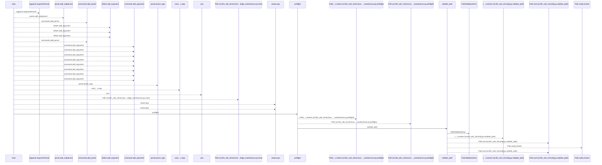
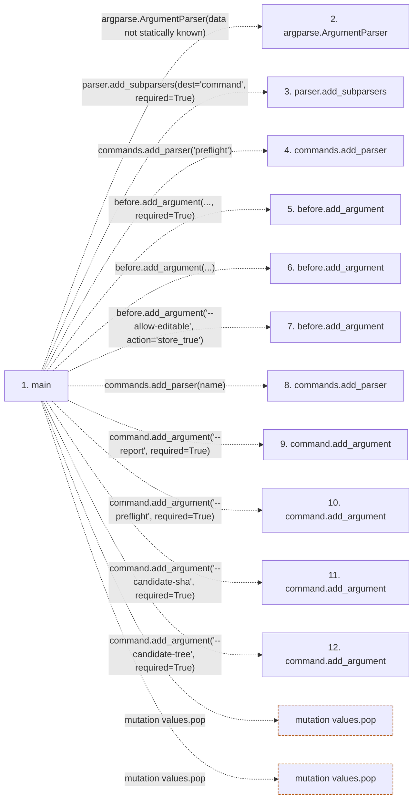

# knowledge_maintenance

**Entry point:** `main` (`process`)
**Source:** [knowledge_maintenance](../modules/knowledge_maintenance.md)
**Modules touched:** [ci_report](../modules/ci_report.md), [common](../modules/common.md), [concept_identity](../modules/concept_identity.md), [config](../modules/config.md), and 28 more

**Complete modules touched:**

- [ci_report](../modules/ci_report.md)
- [common](../modules/common.md)
- [concept_identity](../modules/concept_identity.md)
- [config](../modules/config.md)
- [extractor_helpers](../modules/extractor_helpers.md)
- [filesystem_guard](../modules/filesystem_guard.md)
- [health_contract](../modules/health_contract.md)
- [health_policy](../modules/health_policy.md)
- [io](../modules/io.md)
- [knowledge_envelope](../modules/knowledge_envelope.md)
- [knowledge_evidence](../modules/knowledge_evidence.md)
- [knowledge_freshness](../modules/knowledge_freshness.md)
- [knowledge_generation](../modules/knowledge_generation.md)
- [knowledge_governance](../modules/knowledge_governance.md)
- [knowledge_graph](../modules/knowledge_graph.md)
- [knowledge_maintenance](../modules/knowledge_maintenance.md)
- [knowledge_model](../modules/knowledge_model.md)
- [knowledge_observability](../modules/knowledge_observability.md)
- [knowledge_orchestration](../modules/knowledge_orchestration.md)
- [knowledge_packs](../modules/knowledge_packs.md)
- [knowledge_reuse](../modules/knowledge_reuse.md)
- [knowledge_storage](../modules/knowledge_storage.md)
- [knowledge_storage_io](../modules/knowledge_storage_io.md)
- [manifest_storage](../modules/manifest_storage.md)
- [markdown_sections](../modules/markdown_sections.md)
- [section_ownership](../modules/section_ownership.md)
- [source_selection](../modules/source_selection.md)
- [source_snapshot](../modules/source_snapshot.md)
- [sync_manifest](../modules/sync_manifest.md)
- [validation](../modules/validation.md)
- [wiki_media](../modules/wiki_media.md)
- [wiki_surface](../modules/wiki_surface.md)

**Related modules:** [common](../modules/common.md), [config](../modules/config.md), [health_policy](../modules/health_policy.md), [knowledge_envelope](../modules/knowledge_envelope.md), and 13 more

**Complete related modules:**

- [common](../modules/common.md)
- [config](../modules/config.md)
- [health_policy](../modules/health_policy.md)
- [knowledge_envelope](../modules/knowledge_envelope.md)
- [knowledge_evidence](../modules/knowledge_evidence.md)
- [knowledge_freshness](../modules/knowledge_freshness.md)
- [knowledge_model](../modules/knowledge_model.md)
- [knowledge_orchestration](../modules/knowledge_orchestration.md)
- [knowledge_packs](../modules/knowledge_packs.md)
- [knowledge_storage](../modules/knowledge_storage.md)
- [knowledge_storage_io](../modules/knowledge_storage_io.md)
- [llm_wiki_cli___init__](../modules/llm_wiki_cli___init__.md)
- [services_contracts](../modules/services_contracts.md)
- [source_selection](../modules/source_selection.md)
- [source_snapshot](../modules/source_snapshot.md)
- [sync_manifest](../modules/sync_manifest.md)
- [wiki_surface_index](../modules/wiki_surface_index.md)

## Call sequence

<!-- Auto-generated from static call edges. Dashed arrows are external or unresolved calls. Reviewed runtime conditions and side effects belong in Behavior. -->

> Call sequence diagram shows 30 of 3232 interactions; 3202 omitted to keep the visualization within the 30-interaction and generated-diagram limits.

> Trace truncated at the depth limit; deeper calls are omitted.

## Data flow

<!-- Auto-generated static analysis. Treat values and boundaries as best-effort hints, not runtime proof. -->

### Step data

| Step | Inputs | Reads | Writes | Returns |
|---|---|---|---|---|
| `main` | `argv` | `MAX_EVIDENCE_BYTES`, `MAX_EVIDENCE_BYTES`, `MAX_EVIDENCE_BYTES`, `tarfile`, `subprocess` | - | `...` |
| `argparse.ArgumentParser` | - | - | - | - |
| `parser.add_subparsers` | - | - | - | - |
| `commands.add_parser` | - | - | - | - |
| `before.add_argument` | - | - | - | - |
| `before.add_argument` | - | - | - | - |
| `before.add_argument` | - | - | - | - |
| `commands.add_parser` | - | - | - | - |
| `command.add_argument` | - | - | - | - |
| `command.add_argument` | - | - | - | - |
| `command.add_argument` | - | - | - | - |
| `command.add_argument` | - | - | - | - |

### Call data

| From | To | Line | Call |
|---|---|---:|---|
| main | argparse.ArgumentParser | 358 | `argparse.ArgumentParser(data not statically known)` |
| main | parser.add_subparsers | 359 | `parser.add_subparsers(dest='command', required=True)` |
| main | commands.add_parser | 360 | `commands.add_parser('preflight')` |
| main | before.add_argument | 362 | `before.add_argument(..., required=True)` |
| main | before.add_argument | 369 | `before.add_argument(...)` |
| main | before.add_argument | 370 | `before.add_argument('--allow-editable', action='store_true')` |
| main | commands.add_parser | 372 | `commands.add_parser(name)` |
| main | command.add_argument | 373 | `command.add_argument('--report', required=True)` |
| main | command.add_argument | 374 | `command.add_argument('--preflight', required=True)` |
| main | command.add_argument | 375 | `command.add_argument('--candidate-sha', required=True)` |
| main | command.add_argument | 376 | `command.add_argument('--candidate-tree', required=True)` |

### Boundary effects

| Kind | Target | Step | Line |
|---|---|---|---:|
| mutation | `values.pop` | `main` | 385 |
| mutation | `values.pop` | `main` | 386 |

### Static analysis gaps

| Kind | Step | Target | Line |
|---|---|---|---:|
| external_call | `main` | `argparse.ArgumentParser` | 358 |
| unresolved_call | `main` | `parser.add_subparsers` | 359 |
| unresolved_call | `main` | `commands.add_parser` | 360 |
| unresolved_call | `main` | `before.add_argument` | 362 |
| unresolved_call | `main` | `before.add_argument` | 369 |
| unresolved_call | `main` | `before.add_argument` | 370 |
| unresolved_call | `main` | `commands.add_parser` | 372 |
| unresolved_call | `main` | `command.add_argument` | 373 |
| unresolved_call | `main` | `command.add_argument` | 374 |
| unresolved_call | `main` | `command.add_argument` | 375 |
| unresolved_call | `main` | `command.add_argument` | 376 |
| step_limit | `main` | `first 12 steps` | 0 |

## Behavior

This flow starts at `main` and is classified as `process`. The generated call and data-flow sections are bounded static projections; runtime conditions and side effects require source-level confirmation.
