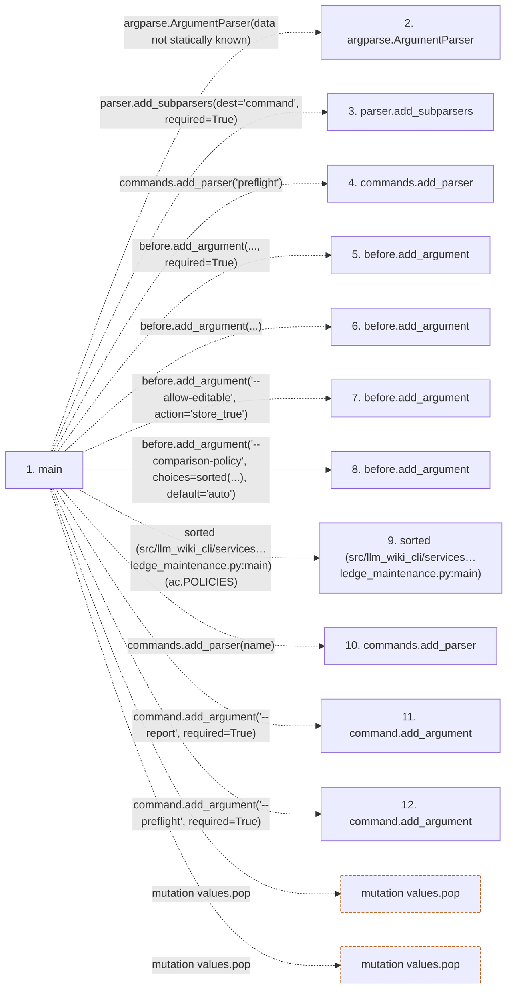

# knowledge_maintenance

**Entry point:** `main` (`process`)
**Source:** [knowledge_maintenance](../modules/knowledge_maintenance.md)
**Modules touched:** [analysis_capture](../modules/analysis_capture.md), [analysis_compatibility](../modules/analysis_compatibility.md), [common](../modules/common.md), [concept_identity](../modules/concept_identity.md), and 32 more

**Complete modules touched:**

- [analysis_capture](../modules/analysis_capture.md)
- [analysis_compatibility](../modules/analysis_compatibility.md)
- [common](../modules/common.md)
- [concept_identity](../modules/concept_identity.md)
- [config](../modules/config.md)
- [extractor_helpers](../modules/extractor_helpers.md)
- [filesystem_guard](../modules/filesystem_guard.md)
- [implementation_evidence](../modules/implementation_evidence.md)
- [io](../modules/io.md)
- [knowledge_envelope](../modules/knowledge_envelope.md)
- [knowledge_evidence](../modules/knowledge_evidence.md)
- [knowledge_generation](../modules/knowledge_generation.md)
- [knowledge_governance](../modules/knowledge_governance.md)
- [knowledge_graph](../modules/knowledge_graph.md)
- [knowledge_maintenance](../modules/knowledge_maintenance.md)
- [knowledge_model](../modules/knowledge_model.md)
- [knowledge_orchestration](../modules/knowledge_orchestration.md)
- [knowledge_packs](../modules/knowledge_packs.md)
- [knowledge_reuse](../modules/knowledge_reuse.md)
- [knowledge_storage](../modules/knowledge_storage.md)
- [knowledge_storage_io](../modules/knowledge_storage_io.md)
- [maintenance_evidence](../modules/maintenance_evidence.md)
- [maintenance_projection](../modules/maintenance_projection.md)
- [maintenance_shapes](../modules/maintenance_shapes.md)
- [maintenance_state](../modules/maintenance_state.md)
- [manifest_storage](../modules/manifest_storage.md)
- [markdown_sections](../modules/markdown_sections.md)
- [python_implementation](../modules/python_implementation.md)
- [section_ownership](../modules/section_ownership.md)
- [source_selection](../modules/source_selection.md)
- [source_snapshot](../modules/source_snapshot.md)
- [sync_manifest](../modules/sync_manifest.md)
- [typescript_helper_identity](../modules/typescript_helper_identity.md)
- [validation](../modules/validation.md)
- [wiki_media](../modules/wiki_media.md)
- [wiki_surface](../modules/wiki_surface.md)

**Related modules:** [analysis_capture](../modules/analysis_capture.md), [common](../modules/common.md), [config](../modules/config.md), [health_policy](../modules/health_policy.md), and 13 more

**Complete related modules:**

- [analysis_capture](../modules/analysis_capture.md)
- [common](../modules/common.md)
- [config](../modules/config.md)
- [health_policy](../modules/health_policy.md)
- [knowledge_envelope](../modules/knowledge_envelope.md)
- [knowledge_evidence](../modules/knowledge_evidence.md)
- [knowledge_model](../modules/knowledge_model.md)
- [knowledge_orchestration](../modules/knowledge_orchestration.md)
- [knowledge_packs](../modules/knowledge_packs.md)
- [knowledge_storage](../modules/knowledge_storage.md)
- [knowledge_storage_io](../modules/knowledge_storage_io.md)
- [llm_wiki_cli___init__](../modules/llm_wiki_cli___init__.md)
- [services_contracts](../modules/services_contracts.md)
- [source_selection](../modules/source_selection.md)
- [source_snapshot](../modules/source_snapshot.md)
- [sync_manifest](../modules/sync_manifest.md)
- [wiki_surface_index](../modules/wiki_surface_index.md)

## Call sequence

> Static overview in presentation order, not runtime execution order. Arrows retain captured callers; representative internal continuations and boundary examples precede repeated helper detail.

<!-- Auto-generated from static call edges. Dashed arrows are external or unresolved calls. Reviewed runtime conditions and side effects belong in Behavior. -->

```mermaid
sequenceDiagram
    participant p0 as main
    participant p1 as preflight
    participant p2 as read_guarded
    participant p3 as validate_path
    participant p4 as validate_source_root
    participant p5 as build_source_snapshot
    participant p6 as _archive_binding
    participant p7 as _installed
    participant p8 as StorageReadSession.read
    participant p9 as parse_packed_root
    participant p10 as parse_knowledge_index
    participant p11 as SyncManifest.load
    participant p12 as validate_persisted_source_selection_identity
    participant p13 as has_contract
    participant p14 as capture_analysis
    participant p15 as _producer_evidence
    participant p16 as _infrastructure_extractor_component
    participant p17 as build_producer_record
    participant p18 as compare_components
    participant p19 as runtime_generation_options
    participant p20 as runtime_generation_options_hash
    participant p21 as get_prepared_typescript_root
    participant p22 as get_prepared_binary
    participant p23 as hash_source_snapshot
    participant p24 as producer_contracts
    participant p25 as _validate_range
    participant p26 as _validate_capture_options
    participant p27 as _require_relative_name
    participant p28 as decode_bytes
    participant p29 as argparse.ArgumentParser
    participant p30 as parser.add_subparsers
    p0->>p1: preflight
    p0->>p2: read_guarded
    p1->>p3: validate_path
    p1->>p4: validate_source_root
    p1->>p5: build_source_snapshot
    p1->>p6: _archive_binding
    p1->>p7: _installed
    p1->>p8: StorageReadSession.read
    p1->>p9: parse_packed_root
    p1->>p10: parse_knowledge_index
    p1->>p11: SyncManifest.load
    p1->>p12: validate_persisted_source_selection_identity
    p1->>p13: has_contract
    p1->>p14: capture_analysis
    p1->>p15: _producer_evidence
    p1->>p16: _infrastructure_extractor_component
    p1->>p17: build_producer_record
    p1->>p18: compare_components
    p1->>p19: runtime_generation_options
    p1->>p20: runtime_generation_options_hash
    p1->>p21: get_prepared_typescript_root
    p1->>p22: get_prepared_binary
    p1->>p23: hash_source_snapshot
    p1->>p24: producer_contracts
    p2->>p25: _validate_range
    p5->>p26: _validate_capture_options
    p8->>p27: _require_relative_name
    p9->>p28: decode_bytes
    p0-->>p29: argparse.ArgumentParser
    p0-->>p30: parser.add_subparsers(dest='command', required=True)
```

> Call sequence diagram shows 30 of 3380 interactions; 3350 omitted to keep the visualization within the 30-interaction and generated-diagram limits, with uncertain identities omitted rather than inferred.

> Captured boundary calls: external 1 of 1091 (1090 omitted); unresolved 1 of 808 (807 omitted). These counts cover the captured static trace.

Omitted captured detail, grouped by actual caller occurrence and target module:

| Caller | Parent step | Target module | Kind | Omitted interactions |
| --- | --- | --- | --- | --- |
| `src/llm_wiki_cli/services/knowledge_maintenance.py:main` | 1 | - | unresolved | 27 |
| `src/llm_wiki_cli/services/knowledge_maintenance.py:main` | 1 | - | external | 10 |
| `src/llm_wiki_cli/services/knowledge_maintenance.py:preflight` | 25 | - | unresolved | 34 |
| `src/llm_wiki_cli/services/knowledge_maintenance.py:preflight` | 25 | - | external | 13 |
| `src/llm_wiki_cli/config.py:validate_path` | 28 | [src/llm_wiki_cli/config.py](../modules/config.md) | internal | 2 |
| `src/llm_wiki_cli/config.py:validate_path` | 28 | - | unresolved | 3 |
| `src/llm_wiki_cli/config.py:validate_path` | 28 | - | external | 2 |
| `src/llm_wiki_cli/config.py:validate_source_root` | 36 | [src/llm_wiki_cli/config.py](../modules/config.md) | internal | 7 |
> Omission summary shows 8 of 774 groups; 766 further groups are not expanded here. Counts above include all omitted interactions.
> Detailed flow queries retain their own coverage and limits; omitted paths may execute at runtime.

> Trace truncated at the depth limit; deeper calls are omitted.

## Data flow

<!-- Auto-generated static analysis. Treat values and boundaries as best-effort hints, not runtime proof. -->

```mermaid
flowchart LR
    s1["1. main"]
    s2["2. argparse.ArgumentParser"]
    s3["3. parser.add_subparsers"]
    s4["4. commands.add_parser"]
    s5["5. before.add_argument"]
    s6["6. before.add_argument"]
    s7["7. before.add_argument"]
    s8["8. before.add_argument"]
    s9["9. sorted (src/llm_wiki_cli/services…ledge_maintenance.py:main)"]
    s10["10. commands.add_parser"]
    s11["11. command.add_argument"]
    s12["12. command.add_argument"]
    s1 -. "argparse.ArgumentParser(data not statically known)" .-> s2
    s1 -. "parser.add_subparsers(dest='command', required=True)" .-> s3
    s1 -. "commands.add_parser('preflight')" .-> s4
    s1 -. "before.add_argument(..., required=True)" .-> s5
    s1 -. "before.add_argument(...)" .-> s6
    s1 -. "before.add_argument('--allow-editable', action='store_true')" .-> s7
    s1 -. "before.add_argument('--comparison-policy', choices=sorted(...), default='auto')" .-> s8
    s1 -. "sorted (src/llm_wiki_cli/services…ledge_maintenance.py:main)(ac.POLICIES)" .-> s9
    s1 -. "commands.add_parser(name)" .-> s10
    s1 -. "command.add_argument('--report', required=True)" .-> s11
    s1 -. "command.add_argument('--preflight', required=True)" .-> s12
    b0["mutation values.pop"]
    s1 -. "mutation values.pop" .-> b0
    b1["mutation values.pop"]
    s1 -. "mutation values.pop" .-> b1
    click s1 "../modules/knowledge_maintenance.md"
    classDef boundary stroke:#b45309,stroke-dasharray: 4 2
    class b0 boundary
    class b1 boundary
```

### Step data

| Step | Inputs | Reads | Writes | Returns |
|---|---|---|---|---|
| `main` | `argv` | `ac`, `MAX_EVIDENCE_BYTES`, `MAX_EVIDENCE_BYTES`, `MAX_EVIDENCE_BYTES`, `tarfile`, `subprocess` | - | `...` |
| `argparse.ArgumentParser` | - | - | - | - |
| `parser.add_subparsers` | - | - | - | - |
| `commands.add_parser` | - | - | - | - |
| `before.add_argument` | - | - | - | - |
| `before.add_argument` | - | - | - | - |
| `before.add_argument` | - | - | - | - |
| `before.add_argument` | - | - | - | - |
| `sorted (src/llm_wiki_cli/services…ledge_maintenance.py:main)` | - | - | - | - |
| `commands.add_parser` | - | - | - | - |
| `command.add_argument` | - | - | - | - |
| `command.add_argument` | - | - | - | - |

### Call data

| From | To | Line | Call |
|---|---|---:|---|
| main | argparse.ArgumentParser | 388 | `argparse.ArgumentParser(data not statically known)` |
| main | parser.add_subparsers | 389 | `parser.add_subparsers(dest='command', required=True)` |
| main | commands.add_parser | 390 | `commands.add_parser('preflight')` |
| main | before.add_argument | 392 | `before.add_argument(..., required=True)` |
| main | before.add_argument | 399 | `before.add_argument(...)` |
| main | before.add_argument | 400 | `before.add_argument('--allow-editable', action='store_true')` |
| main | before.add_argument | 401 | `before.add_argument('--comparison-policy', choices=sorted(...), default='auto')` |
| main | sorted (src/llm_wiki_cli/services…ledge_maintenance.py:main) | 401 | `sorted(ac.POLICIES)` |
| main | commands.add_parser | 403 | `commands.add_parser(name)` |
| main | command.add_argument | 404 | `command.add_argument('--report', required=True)` |
| main | command.add_argument | 405 | `command.add_argument('--preflight', required=True)` |

### Boundary effects

| Kind | Target | Step | Line |
|---|---|---|---:|
| mutation | `values.pop` | `main` | 416 |
| mutation | `values.pop` | `main` | 417 |

### Static analysis gaps

| Kind | Step | Target | Line |
|---|---|---|---:|
| external_call | `main` | `argparse.ArgumentParser` | 388 |
| unresolved_call | `main` | `parser.add_subparsers` | 389 |
| unresolved_call | `main` | `commands.add_parser` | 390 |
| unresolved_call | `main` | `before.add_argument` | 392 |
| unresolved_call | `main` | `before.add_argument` | 399 |
| unresolved_call | `main` | `before.add_argument` | 400 |
| unresolved_call | `main` | `before.add_argument` | 401 |
| external_call | `main` | `sorted` | 401 |
| unresolved_call | `main` | `commands.add_parser` | 403 |
| unresolved_call | `main` | `command.add_argument` | 404 |
| unresolved_call | `main` | `command.add_argument` | 405 |
| step_limit | `main` | `first 12 steps` | 0 |

## Behavior

This flow starts at `main` and is classified as `process`. The generated call and data-flow sections are bounded static projections; runtime conditions and side effects require source-level confirmation.
