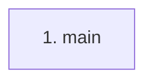

# llm-wiki

**Entry point:** `main` (`process`)

## Call sequence

<!-- Auto-generated from static call edges. Dashed arrows are external or unresolved calls. Reviewed runtime conditions and side effects belong in Behavior. -->
*No outbound calls were detected by static analysis.*

## Data flow

<!-- Auto-generated static analysis. Treat values and boundaries as best-effort hints, not runtime proof. -->

### Step data

| Step | Inputs | Reads | Writes | Returns |
|---|---|---|---|---|
| `main` | - | - | - | - |

### Call data

*No call data transfers detected.*

### Boundary effects

*No boundary effects detected.*

### Static analysis gaps

*No static analysis gaps detected.*

## Behavior

Serves as the installed `llm-wiki` process entry point. It builds the full
argument parser, handles version output, and dispatches the selected command to
its command or service module. Missing commands are rejected with usage
guidance; validated
path-policy failures are rendered as concise errors and return a nonzero
process status.
