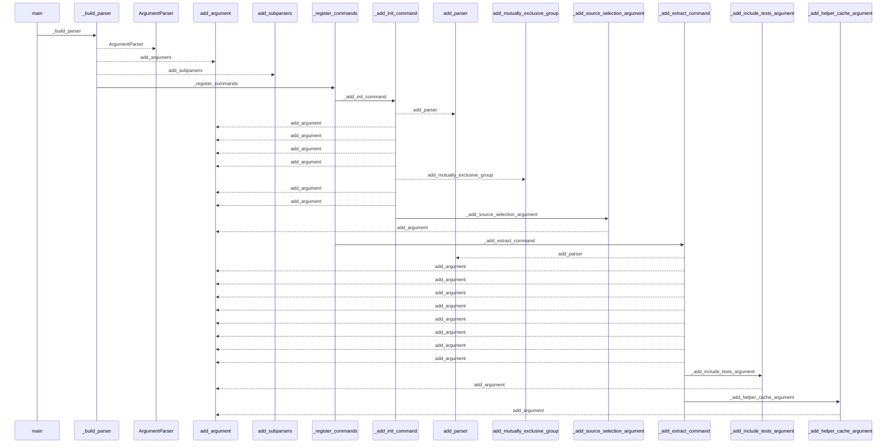
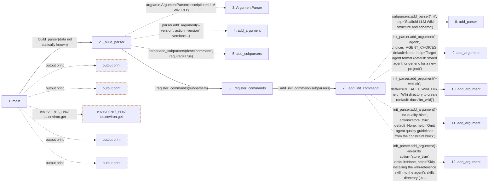

# llm-wiki

**Entry point:** `main` (`process`)
**Source:** [cli](../modules/cli.md)
**Modules touched:** [cli](../modules/cli.md), [resource_diagnostics](../modules/resource_diagnostics.md)

**Related modules:** [config](../modules/config.md), [extraction_jobs](../modules/extraction_jobs.md), [resource_diagnostics](../modules/resource_diagnostics.md), [services_contracts](../modules/services_contracts.md)

## Call sequence

<!-- Auto-generated from static call edges. Dashed arrows are external or unresolved calls. Reviewed runtime conditions and side effects belong in Behavior. -->

> Call sequence diagram shows 30 of 533 interactions; 503 omitted to keep the visualization within the 30-interaction and generated-diagram limits.

## Data flow

<!-- Auto-generated static analysis. Treat values and boundaries as best-effort hints, not runtime proof. -->

### Step data

| Step | Inputs | Reads | Writes | Returns |
|---|---|---|---|---|
| `main` | - | `PathValidationError`, `sys`, `sys`, `sys` | - | - |
| `_build_parser` | - | `__version__` | - | `parser` |
| `ArgumentParser` | - | - | - | - |
| `add_argument` | - | - | - | - |
| `add_subparsers` | - | - | - | - |
| `_register_commands` | `subparsers` | - | - | - |
| `_add_init_command` | `subparsers` | `AGENT_CHOICES`, `DEFAULT_WIKI_DIR` | - | - |
| `add_parser` | - | - | - | - |
| `add_argument` | - | - | - | - |
| `add_argument` | - | - | - | - |
| `add_argument` | - | - | - | - |
| `add_argument` | - | - | - | - |

### Call data

| From | To | Line | Call |
|---|---|---:|---|
| main | _build_parser | 2314 | `_build_parser(data not statically known)` |
| _build_parser | ArgumentParser | 162 | `argparse.ArgumentParser(description='LLM Wiki CLI')` |
| _build_parser | add_argument | 163 | `parser.add_argument('--version', action='version', version=...)` |
| _build_parser | add_subparsers | 166 | `parser.add_subparsers(dest='command', required=True)` |
| _build_parser | _register_commands | 167 | `_register_commands(subparsers)` |
| _register_commands | _add_init_command | 172 | `_add_init_command(subparsers)` |
| _add_init_command | add_parser | 242 | `subparsers.add_parser('init', help='Scaffold LLM Wiki structure and schema')` |
| _add_init_command | add_argument | 245 | `init_parser.add_argument('--agent', choices=AGENT_CHOICES, default=None, help='Target agent format (default: stored agent, or generic for a new project)')` |
| _add_init_command | add_argument | 251 | `init_parser.add_argument('--wiki-dir', default=DEFAULT_WIKI_DIR, help='Wiki directory to create (default: docs/llm_wiki)')` |
| _add_init_command | add_argument | 256 | `init_parser.add_argument('--no-quality-hints', action='store_true', default=None, help='Omit agent quality guidelines from the constraint block')` |
| _add_init_command | add_argument | 262 | `init_parser.add_argument('--no-skills', action='store_true', default=None, help="Skip installing the wiki-reference skill into the agent's skills directory (.claude/skills for claude, .llm-wiki/skills otherwise)")` |

### Boundary effects

| Kind | Target | Step | Line |
|---|---|---|---:|
| output | `print` | `main` | 2320 |
| output | `print` | `main` | 2323 |
| environment_read | `os.environ.get` | `main` | 2326 |
| output | `print` | `main` | 2328 |
| output | `print` | `main` | 2331 |

### Static analysis gaps

| Kind | Step | Target | Line |
|---|---|---|---:|
| external_call | `_build_parser` | `argparse.ArgumentParser` | 162 |
| unresolved_call | `_build_parser` | `parser.add_argument` | 163 |
| unresolved_call | `_build_parser` | `parser.add_subparsers` | 166 |
| unresolved_call | `_add_init_command` | `subparsers.add_parser` | 242 |
| unresolved_call | `_add_init_command` | `init_parser.add_argument` | 245 |
| unresolved_call | `_add_init_command` | `init_parser.add_argument` | 251 |
| unresolved_call | `_add_init_command` | `init_parser.add_argument` | 256 |
| unresolved_call | `_add_init_command` | `init_parser.add_argument` | 262 |
| step_limit | `main` | `first 12 steps` | 0 |

## Behavior

Serves as the installed `llm-wiki` process entry point. It builds the full
argument parser, handles version output, and dispatches the selected command to
its command or service module. Missing commands are rejected with usage
guidance; validated
path-policy failures are rendered as concise errors and return a nonzero
process status.
