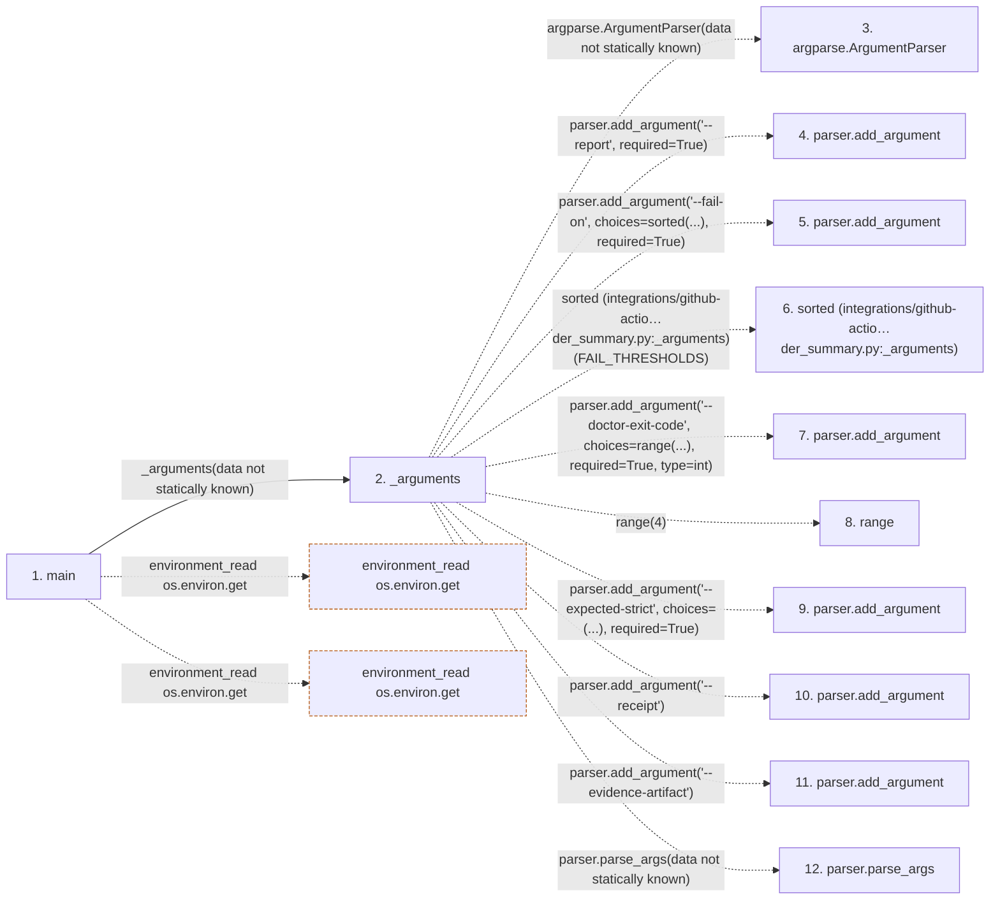

# render_summary

**Entry point:** `main` (`process`)
**Source:** [render_summary](../modules/render_summary.md)
**Modules touched:** [ci_report](../modules/ci_report.md), [health_summary](../modules/health_summary.md), [render_summary](../modules/render_summary.md)

**Related modules:** [ci_report](../modules/ci_report.md), [health_summary](../modules/health_summary.md)

## Call sequence

```mermaid
sequenceDiagram
    participant p0 as main
    participant p1 as _arguments
    participant p2 as argparse.ArgumentParser
    participant p3 as parser.add_argument
    participant p4 as sorted (integrations/github-actio…der_summary.py:_arguments)
    participant p5 as range
    participant p6 as parser.parse_args
    participant p7 as load_report
    participant p8 as json.loads
    participant p9 as Path(…).read_text
    participant p10 as Path (integrations/github-actio…er_summary.py:load_report)
    participant p11 as ValueError (integrations/github-actio…er_summary.py:load_report)
    participant p12 as _required_object
    participant p13 as _object (integrations/github-action/render_summary.py)
    participant p14 as isinstance (integrations/github-actio…render_summary.py:_object)
    participant p15 as ValueError (integrations/github-actio…render_summary.py:_object)
    participant p16 as sorted (integrations/github-actio…mmary.py:_required_object)
    participant p17 as set (integrations/github-actio…mmary.py:_required_object)
    participant p18 as ValueError (integrations/github-actio…mmary.py:_required_object)
    participant p19 as report.get
    participant p20 as _enum (integrations/github-action/render_summary.py)
    participant p21 as _string (integrations/github-action/render_summary.py)
    participant p22 as isinstance (integrations/github-actio…render_summary.py:_string)
    participant p23 as value.strip (integrations/github-actio…render_summary.py:_string)
    participant p24 as ValueError (integrations/github-actio…render_summary.py:_string)
    p0->>p1: _arguments
    p1-->>p2: argparse.ArgumentParser
    p1-->>p3: parser.add_argument
    p1-->>p3: parser.add_argument
    p1-->>p4: sorted (integrations/github-actio…der_summary.py:_arguments)
    p1-->>p3: parser.add_argument
    p1-->>p5: range
    p1-->>p3: parser.add_argument
    p1-->>p3: parser.add_argument
    p1-->>p3: parser.add_argument
    p1-->>p6: parser.parse_args
    p0->>p7: load_report
    p7-->>p8: json.loads
    p7-->>p9: Path(…).read_text
    p7-->>p10: Path (integrations/github-actio…er_summary.py:load_report)
    p7-->>p11: ValueError (integrations/github-actio…er_summary.py:load_report)
    p7->>p12: _required_object
    p12->>p13: _object (integrations/github-action/render_summary.py)
    p13-->>p14: isinstance (integrations/github-actio…render_summary.py:_object)
    p13-->>p15: ValueError (integrations/github-actio…render_summary.py:_object)
    p12-->>p16: sorted (integrations/github-actio…mmary.py:_required_object)
    p12-->>p17: set (integrations/github-actio…mmary.py:_required_object)
    p12-->>p18: ValueError (integrations/github-actio…mmary.py:_required_object)
    p7-->>p19: report.get
    p7-->>p11: ValueError (integrations/github-actio…er_summary.py:load_report)
    p7->>p20: _enum (integrations/github-action/render_summary.py)
    p20->>p21: _string (integrations/github-action/render_summary.py)
    p21-->>p22: isinstance (integrations/github-actio…render_summary.py:_string)
    p21-->>p23: value.strip (integrations/github-actio…render_summary.py:_string)
    p21-->>p24: ValueError (integrations/github-actio…render_summary.py:_string)
```

<!-- Auto-generated from static call edges. Dashed arrows are external or unresolved calls. Reviewed runtime conditions and side effects belong in Behavior. -->

> Call sequence diagram shows 30 of 330 interactions; 300 omitted to keep the visualization within the 30-interaction and generated-diagram limits.

> Trace truncated at the depth limit; deeper calls are omitted.

## Data flow

<!-- Auto-generated static analysis. Treat values and boundaries as best-effort hints, not runtime proof. -->

### Step data

| Step | Inputs | Reads | Writes | Returns |
|---|---|---|---|---|
| `main` | - | `FAIL_THRESHOLDS`, `STATUS_SEVERITY` | - | `dashboard_exit` |
| `_arguments` | - | `FAIL_THRESHOLDS` | - | `parser.parse_args(...)` |
| `argparse.ArgumentParser` | - | - | - | - |
| `parser.add_argument` | - | - | - | - |
| `parser.add_argument` | - | - | - | - |
| `sorted (integrations/github-actio…der_summary.py:_arguments)` | - | - | - | - |
| `parser.add_argument` | - | - | - | - |
| `range` | - | - | - | - |
| `parser.add_argument` | - | - | - | - |
| `parser.add_argument` | - | - | - | - |
| `parser.add_argument` | - | - | - | - |
| `parser.parse_args` | - | - | - | - |

### Call data

| From | To | Line | Call |
|---|---|---:|---|
| main | _arguments | 532 | `_arguments(data not statically known)` |
| _arguments | argparse.ArgumentParser | 116 | `argparse.ArgumentParser(data not statically known)` |
| _arguments | parser.add_argument | 117 | `parser.add_argument('--report', required=True)` |
| _arguments | parser.add_argument | 118 | `parser.add_argument('--fail-on', choices=sorted(...), required=True)` |
| _arguments | sorted (integrations/github-actio…der_summary.py:_arguments) | 118 | `sorted(FAIL_THRESHOLDS)` |
| _arguments | parser.add_argument | 119 | `parser.add_argument('--doctor-exit-code', choices=range(...), required=True, type=int)` |
| _arguments | range | 121 | `range(4)` |
| _arguments | parser.add_argument | 125 | `parser.add_argument('--expected-strict', choices=(...), required=True)` |
| _arguments | parser.add_argument | 130 | `parser.add_argument('--receipt')` |
| _arguments | parser.add_argument | 131 | `parser.add_argument('--evidence-artifact')` |
| _arguments | parser.parse_args | 132 | `parser.parse_args(data not statically known)` |

### Boundary effects

| Kind | Target | Step | Line |
|---|---|---|---:|
| environment_read | `os.environ.get` | `main` | 546 |
| environment_read | `os.environ.get` | `main` | 548 |

### Static analysis gaps

| Kind | Step | Target | Line |
|---|---|---|---:|
| external_call | `_arguments` | `argparse.ArgumentParser` | 116 |
| unresolved_call | `_arguments` | `parser.add_argument` | 117 |
| unresolved_call | `_arguments` | `parser.add_argument` | 118 |
| external_call | `_arguments` | `sorted` | 118 |
| unresolved_call | `_arguments` | `parser.add_argument` | 119 |
| external_call | `_arguments` | `range` | 121 |
| unresolved_call | `_arguments` | `parser.add_argument` | 125 |
| unresolved_call | `_arguments` | `parser.add_argument` | 130 |
| unresolved_call | `_arguments` | `parser.add_argument` | 131 |
| unresolved_call | `_arguments` | `parser.parse_args` | 132 |
| step_limit | `main` | `first 12 steps` | 0 |
| truncated_flow | `main` | `depth limit` | 0 |

## Behavior

Reads the GitHub Action's doctor JSON, validates the exact contract and captured
doctor exit code, and renders a compact health table. When GitHub output paths
are present it appends the summary and status output, then returns whether the
report severity meets the configured degraded or unhealthy threshold. Invalid
input stops with a contract error rather than publishing a partial summary.
