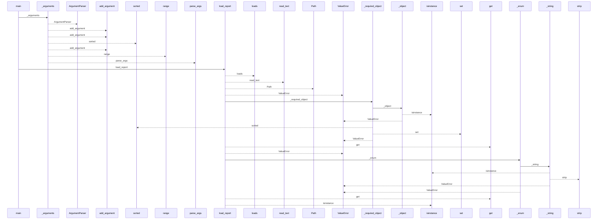
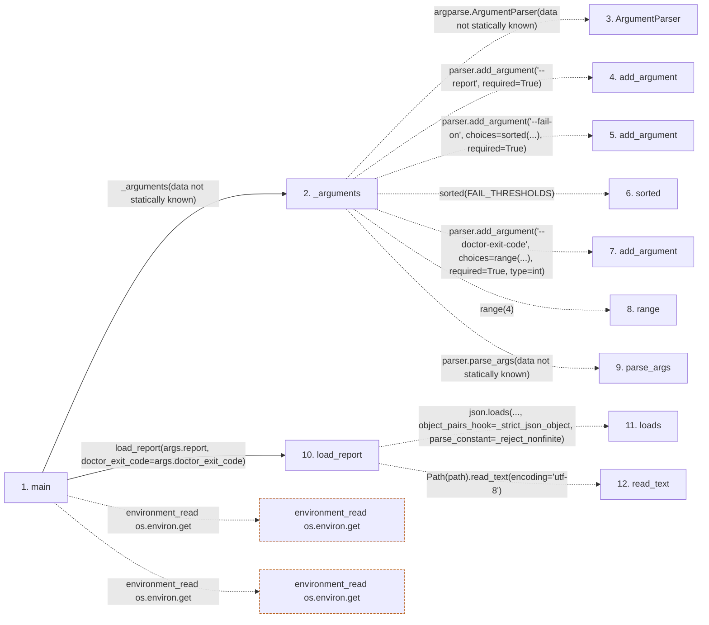

# render_summary

**Entry point:** `main` (`process`)
**Source:** [render_summary](../modules/render_summary.md)
**Modules touched:** [render_summary](../modules/render_summary.md)

## Call sequence

<!-- Auto-generated from static call edges. Dashed arrows are external or unresolved calls. Reviewed runtime conditions and side effects belong in Behavior. -->

> Call sequence diagram shows 30 of 134 interactions; 104 omitted to keep the visualization within the 30-interaction and generated-diagram limits.

## Data flow

<!-- Auto-generated static analysis. Treat values and boundaries as best-effort hints, not runtime proof. -->

### Step data

| Step | Inputs | Reads | Writes | Returns |
|---|---|---|---|---|
| `main` | - | `FAIL_THRESHOLDS`, `STATUS_SEVERITY` | - | `int(...)` |
| `_arguments` | - | `FAIL_THRESHOLDS` | - | `parser.parse_args(...)` |
| `ArgumentParser` | - | - | - | - |
| `add_argument` | - | - | - | - |
| `add_argument` | - | - | - | - |
| `sorted` | - | - | - | - |
| `add_argument` | - | - | - | - |
| `range` | - | - | - | - |
| `parse_args` | - | - | - | - |
| `load_report` | `path: str \| Path`, `doctor_exit_code: int` | `_strict_json_object`, `_reject_nonfinite`, `json`, `REPORT_FIELDS`, `SCHEMA_VERSION`, `SCHEMA_VERSION`, `STATUS_SEVERITY`, `STATUS_SEVERITY` | - | `report` |
| `loads` | - | - | - | - |
| `read_text` | - | - | - | - |

### Call data

| From | To | Line | Call |
|---|---|---:|---|
| main | _arguments | 437 | `_arguments(data not statically known)` |
| _arguments | ArgumentParser | 107 | `argparse.ArgumentParser(data not statically known)` |
| _arguments | add_argument | 108 | `parser.add_argument('--report', required=True)` |
| _arguments | add_argument | 109 | `parser.add_argument('--fail-on', choices=sorted(...), required=True)` |
| _arguments | sorted | 109 | `sorted(FAIL_THRESHOLDS)` |
| _arguments | add_argument | 110 | `parser.add_argument('--doctor-exit-code', choices=range(...), required=True, type=int)` |
| _arguments | range | 112 | `range(4)` |
| _arguments | parse_args | 116 | `parser.parse_args(data not statically known)` |
| main | load_report | 439 | `load_report(args.report, doctor_exit_code=args.doctor_exit_code)` |
| load_report | loads | 344 | `json.loads(..., object_pairs_hook=_strict_json_object, parse_constant=_reject_nonfinite)` |
| load_report | read_text | 345 | `Path(path).read_text(encoding='utf-8')` |

### Boundary effects

| Kind | Target | Step | Line |
|---|---|---|---:|
| environment_read | `os.environ.get` | `main` | 447 |
| environment_read | `os.environ.get` | `main` | 449 |

### Static analysis gaps

| Kind | Step | Target | Line |
|---|---|---|---:|
| external_call | `_arguments` | `argparse.ArgumentParser` | 107 |
| unresolved_call | `_arguments` | `parser.add_argument` | 108 |
| unresolved_call | `_arguments` | `parser.add_argument` | 109 |
| unresolved_call | `_arguments` | `sorted` | 109 |
| unresolved_call | `_arguments` | `parser.add_argument` | 110 |
| unresolved_call | `_arguments` | `range` | 112 |
| unresolved_call | `_arguments` | `parser.parse_args` | 116 |
| external_call | `load_report` | `json.loads` | 344 |
| unresolved_call | `load_report` | `Path(path).read_text` | 345 |
| step_limit | `main` | `first 12 steps` | 0 |

## Behavior

Reads the GitHub Action's doctor JSON, validates the exact contract and captured
doctor exit code, and renders a compact health table. When GitHub output paths
are present it appends the summary and status output, then returns whether the
report severity meets the configured degraded or unhealthy threshold. Invalid
input stops with a contract error rather than publishing a partial summary.
