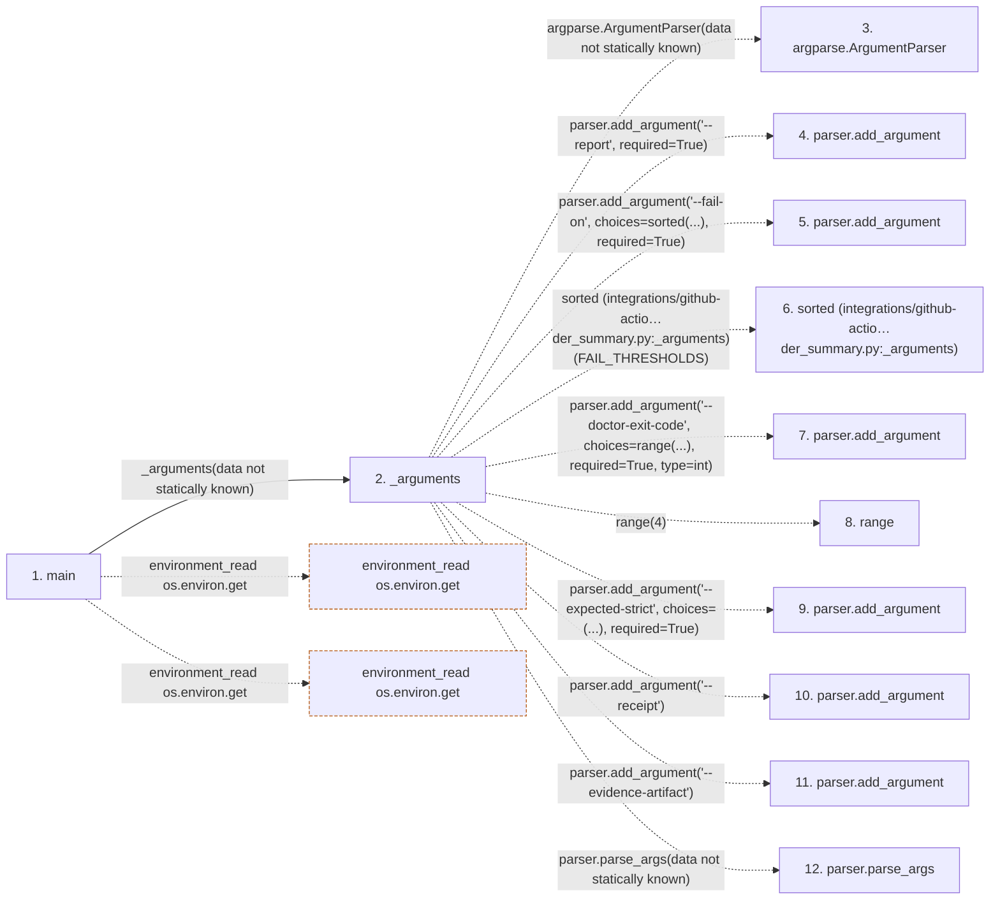

# render_summary

**Entry point:** `main` (`process`)
**Source:** [render_summary](../modules/render_summary.md)
**Modules touched:** [ci_report](../modules/ci_report.md), [health_contract](../modules/health_contract.md), [health_summary](../modules/health_summary.md), [knowledge_freshness](../modules/knowledge_freshness.md), and 1 more

**Complete modules touched:**

- [ci_report](../modules/ci_report.md)
- [health_contract](../modules/health_contract.md)
- [health_summary](../modules/health_summary.md)
- [knowledge_freshness](../modules/knowledge_freshness.md)
- [render_summary](../modules/render_summary.md)

**Related modules:** [ci_report](../modules/ci_report.md), [health_summary](../modules/health_summary.md), [services_contracts](../modules/services_contracts.md)

## Call sequence

```mermaid
sequenceDiagram
    participant p0 as main
    participant p1 as _arguments
    participant p2 as argparse.ArgumentParser
    participant p3 as parser.add_argument
    participant p4 as sorted (integrations/github-actio…der_summary.py:_arguments)
    participant p5 as range
    participant p6 as parser.parse_args
    participant p7 as load_report
    participant p8 as Path(…).read_bytes (integrations/github-actio…er_summary.py:load_report)
    participant p9 as Path (integrations/github-actio…er_summary.py:load_report)
    participant p10 as ValueError (integrations/github-actio…er_summary.py:load_report)
    participant p11 as _validate_report_bytes
    participant p12 as json.loads
    participant p13 as raw.decode
    participant p14 as ValueError (integrations/github-actio…py:_validate_report_bytes)
    participant p15 as _required_object
    participant p16 as _object (integrations/github-action/render_summary.py)
    participant p17 as isinstance (integrations/github-actio…render_summary.py:_object)
    participant p18 as ValueError (integrations/github-actio…render_summary.py:_object)
    participant p19 as sorted (integrations/github-actio…mmary.py:_required_object)
    participant p20 as set (integrations/github-actio…mmary.py:_required_object)
    participant p21 as ValueError (integrations/github-actio…mmary.py:_required_object)
    participant p22 as report.get
    participant p23 as _enum (integrations/github-action/render_summary.py)
    participant p24 as _string (integrations/github-action/render_summary.py)
    p0->>p1: _arguments
    p1-->>p2: argparse.ArgumentParser
    p1-->>p3: parser.add_argument
    p1-->>p3: parser.add_argument
    p1-->>p4: sorted (integrations/github-actio…der_summary.py:_arguments)
    p1-->>p3: parser.add_argument
    p1-->>p5: range
    p1-->>p3: parser.add_argument
    p1-->>p3: parser.add_argument
    p1-->>p3: parser.add_argument
    p1-->>p6: parser.parse_args
    p0->>p7: load_report
    p7-->>p8: Path(…).read_bytes (integrations/github-actio…er_summary.py:load_report)
    p7-->>p9: Path (integrations/github-actio…er_summary.py:load_report)
    p7-->>p10: ValueError (integrations/github-actio…er_summary.py:load_report)
    p7->>p11: _validate_report_bytes
    p11-->>p12: json.loads
    p11-->>p13: raw.decode
    p11-->>p14: ValueError (integrations/github-actio…py:_validate_report_bytes)
    p11->>p15: _required_object
    p15->>p16: _object (integrations/github-action/render_summary.py)
    p16-->>p17: isinstance (integrations/github-actio…render_summary.py:_object)
    p16-->>p18: ValueError (integrations/github-actio…render_summary.py:_object)
    p15-->>p19: sorted (integrations/github-actio…mmary.py:_required_object)
    p15-->>p20: set (integrations/github-actio…mmary.py:_required_object)
    p15-->>p21: ValueError (integrations/github-actio…mmary.py:_required_object)
    p11-->>p22: report.get
    p11-->>p14: ValueError (integrations/github-actio…py:_validate_report_bytes)
    p11->>p23: _enum (integrations/github-action/render_summary.py)
    p23->>p24: _string (integrations/github-action/render_summary.py)
```

<!-- Auto-generated from static call edges. Dashed arrows are external or unresolved calls. Reviewed runtime conditions and side effects belong in Behavior. -->

> Call sequence diagram shows 30 of 481 interactions; 451 omitted to keep the visualization within the 30-interaction and generated-diagram limits.

> Trace truncated at the depth limit; deeper calls are omitted.

## Data flow

<!-- Auto-generated static analysis. Treat values and boundaries as best-effort hints, not runtime proof. -->

### Step data

| Step | Inputs | Reads | Writes | Returns |
|---|---|---|---|---|
| `main` | - | `FAIL_THRESHOLDS`, `STATUS_SEVERITY` | - | `dashboard_exit` |
| `_arguments` | - | `FAIL_THRESHOLDS` | - | `parser.parse_args(...)` |
| `argparse.ArgumentParser` | - | - | - | - |
| `parser.add_argument` | - | - | - | - |
| `parser.add_argument` | - | - | - | - |
| `sorted (integrations/github-actio…der_summary.py:_arguments)` | - | - | - | - |
| `parser.add_argument` | - | - | - | - |
| `range` | - | - | - | - |
| `parser.add_argument` | - | - | - | - |
| `parser.add_argument` | - | - | - | - |
| `parser.add_argument` | - | - | - | - |
| `parser.parse_args` | - | - | - | - |

### Call data

| From | To | Line | Call |
|---|---|---:|---|
| main | _arguments | 547 | `_arguments(data not statically known)` |
| _arguments | argparse.ArgumentParser | 118 | `argparse.ArgumentParser(data not statically known)` |
| _arguments | parser.add_argument | 119 | `parser.add_argument('--report', required=True)` |
| _arguments | parser.add_argument | 120 | `parser.add_argument('--fail-on', choices=sorted(...), required=True)` |
| _arguments | sorted (integrations/github-actio…der_summary.py:_arguments) | 120 | `sorted(FAIL_THRESHOLDS)` |
| _arguments | parser.add_argument | 121 | `parser.add_argument('--doctor-exit-code', choices=range(...), required=True, type=int)` |
| _arguments | range | 123 | `range(4)` |
| _arguments | parser.add_argument | 127 | `parser.add_argument('--expected-strict', choices=(...), required=True)` |
| _arguments | parser.add_argument | 132 | `parser.add_argument('--receipt')` |
| _arguments | parser.add_argument | 133 | `parser.add_argument('--evidence-artifact')` |
| _arguments | parser.parse_args | 134 | `parser.parse_args(data not statically known)` |

### Boundary effects

| Kind | Target | Step | Line |
|---|---|---|---:|
| environment_read | `os.environ.get` | `main` | 561 |
| environment_read | `os.environ.get` | `main` | 563 |

### Static analysis gaps

| Kind | Step | Target | Line |
|---|---|---|---:|
| external_call | `_arguments` | `argparse.ArgumentParser` | 118 |
| unresolved_call | `_arguments` | `parser.add_argument` | 119 |
| unresolved_call | `_arguments` | `parser.add_argument` | 120 |
| external_call | `_arguments` | `sorted` | 120 |
| unresolved_call | `_arguments` | `parser.add_argument` | 121 |
| external_call | `_arguments` | `range` | 123 |
| unresolved_call | `_arguments` | `parser.add_argument` | 127 |
| unresolved_call | `_arguments` | `parser.add_argument` | 132 |
| unresolved_call | `_arguments` | `parser.add_argument` | 133 |
| unresolved_call | `_arguments` | `parser.parse_args` | 134 |
| step_limit | `main` | `first 12 steps` | 0 |
| truncated_flow | `main` | `depth limit` | 0 |

## Behavior

Reads the GitHub Action's doctor JSON, validates the exact contract and captured
doctor exit code, and renders a compact health table. When GitHub output paths
are present it appends the summary and status output, then returns whether the
report severity meets the configured degraded or unhealthy threshold. Invalid
input stops with a contract error rather than publishing a partial summary.
