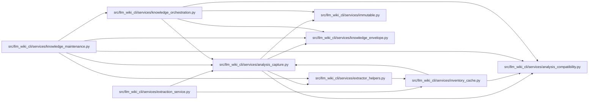

# analysis_capture Module

**Path:** `src/llm_wiki_cli/services/analysis_capture.py`

## Description

Operation-owned capture of installed analysis implementation and runtimes.

## Imports

| Source | Symbols |
|--------|---------|
| `.` | `analysis_compatibility`, `extractor_helpers` |
| `.immutable` | `FrozenDict`, `freeze` |
| `.knowledge_envelope` | `hash_component_configuration` |
| `__future__` | `annotations` |
| `collections.abc` | `Mapping` |
| `contextvars` | `ContextVar` |
| `dataclasses` | `replace` |
| `functools` | `wraps` |
| `hashlib` | `hashlib` |
| `importlib.metadata` | `version` |
| `json` | `json` |
| `pathlib` | `Path` |
| `platform` | `platform` |
| `re` | `re` |
| `sys` | `sys` |

## Local dependency map

<!-- Auto-generated local dependency summary. Do not edit by hand. -->

### Internal neighbors

| Direction | Module |
|---|---|
| Inbound | [extraction_service](../modules/extraction_service.md) |
| Inbound | [inventory_cache](../modules/inventory_cache.md) |
| Inbound | [knowledge_maintenance](../modules/knowledge_maintenance.md) |
| Inbound | [knowledge_orchestration](../modules/knowledge_orchestration.md) |
| Outbound | [analysis_compatibility](../modules/analysis_compatibility.md) |
| Outbound | [extractor_helpers](../modules/extractor_helpers.md) |
| Outbound | [immutable](../modules/immutable.md) |
| Outbound | [knowledge_envelope](../modules/knowledge_envelope.md) |

## Classes

| Class | Line | Bases | Description |
|-------|------|-------|-------------|
| [_CapturedAnalysis](../entities/CapturedAnalysis.md) | 21 | `FrozenDict` | — |

## Functions

| Function | Signature | Decorators | Description |
|----------|-----------|------------|-------------|
| `_issued` | `(values)` | — | — |
| `capture_operation` | `(function)` | — | — |
| `registry` | `(root: Path \| None = None) -> dict` | — | — |
| `implementation_hash` | `(root: Path, paths: list[str]) -> str` | — | — |
| `capture_analysis` | `(registry_entries: Mapping[str, str], *, helper_cache_dir = None, source_root: str \| Path = '.', languages = None, package_root: Path \| None = None) -> dict` | — | Capture immutable JSON inputs once; unavailable providers stay unknown. |
| `attach` | `(component, captured: Mapping \| None)` | — | — |
