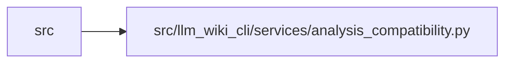

# analysis_compatibility Module

**Path:** `src/llm_wiki_cli/services/analysis_compatibility.py`

## Description

Pure, versioned comparison of application-owned analysis commitments.

This module is also shipped in the isolated release harness. Keep it stdlib-only
and never resolve executable paths or declarations from knowledge documents.

## Imports

| Source | Symbols |
|--------|---------|
| `__future__` | `annotations` |
| `collections.abc` | `Mapping` |
| `contextlib` | `contextmanager` |
| `contextvars` | `ContextVar` |
| `functools` | `wraps` |
| `hashlib` | `hashlib` |
| `json` | `json` |
| `re` | `re` |
| `typing` | `Callable`, `ParamSpec`, `TypeVar` |

## Local dependency map

<!-- Auto-generated local dependency summary. Do not edit by hand. -->

> Module-level dependencies exceed the generated-diagram limits, so the diagram and table below group them by top-level package. Counts report the number of module neighbors in each package.

### Internal neighbors

| Direction | Module |
|---|---|
| Inbound | `src` (16) |

> All 16 module neighbor(s) are summarized by package because the module-level view exceeds the 12-node limit.

## Functions

| Function | Signature | Decorators | Description |
|----------|-----------|------------|-------------|
| `digest` | `(value: object) -> str` | — | — |
| `selected_policy` | `(value: str \| None = None) -> str` | — | — |
| `comparison_scope` | `(value: str)` | `@contextmanager` | — |
| `validate_record` | `(value: object, component: str \| None = None) -> dict` | — | — |
| `make_record` | `(component: str, contract: str, implementation: str, configuration: str, runtime: str, provenance: Mapping) -> dict` | — | — |
| `component_record` | `(component) -> dict \| None` | — | — |
| `has_contract` | `(producer) -> bool` | — | — |
| `committed_configuration` | `(configuration: Mapping, record: Mapping) -> dict` | — | — |
| `configuration_commitment` | `(record: Mapping) -> str` | — | — |
| `compare_components` | `(recorded, live, *, policy: str = 'auto', plugins: bool = False, configuration_required: bool = True) -> str \| None` | — | Return the differing basis, or None; callers map it to their contract. |
| `report_schema` | `(requested: str, details: Mapping \| None, *, legacy: str = 'v1') -> str` | — | — |
| `legacy_details` | `(details: Mapping) -> dict` | — | — |
| `comparison_entrypoint` | `(function: Callable[_P, _R]) -> Callable[_P, _R]` | — | — |
| `detailed_v2` | `(details: Mapping) -> dict` | — | — |
| `producer_contracts` | `(producer) -> dict` | — | — |
| `captured_components` | `(basis: Mapping, side: str) -> dict` | — | — |
| `basis_decision` | `(basis: Mapping) -> dict` | — | — |
| `compatible_basis` | `(basis: Mapping) -> bool` | — | — |
| `bound_comparison` | `(function: Callable[_P, _R]) -> Callable[_P, _R]` | — | — |
