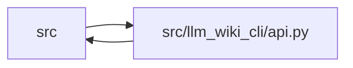

# api Module

**Path:** `src/llm_wiki_cli/api.py`

## Description

Provides the stable Python boundary for first-use generation, extraction,
context assembly, wiki discovery, health reporting, graph queries, and
documentation operations. Public wrappers validate arguments and translate
service failures into a small `LlmWikiApiError` hierarchy, allowing library
callers to depend on typed results rather than CLI namespaces or console text.

## Imports

| Source | Symbols |
|--------|---------|
| `.api_types` | `CalleesResult`, `CallersResult`, `ConceptResult`, `ConceptSectionsResult`, `ContextPayload`, `DataFlowForEntrypointResult`, `DependencyNeighborhoodResult`, `DocumentationExportResult`, `DoctorResult`, `EvidenceExplanationResult`, `ExtractSourceResult`, `FlowForEntrypointResult`, `MarkdownContextResult`, `PagesForSymbolResult`, `RelatedConceptsResult`, `TypedGraphTraversalResult`, `WikiPage`, `WikiPageCounts`, `WikiPagesResult` |
| `.config` | `DEFAULT_WIKI_DIR`, `PathValidationError`, `validate_path`, `validate_source_root` |
| `.services` | `bootstrap_runtime`, `context_service`, `extraction_service`, `context_packet`, `wiki_surface` |
| `.services.bootstrap_service` | `BootstrapContractError`, `BootstrapExtractionError`, `BootstrapRequestError`, `BootstrapRequest`, `BootstrapResult`, `BootstrapServiceError` |
| `.services.calibration` | `controller`, `host_broker`, `controller`, `host_broker`, `controller` |
| `.services.calibration.controller` | `P0CalibrationAgentPacket`, `P0CalibrationAgentResult`, `P0CalibrationDispatchReceipt`, `P0CalibrationError`, `P0CalibrationIntegrityError`, `P0CalibrationRecoveryError`, `P0CalibrationRun`, `P0CalibrationSchemaError`, `P0CalibrationStatus`, `P0CalibrationTransitionError`, `P0CalibrationVerificationReport` |
| `.services.calibration.host_broker` | `HostBrokerAuthenticationError`, `HostBrokerAuthenticationProof`, `HostBrokerAuthenticationUnavailable`, `HostBrokerAuthenticator`, `use_calibration_host_broker_authenticator` |
| `.services.contracts` | `BOOTSTRAP_SUMMARY_SCHEMA_VERSION`, `DOCUMENTATION_AGENT_PACKET_SCHEMA_VERSION`, `DOCUMENTATION_AGENT_RESULT_SCHEMA_VERSION`, `DOCUMENTATION_FINAL_REPORT_SCHEMA_VERSION`, `DOCUMENTATION_MODEL_ROUTING_SCHEMA_VERSION`, `DOCUMENTATION_MODEL_SELECTION_SCHEMA_VERSION`, `DOCUMENTATION_RUN_SCHEMA_VERSION`, `DOCUMENTATION_VERIFICATION_SCHEMA_VERSION`, `DOCTOR_SCHEMA_VERSION`, `EXTRACT_SCHEMA_VERSION`, `P0_CALIBRATION_AGENT_PACKET_SCHEMA_VERSION`, `P0_CALIBRATION_AGENT_RESULT_SCHEMA_VERSION`, `P0_CALIBRATION_DECISION_SCOPE`, `P0_CALIBRATION_DISPATCH_RECEIPT_SCHEMA_VERSION`, `P0_CALIBRATION_RUN_SCHEMA_VERSION`, `P0_CALIBRATION_VERIFICATION_REPORT_SCHEMA_VERSION`, `QUALIFIED_CONTEXT_PACKET_SCHEMA_VERSION` |
| `.services.dependencies` | `analyze_dependencies` |
| `.services.doctor_service` | `build_doctor_report` |
| `.services.documentation_model_policy` | `DocumentationModelEscalationRule`, `DocumentationModelOverride`, `DocumentationModelPolicyError`, `DocumentationModelRoute`, `DocumentationModelRoutingPolicy`, `DocumentationModelRoutingRequest`, `DocumentationModelSelection`, `select_documentation_model`, `validate_documentation_model_selection` |
| `.services.documentation_policy` | `DocumentationPolicyError` |
| `.services.documentation_queries` | `DocumentationGraphQueryService`, `DocumentationQueryError` |
| `.services.documentation_query_builder` | `build_live_documentation_query_service` |
| `.services.documentation_run` | `DocumentationAgentPacket`, `DocumentationAgentResult`, `DocumentationIntegrityError`, `DocumentationIntakeBrief`, `DocumentationRun`, `DocumentationRunError`, `DocumentationRunStatus`, `DocumentationSchemaError`, `DocumentationTransitionError`, `DocumentationVerificationReport`, `build_documentation_agent_packet`, `export_documentation_run`, `get_documentation_run_status`, `prepare_documentation_run`, `record_documentation_agent_result`, `verify_documentation_run` |
| `.services.documentation_wiki_input` | `DocumentationWikiInputError`, `DocumentationWikiSnapshot`, `adopt_documentation_wiki_snapshot`, `fingerprint_documentation_wiki_input` |
| `.services.entrypoints` | `build_flow` |
| `.services.knowledge_verification` | `attach_machine_verification_read_view`, `verification_summaries_for_concepts` |
| `.services.wiki_surface_index` | `evaluate_surface_index` |
| `__future__` | `annotations` |
| `collections.abc` | `Callable`, `Iterable`, `Iterator`, `Mapping`, `Sequence` |
| `contextlib` | `contextmanager` |
| `functools` | `wraps` |
| `inspect` | `inspect` |
| `pathlib` | `Path` |
| `typing` | `TYPE_CHECKING`, `Any`, `NoReturn`, `ParamSpec`, `TypeVar`, `cast` |
| `warnings` | `warnings` |

## Local dependency map

<!-- Auto-generated local dependency summary. Do not edit by hand. -->

> Module-level dependencies exceed the generated-diagram limits, so the diagram and table below group them by top-level package. Counts report the number of module neighbors in each package.

### Internal neighbors

| Direction | Module |
|---|---|
| Inbound | `src` (1) |
| Outbound | `src` (22) |

> All 23 module neighbor(s) are summarized by package because the module-level view exceeds the 12-node limit.

## Classes

| Class | Line | Bases | Description |
|-------|------|-------|-------------|
| [_LazyCalibrationAnnotations](../entities/LazyCalibrationAnnotations.md) | 223 | `dict[str, Any]` | Load calibration types only when an annotation consumer evaluates them. |
| [LlmWikiApiError](../entities/LlmWikiApiError.md) | 307 | `RuntimeError` | Base exception raised by the supported Python API. |
| [InvalidRequestError](../entities/InvalidRequestError.md) | 311 | `LlmWikiApiError` | Raised when arguments or a submitted request contract are invalid. |
| [WorkspaceStateError](../entities/WorkspaceStateError.md) | 315 | `LlmWikiApiError` | Raised when workspace state or an operational dependency is unusable. |
| [ArtifactIntegrityError](../entities/ArtifactIntegrityError.md) | 319 | `LlmWikiApiError` | Raised when persisted or supplied artifact integrity cannot be trusted. |

## Functions

| Function | Signature | Decorators | Description |
|----------|-----------|------------|-------------|
| `_load_calibration_type_exports` | `(names: frozenset[str]) -> None` | — | Populate explicitly requested calibration types for runtime introspection. |
| `_defer_calibration_annotations` | `(function: Callable[..., Any]) -> None` | — | Keep type hints lazy and resolvable across a public wrapper chain. |
| `__getattr__` | `(name: str) -> Any` | — | Resolve supported calibration types only when callers request them. |
| `__dir__` | `() -> list[str]` | — | Include lazy public types in module introspection. |
| `_caused_by` | `(exc: BaseException, expected: type[BaseException]) -> bool` | — | Return whether an explicitly chained cause has the requested type. |
| `_has_exception_origin` | `(exc: BaseException, module_names: frozenset[str]) -> bool` | — | Return whether one exception inherits from a named service module. |
| `_calibration_error_category` | `(exc: Exception) -> str \| None` | — | Classify calibration failures without importing calibration on core paths. |
| `_raise_api_error` | `(exc: Exception) -> NoReturn` | — | Translate one internal exception at the supported API boundary. |
| `_api_boundary` | `(function: Callable[_P, _R]) -> Callable[_P, _R]` | — | Wrap a synchronous public callable in the stable exception taxonomy. |
| `bootstrap_wiki` | `(source_root: str, wiki_root: str, *, depth: str = 'full', skip_workflows: bool = False, skip_flows: bool = False, skip_data_flow: bool = False, skip_dependencies: bool = False, api_contracts: bool = False, openapi_file: str \| None = None, dependency_graph_detail: str = 'auto', overwrite: bool = False, helper_cache_dir: str \| None = None, include_tests: list[str] \| None = None, trust_source_plugins: bool = False, source_selection: str \| Path \| None = None) -> BootstrapResult` | `@_api_boundary` | Build a first-use deterministic wiki through the typed service boundary. |
| `extract_source` | `(src_dir: str = '.', *, changed: bool = False, summary: bool = False, deep: bool = False, paths: list[str] \| None = None, package: str \| None = None, include_empty: bool = False, allow_external_src: bool = False, read_only: bool = True, source_selection: str \| Path \| None = None) -> ExtractSourceResult` | `@_api_boundary` | Return the stable ``llm-wiki extract`` JSON payload as a dict. |
| `build_context` | `(src_dir: str = '.', *, budget: int = 32000, format: str = 'json', focus: str \| list[str] = 'changed', filters: dict[str, Any] \| None = None, wiki_dir: str = DEFAULT_WIKI_DIR, prefer_fresh: bool = False, allow_external_src: bool = False, read_only: bool = True, source_selection: str \| Path \| None = None) -> ContextPayload \| MarkdownContextResult` | `@_api_boundary` | Return a supported context payload without depending on CLI internals. |
| `build_qualified_context` | `(src_dir: str = '.', wiki_dir: str = DEFAULT_WIKI_DIR, request: Mapping[str, Any] \| None = None, *, allow_external_src: bool = False, read_only: bool = True, source_selection: str \| Path \| None = None) -> QualifiedContextPacket` | `@_api_boundary` | Build a canonical in-memory qualified-context packet. |
| `validate_context_packet` | `(packet_bytes: bytes \| bytearray \| memoryview) -> ContextPacketValidation` | `@_api_boundary` | Validate canonical packet bytes without claiming live currentness. |
| `compare_context_packet_basis` | `(packet_bytes: bytes \| bytearray \| memoryview, expected_basis: Mapping[str, Any]) -> ContextBasisComparison` | `@_api_boundary` | Compare caller basis without upgrading it to a currentness claim. |
| `reconcile_context_packet` | `(packet_bytes: bytes \| bytearray \| memoryview, src_dir: str = '.', *, wiki_dir: str = DEFAULT_WIKI_DIR, allow_external_src: bool = False, read_only: bool = True, source_selection: str \| Path \| None = None) -> ContextPacketReconciliation` | `@_api_boundary` | Reconcile packet facets against one fresh official read. |
| `list_wiki_pages` | `(wiki_dir: str = DEFAULT_WIKI_DIR) -> WikiPagesResult` | `@_api_boundary` | Return registry-backed wiki page metadata without source extraction. |
| `doctor` | `(src_dir: str = '.', *, wiki_dir: str = DEFAULT_WIKI_DIR, strict: bool = False, allow_external_src: bool = False, source_selection: str \| Path \| None = None) -> DoctorResult` | `@_api_boundary` | Return the stable read-only knowledge health report. |
| `build_documentation_query_service` | `(src_dir: str = '.', *, wiki_dir: str = DEFAULT_WIKI_DIR, limit: int = 20, allow_external_src: bool = False, read_only: bool = True, source_selection: str \| Path \| None = None) -> DocumentationGraphQueryService` | `@_api_boundary` | Build a supported graph query service over derived documentation data. |
| `flow_for_entrypoint` | `(id_or_symbol: object, *, service: DocumentationGraphQueryService \| None = None, src_dir: str = '.', wiki_dir: str = DEFAULT_WIKI_DIR, limit: int = 20, allow_external_src: bool = False, read_only: bool = True, source_selection: str \| Path \| None = None) -> FlowForEntrypointResult` | `@_api_boundary` | Return a bounded user-flow query result for an entry point. |
| `data_flow_for_entrypoint` | `(id_or_symbol: object, *, service: DocumentationGraphQueryService \| None = None, src_dir: str = '.', wiki_dir: str = DEFAULT_WIKI_DIR, limit: int = 20, allow_external_src: bool = False, read_only: bool = True, source_selection: str \| Path \| None = None) -> DataFlowForEntrypointResult` | `@_api_boundary` | Return a bounded data-flow query result for an entry point. |
| `callers` | `(symbol: object, *, service: DocumentationGraphQueryService \| None = None, src_dir: str = '.', wiki_dir: str = DEFAULT_WIKI_DIR, limit: int = 20, allow_external_src: bool = False, read_only: bool = True, source_selection: str \| Path \| None = None) -> CallersResult` | `@_api_boundary` | Return bounded callers for one callable symbol. |
| `callees` | `(symbol: object, *, service: DocumentationGraphQueryService \| None = None, src_dir: str = '.', wiki_dir: str = DEFAULT_WIKI_DIR, limit: int = 20, allow_external_src: bool = False, read_only: bool = True, source_selection: str \| Path \| None = None) -> CalleesResult` | `@_api_boundary` | Return bounded callees for one callable symbol. |
| `dependency_neighborhood` | `(path: object, *, service: DocumentationGraphQueryService \| None = None, src_dir: str = '.', wiki_dir: str = DEFAULT_WIKI_DIR, limit: int = 20, allow_external_src: bool = False, read_only: bool = True, source_selection: str \| Path \| None = None) -> DependencyNeighborhoodResult` | `@_api_boundary` | Return bounded dependency neighbors for one source path. |
| `pages_for_symbol` | `(symbol: object, *, service: DocumentationGraphQueryService \| None = None, src_dir: str = '.', wiki_dir: str = DEFAULT_WIKI_DIR, limit: int = 20, allow_external_src: bool = False, read_only: bool = True, source_selection: str \| Path \| None = None) -> PagesForSymbolResult` | `@_api_boundary` | Return wiki surface pages related to one symbol. |
| `get_concept` | `(locator_or_exact_route: object, *, service: DocumentationGraphQueryService \| None = None, src_dir: str = '.', wiki_dir: str = DEFAULT_WIKI_DIR, limit: int = 20, allow_external_src: bool = False, read_only: bool = True, source_selection: str \| Path \| None = None) -> ConceptResult` | `@_api_boundary` | Return one concept by current coordinate, durable UID, or alias. |
| `list_concept_sections` | `(locator_or_exact_route: object, *, ownership: str \| None = None, service: DocumentationGraphQueryService \| None = None, src_dir: str = '.', wiki_dir: str = DEFAULT_WIKI_DIR, limit: int = 20, allow_external_src: bool = False, read_only: bool = True, source_selection: str \| Path \| None = None) -> ConceptSectionsResult` | `@_api_boundary` | Return bounded document-order sections for one exact concept. |
| `related_concepts` | `(locator_or_exact_route: object, *, direction: str = 'both', kinds: Iterable[str] \| None = None, service: DocumentationGraphQueryService \| None = None, src_dir: str = '.', wiki_dir: str = DEFAULT_WIKI_DIR, limit: int = 20, allow_external_src: bool = False, read_only: bool = True, source_selection: str \| Path \| None = None) -> RelatedConceptsResult` | `@_api_boundary` | Return bounded knowledge relationships for one exact concept identity. |
| `traverse_typed_graph` | `(locator_or_exact_route: object, *, direction: str = 'both', kinds: Iterable[str] \| None = None, origins: Iterable[str] \| None = None, resolutions: Iterable[str] \| None = None, include_evidence: bool = False, service: DocumentationGraphQueryService \| None = None, src_dir: str = '.', wiki_dir: str = DEFAULT_WIKI_DIR, limit: int = 20, allow_external_src: bool = False, read_only: bool = True, source_selection: str \| Path \| None = None) -> TypedGraphTraversalResult` | `@_api_boundary` | Traverse persisted typed relationships for one exact concept. |
| `explain_evidence` | `(locator_or_exact_route: object, *, service: DocumentationGraphQueryService \| None = None, src_dir: str = '.', wiki_dir: str = DEFAULT_WIKI_DIR, limit: int = 20, allow_external_src: bool = False, read_only: bool = True, source_selection: str \| Path \| None = None) -> EvidenceExplanationResult` | `@_api_boundary` | Return stored and computed evidence for one exact concept identity. |
| `_normalise_focus` | `(focus: str \| list[str]) -> list[str]` | — | — |
| `_validate_wiki_dir` | `(wiki_dir: str) -> Path` | — | — |
| `_display_path` | `(path: Path) -> str` | — | — |
| `_wiki_page_payload` | `(page: wiki_surface.WikiSurfacePage) -> WikiPage` | — | — |
| `_wiki_page_counts` | `(pages: list[WikiPage]) -> WikiPageCounts` | — | — |
| `_query_service` | `(service: DocumentationGraphQueryService \| None, *, src_dir: str, wiki_dir: str, limit: int, allow_external_src: bool, read_only: bool, source_selection: str \| Path \| None) -> DocumentationGraphQueryService` | — | — |
| `_run_query` | `(callback: Callable[[], dict[str, Any]]) -> dict[str, Any]` | — | — |
| `export_documentation_run` | `(workspace: str \| Path, *, build: bool = False, builder_command: Iterable[str] \| None = None, knowledge_mode: str \| None = None, knowledge_public_repository_identity: str \| None = None) -> DocumentationExportResult` | `@_api_boundary` | Export a documentation workspace through the stable API boundary. |
| `_call_calibration_controller` | `(name: str, *args: Any, **kwargs: Any) -> Any` | — | Call one isolated calibration operation after an explicit API request. |
| `prepare_calibration_run` | `(root: str \| Path, *, control_workspaces: Sequence[str \| Path], execution_manifest: Mapping[str, Any]) -> P0CalibrationRun` | `@_api_boundary` | Freeze two matching documentation controls into a fresh cohort. |
| `admit_calibration_run` | `(root: str \| Path, *, authority_grant: Mapping[str, Any], broker_attestation: Mapping[str, Any] \| None = None) -> P0CalibrationRun` | `@_api_boundary` | Authorize one frozen calibration cohort. |
| `get_calibration_run_status` | `(root: str \| Path) -> P0CalibrationStatus` | `@_api_boundary` | Return verified calibration status without advancing the lifecycle. |
| `build_calibration_agent_packet` | `(root: str \| Path, *, role: str) -> P0CalibrationAgentPacket` | `@_api_boundary` | Build one bounded calibration role packet. |
| `dispatch_calibration_agent` | `(root: str \| Path, *, role: str) -> P0CalibrationDispatchReceipt` | `@_api_boundary` | Dispatch one issued calibration packet. |
| `record_calibration_agent_result` | `(root: str \| Path, *, dispatch_receipt: P0CalibrationDispatchReceipt \| Mapping[str, Any], result: P0CalibrationAgentResult \| Mapping[str, Any]) -> P0CalibrationRun` | `@_api_boundary` | Import one authenticated calibration result. |
| `verify_calibration_run` | `(root: str \| Path, *, advance: bool = True) -> P0CalibrationVerificationReport` | `@_api_boundary` | Recompute calibration gates and optionally advance the lifecycle. |
| `use_calibration_host_broker_authenticator` | `(authenticator: HostBrokerAuthenticator) -> Iterator[None]` | `@contextmanager` | Scope a host authenticator while preserving caller-block exceptions. |
| `_deprecated_api_alias` | `(replacement: Callable[..., Any], *, legacy_name: str, replacement_name: str) -> Callable[..., Any]` | — | — |