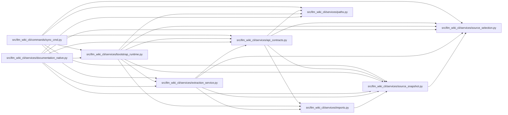

# api_contracts Module

**Path:** `src/llm_wiki_cli/services/api_contracts.py`

## Description

Static FastAPI and exported OpenAPI contract assembly.

The service consumes syntax-only inventory.  It never imports a target
application and never resolves remote OpenAPI references.

## Imports

| Source | Symbols |
|--------|---------|
| `.imports` | `build_module_path_resolver` |
| `.paths` | `is_test_source_path` |
| `.source_selection` | `SourceSelectionError`, `path_is_link_or_reparse`, `path_is_selected` |
| `.source_snapshot` | `SourceSnapshot` |
| `__future__` | `annotations` |
| `collections` | `defaultdict` |
| `collections.abc` | `Mapping`, `Sequence` |
| `hashlib` | `hashlib` |
| `json` | `json` |
| `os` | `os` |
| `pathlib` | `Path` |
| `re` | `re` |
| `typing` | `Any` |
| `yaml` | `yaml` |

## Local dependency map

<!-- Auto-generated local dependency summary. Do not edit by hand. -->

### Internal neighbors

| Direction | Module |
|---|---|
| Inbound | [sync_cmd](../modules/sync_cmd.md) |
| Inbound | [bootstrap_runtime](../modules/bootstrap_runtime.md) |
| Inbound | [documentation_native](../modules/documentation_native.md) |
| Inbound | [extraction_service](../modules/extraction_service.md) |
| Outbound | [imports](../modules/imports.md) |
| Outbound | [paths](../modules/paths.md) |
| Outbound | [source_selection](../modules/source_selection.md) |
| Outbound | [source_snapshot](../modules/source_snapshot.md) |

### External packages

| Language | Used packages | Undeclared packages |
|---|---:|---:|
| python | 1 | 0 |

## Classes

| Class | Line | Bases | Description |
|-------|------|-------|-------------|
| [ApiContractError](../entities/ApiContractError.md) | 72 | `ValueError` | Raised when an API-contract input cannot be consumed safely. |

## Functions

| Function | Signature | Decorators | Description |
|----------|-----------|------------|-------------|
| `_diagnostic` | `(code: str, message: str, *, severity: str = 'warning', **context: Any) -> dict[str, Any]` | — | — |
| `_record_value` | `(record: Any, *, allow_references: bool = False) -> Any` | — | — |
| `_display_call` | `(record: Mapping[str, Any]) -> str` | — | — |
| `_display_value` | `(value: Any) -> str` | — | — |
| `_kwargs` | `(record: Mapping[str, Any]) -> Mapping[str, Any]` | — | — |
| `_kw_value` | `(record: Mapping[str, Any], name: str, default: Any = None, *, allow_references: bool = False) -> Any` | — | — |
| `_first_arg` | `(record: Mapping[str, Any], *, allow_references: bool = False) -> Any` | — | — |
| `_kw_unknown` | `(record: Mapping[str, Any], name: str, *, allow_references: bool = False) -> bool` | — | — |
| `_join_paths` | `(*parts: Any) -> str \| None` | — | — |
| `_node_key` | `(filepath: str, scope: str, binding: str) -> tuple[str, str, str]` | — | — |
| `_framework_records` | `(inventory: Mapping[str, Mapping[str, Any]])` | — | — |
| `_declaration_nodes` | `(inventory: Mapping[str, Mapping[str, Any]])` | — | — |
| `_canonical_node_key` | `(key: tuple[str, str, str], nodes: Mapping[tuple[str, str, str], Mapping[str, Any]]) -> tuple[str, str, str]` | — | — |
| `_import_bindings` | `(file_data: Mapping[str, Any]) -> dict[str, tuple[str, str \| None]]` | — | — |
| `_canonical_imported_reference` | `(value: Any, file_data: Mapping[str, Any]) -> Any` | — | — |
| `_candidate_scopes` | `(scope: str) -> list[str]` | — | — |
| `_resolve_binding` | `(ref: str, *, filepath: str, scope: str, nodes: Mapping[tuple[str, str, str], Mapping[str, Any]], inventory: Mapping[str, Mapping[str, Any]], resolver: Any) -> tuple[str, str, str] \| None` | — | — |
| `_router_prefix` | `(record: Mapping[str, Any]) -> str \| None` | — | — |
| `_tags` | `(record: Mapping[str, Any]) -> tuple[list[str], bool]` | — | — |
| `_operation_methods` | `(record: Mapping[str, Any]) -> tuple[list[str], bool]` | — | — |
| `_status_code` | `(value: Any) -> int \| str \| None` | — | — |
| `_leaf_type` | `(annotation: str) -> str` | — | — |
| `_parameter_default` | `(marker: Mapping[str, Any] \| None) -> tuple[bool, bool, Any, bool]` | — | Return required, has-default, value, and unresolved-default state. |
| `_normalize_parameters` | `(record: Mapping[str, Any], route_path: str \| None) -> tuple[list[dict[str, Any]], dict[str, Any] \| None, list[dict[str, Any]]]` | — | — |
| `_response_media_type` | `(response_class: Any) -> str` | — | — |
| `_additional_responses` | `(record: Mapping[str, Any], file_data: Mapping[str, Any] \| None = None) -> tuple[list[dict[str, Any]], bool]` | — | — |
| `_merge_responses` | `(*groups: Sequence[Mapping[str, Any]]) -> list[dict[str, Any]]` | — | — |
| `_operation_responses` | `(record: Mapping[str, Any], inherited_response_class: Any, inherited_responses: Sequence[Mapping[str, Any]], file_data: Mapping[str, Any]) -> tuple[list[dict[str, Any]], list[dict[str, Any]]]` | — | — |
| `_operation_id` | `(method: str, path: str, index: int) -> str` | — | — |
| `build_static_api_contracts` | `(inventory: Mapping[str, Mapping[str, Any]]) -> dict[str, Any]` | — | Assemble production FastAPI operations from syntax-only inventory. |
| `_resolve_openapi_path` | `(path: str \| Path, source_root: str \| Path, *, source_snapshot: SourceSnapshot \| None = None) -> tuple[Path, str]` | — | — |
| `_path_contains_link_or_reparse` | `(root: Path, relative: str) -> bool` | — | — |
| `load_openapi_document` | `(path: str \| Path, *, source_root: str \| Path = '.', source_snapshot: SourceSnapshot \| None = None) -> dict[str, Any]` | — | Load and validate a source-contained OpenAPI JSON/YAML document. |
| `_json_pointer` | `(document: Mapping[str, Any], ref: str) -> Any` | — | — |
| `_dereference` | `(value: Any, document: Mapping[str, Any], diagnostics: list[dict[str, Any]], *, context: str) -> Any` | — | — |
| `_schema_name` | `(schema: Any, document: Mapping[str, Any], diagnostics: list[dict[str, Any]], *, context: str) -> str \| None` | — | — |
| `_schema_nullable` | `(schema: Any) -> bool` | — | — |
| `_openapi_parameter` | `(raw: Any, document: Mapping[str, Any], diagnostics: list[dict[str, Any]], context: str) -> dict[str, Any] \| None` | — | — |
| `_openapi_request_body` | `(raw: Any, document: Mapping[str, Any], diagnostics: list[dict[str, Any]], context: str) -> dict[str, Any] \| None` | — | — |
| `_openapi_responses` | `(raw: Any, document: Mapping[str, Any], diagnostics: list[dict[str, Any]], context: str) -> list[dict[str, Any]]` | — | — |
| `_openapi_operations` | `(loaded: Mapping[str, Any]) -> tuple[list[dict[str, Any]], list[dict[str, Any]]]` | — | — |
| `_parameter_contract` | `(operation: Mapping[str, Any]) -> set[tuple[Any, ...]]` | — | — |
| `_response_keys` | `(operation: Mapping[str, Any]) -> set[str]` | — | — |
| `_canonical_schema_token` | `(value: Any) -> str` | — | — |
| `_schema_contract` | `(operation: Mapping[str, Any]) -> tuple[Any, ...]` | — | — |
| `_content_type_contract` | `(operation: Mapping[str, Any]) -> tuple[Any, ...]` | — | — |
| `_attach_static_parameter_names` | `(openapi_operation: dict[str, Any], static_operation: Mapping[str, Any]) -> None` | — | — |
| `_reconcile_openapi` | `(static: Mapping[str, Any], loaded: Mapping[str, Any]) -> dict[str, Any]` | — | — |
| `build_api_contracts` | `(inventory: Mapping[str, Mapping[str, Any]], *, openapi_file: str \| Path \| None = None, source_root: str \| Path = '.', source_snapshot: SourceSnapshot \| None = None) -> dict[str, Any]` | — | Build static contracts or reconcile them with authoritative OpenAPI. |
| `attach_routes_to_entry_points` | `(entry_points: Sequence[Mapping[str, Any]], contracts: Mapping[str, Any]) -> list[dict[str, Any]]` | — | Keep one HTTP flow per handler while attaching all resolved routes. |
| `_md_text` | `(value: Any) -> str` | — | — |
| `_md_code` | `(value: Any) -> str` | — | — |
| `_operation_anchor` | `(operation: Mapping[str, Any]) -> str` | — | — |
| `_entity_link` | `(name: Any, entity_page_map: Mapping[Any, str] \| None) -> str` | — | — |
| `_handler_link` | `(handler: Any, module_page_map: Mapping[str, str] \| None) -> str` | — | — |
| `render_api_contracts_markdown` | `(contracts: Mapping[str, Any], *, module_page_map: Mapping[str, str] \| None = None, entity_page_map: Mapping[Any, str] \| None = None) -> str` | — | Render the canonical mixed ``api-contracts.md`` surface. |
| `render_flow_api_contract_section` | `(operations: Sequence[Mapping[str, Any]]) -> str` | — | Render a concise generated section for one handler flow. |
