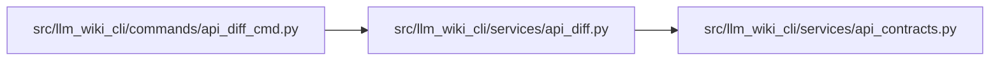

# api_diff Module

**Path:** `src/llm_wiki_cli/services/api_diff.py`

## Description

Compares supplied OpenAPI exports using the existing authoritative normalizer.
The narrow gate identifies proven breaking changes to operations, success
responses, and required request inputs. Malformed or unresolved evidence retains
an operation-scoped unknown verdict; read-only request fields and schema keywords
that cannot apply to the declared type do not become new required inputs.
Nested reference diagnostics retain their actual owning operation, including
when another route resembles a diagnostic suffix. Inherited parameters that
collide on the same wire identity remain advisory.

## Imports

| Source | Symbols |
|--------|---------|
| `.api_contracts` | `ApiContractError`, `_dereference`, `_openapi_operations`, `load_openapi_document` |
| `__future__` | `annotations` |
| `collections` | `Counter` |
| `collections.abc` | `Mapping` |
| `hashlib` | `hashlib` |
| `html` | `html` |
| `json` | `json` |
| `re` | `re` |

## Local dependency map

<!-- Auto-generated local dependency summary. Do not edit by hand. -->

### Internal neighbors

| Direction | Module |
|---|---|
| Inbound | [api_diff_cmd](../modules/api_diff_cmd.md) |
| Outbound | [api_contracts](../modules/api_contracts.md) |

## Functions

| Function | Signature | Decorators | Description |
|----------|-----------|------------|-------------|
| `_hash` | `(value)` | — | — |
| `_route` | `(path)` | — | — |
| `_key` | `(operation)` | — | — |
| `_wire_key` | `(parameter, path)` | — | — |
| `_requirements` | `(schema, document, *, prefix = '', seen = (), depth = 0)` | — | Only plain object/array schemas; composition and recursion stay unknown. |
| `_raw_operation` | `(loaded, operation)` | — | — |
| `_body_requirements` | `(loaded, operation)` | — | — |
| `_normalization_diagnostics` | `(loaded, diagnostics)` | — | Keep malformed evidence that the inventory normalizer omits or coerces. |
| `compare_exports` | `(baseline, candidate)` | — | Compare already loaded exports, reusing the authoritative normalizer. |
| `compare_openapi` | `(baseline, candidate, *, source_root = '.')` | — | — |
| `render_markdown` | `(report)` | — | — |