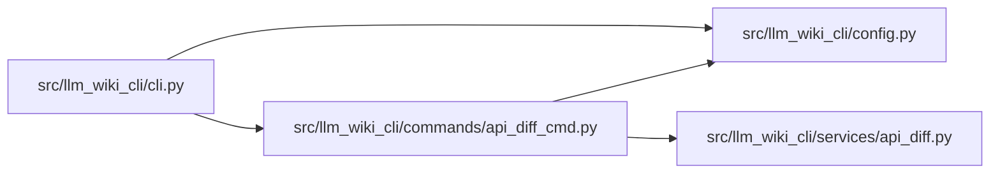

# api_diff_cmd Module

**Path:** `src/llm_wiki_cli/commands/api_diff_cmd.py`

## Description

Compare supplied local OpenAPI exports without invoking target code.

## Imports

| Source | Symbols |
|--------|---------|
| `..config` | `validate_source_root` |
| `..services.api_diff` | `compare_openapi`, `render_markdown` |
| `json` | `json` |

## Local dependency map

<!-- Auto-generated local dependency summary. Do not edit by hand. -->

### Internal neighbors

| Direction | Module |
|---|---|
| Inbound | [cli](../modules/cli.md) |
| Outbound | [config](../modules/config.md) |
| Outbound | [api_diff](../modules/api_diff.md) |

## Functions

| Function | Signature | Decorators | Description |
|----------|-----------|------------|-------------|
| `run` | `(args)` | — | — |
