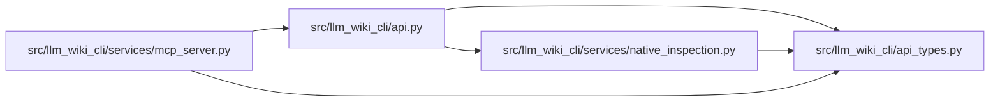

# api_types Module

**Path:** `src/llm_wiki_cli/api_types.py`

## Description

Static return contracts for the supported Python API.

These types describe the stable top-level response fields.  Nested extractor,
context, graph, and lifecycle records remain versioned wire payloads and are
therefore represented as ``Any`` where their shape belongs to another
contract.

## Imports

| Source | Symbols |
|--------|---------|
| `__future__` | `annotations` |
| `typing` | `Any`, `Literal`, `TypedDict` |

## Local dependency map

<!-- Auto-generated local dependency summary. Do not edit by hand. -->

### Internal neighbors

| Direction | Module |
|---|---|
| Inbound | [api](../modules/api.md) |
| Inbound | [mcp_server](../modules/mcp_server.md) |
| Inbound | [native_inspection](../modules/native_inspection.md) |

## Classes

| Class | Kind | Line | Bases / Target | Description |
|-------|------|------|----------------|-------------|
| [KnowledgeMode](../entities/KnowledgeMode.md) | Type alias | 14 | `Literal['off', 'auto', 'required']` | — |
| [TaskAnchor](../entities/TaskAnchor.md) | Class | 17 | `TypedDict` | — |
| [_RequirementOptions](../entities/RequirementOptions.md) | Class | 22 | `TypedDict` | — |
| [EvidenceRequirement](../entities/EvidenceRequirement.md) | Class | 26 | `_RequirementOptions` | — |
| [TaskStorageOptions](../entities/TaskStorageOptions.md) | Class | 33 | `TypedDict` | Optional selection and proof layout for task request v2. |
| [_TaskOptions](../entities/TaskOptions.md) | Class | 40 | `TypedDict` | — |
| [TaskContextRequest](../entities/TaskContextRequest.md) | Class | 51 | `_TaskOptions` | — |
| [_SearchMatchRanking](../entities/SearchMatchRanking.md) | Class | 55 | `TypedDict` | — |
| [SearchMatch](../entities/SearchMatch.md) | Class | 61 | `_SearchMatchRanking` | — |
| [_SearchMetadata](../entities/SearchMetadata.md) | Class | 70 | `TypedDict` | — |
| [SearchResult](../entities/SearchResult.md) | Class | 77 | `_SearchMetadata` | — |
| [MaintenanceQueueResult](../entities/MaintenanceQueueResult.md) | Class | 88 | `TypedDict` | — |
| [KnowledgeCoverageCounts](../entities/KnowledgeCoverageCounts.md) | Class | 102 | `TypedDict` | — |
| [KnowledgeCoverageResult](../entities/KnowledgeCoverageResult.md) | Class | 110 | `TypedDict` | Versioned aggregate diagnostics without identities or raw evidence. |
| [ResultBounds](../entities/ResultBounds.md) | Class | 123 | `TypedDict` | Exact size disclosure for one bounded result collection. |
| [ByteResultBounds](../entities/ByteResultBounds.md) | Class | 131 | `ResultBounds` | Serialized-byte bound with its independent hard limit. |
| [KnowledgeStatus](../entities/KnowledgeStatus.md) | Class | 137 | `TypedDict` | Compact availability and freshness status shared by query adapters. |
| [ContextKnowledgeSelection](../entities/ContextKnowledgeSelection.md) | Class | 146 | `TypedDict` | Bounded inert content selected by explicit knowledge mode. |
| [_ContextKnowledgeRequired](../entities/ContextKnowledgeRequired.md) | Class | 155 | `TypedDict` | — |
| [ContextKnowledgeResult](../entities/ContextKnowledgeResult.md) | Class | 166 | `_ContextKnowledgeRequired` | Canonical explicit-mode knowledge outcome. |
| [RankingPolicy](../entities/RankingPolicy.md) | Class | 172 | `TypedDict` | Disclosure for optional current-first budget ranking. |
| [RequiredKnowledgeErrorDetails](../entities/RequiredKnowledgeErrorDetails.md) | Class | 183 | `TypedDict` | Stable details attached to required-mode interface failures. |
| [_ExtractSourceRequired](../entities/ExtractSourceRequired.md) | Class | 196 | `TypedDict` | — |
| [ExtractSourceResult](../entities/ExtractSourceResult.md) | Class | 202 | `_ExtractSourceRequired` | Top-level ``extract_source`` payload. |
| [_ContextRequired](../entities/ContextRequired.md) | Class | 214 | `TypedDict` | — |
| [ContextPayload](../entities/ContextPayload.md) | Class | 224 | `_ContextRequired` | Top-level JSON context payload. |
| [MarkdownContextResult](../entities/MarkdownContextResult.md) | Class | 235 | `TypedDict` | Markdown rendering plus its source context payload. |
| [WikiPage](../entities/api_types_WikiPage.md) | Class | 243 | `TypedDict` | One registry-backed wiki page. |
| [WikiPageCounts](../entities/WikiPageCounts.md) | Class | 255 | `TypedDict` | Counts returned with a wiki-page listing. |
| [WikiPagesResult](../entities/WikiPagesResult.md) | Class | 263 | `TypedDict` | Top-level ``list_wiki_pages`` payload. |
| [_BoundedQueryResult](../entities/BoundedQueryResult.md) | Class | 271 | `TypedDict` | Fields shared by bounded documentation graph queries. |
| [FlowForEntrypointResult](../entities/FlowForEntrypointResult.md) | Class | 282 | `_BoundedQueryResult` | — |
| [DataFlowForEntrypointResult](../entities/DataFlowForEntrypointResult.md) | Class | 286 | `_BoundedQueryResult` | — |
| [CallersResult](../entities/CallersResult.md) | Class | 290 | `_BoundedQueryResult` | — |
| [CalleesResult](../entities/CalleesResult.md) | Class | 295 | `_BoundedQueryResult` | — |
| [DependencyNeighborhoodResult](../entities/DependencyNeighborhoodResult.md) | Class | 300 | `_BoundedQueryResult` | — |
| [PagesForSymbolResult](../entities/PagesForSymbolResult.md) | Class | 310 | `_BoundedQueryResult` | — |
| [ConceptResult](../entities/ConceptResult.md) | Class | 315 | `_BoundedQueryResult` | — |
| [ConceptSectionsResult](../entities/ConceptSectionsResult.md) | Class | 322 | `ConceptResult` | — |
| [RelatedConceptsResult](../entities/RelatedConceptsResult.md) | Class | 328 | `ConceptResult` | — |
| [TypedGraphTraversalResult](../entities/TypedGraphTraversalResult.md) | Class | 337 | `ConceptResult` | — |
| [EvidenceExplanationResult](../entities/EvidenceExplanationResult.md) | Class | 347 | `ConceptResult` | — |
| [QueryCostDisclosure](../entities/QueryCostDisclosure.md) | Class | 351 | `TypedDict` | Deterministic disclosure of work selected for a query. |
| [_DocumentationQueryRequired](../entities/DocumentationQueryRequired.md) | Class | 363 | `TypedDict` | — |
| [DocumentationQueryResult](../entities/DocumentationQueryResult.md) | Class | 375 | `_DocumentationQueryRequired` | Common envelope returned by the shared bounded query dispatcher. |
| [DocumentationExportResult](../entities/DocumentationExportResult.md) | Class | 411 | `TypedDict` | Top-level documentation export and verification report. |
| [DoctorAvailability](../entities/DoctorAvailability.md) | Class | 435 | `TypedDict` | — |
| [DoctorFreshness](../entities/DoctorFreshness.md) | Class | 441 | `TypedDict` | — |
| [DoctorSnapshotParity](../entities/DoctorSnapshotParity.md) | Class | 448 | `TypedDict` | — |
| [DoctorGovernance](../entities/DoctorGovernance.md) | Class | 454 | `TypedDict` | — |
| [DoctorDrift](../entities/DoctorDrift.md) | Class | 463 | `TypedDict` | — |
| [DoctorVerificationReceipt](../entities/DoctorVerificationReceipt.md) | Class | 473 | `TypedDict` | — |
| [DoctorResult](../entities/DoctorResult.md) | Class | 480 | `TypedDict` | Stable ``llm-wiki-doctor/v1`` Python API payload. |
| [HealthSelection](../entities/HealthSelection.md) | Class | 499 | `TypedDict` | — |
| [HealthScope](../entities/HealthScope.md) | Class | 505 | `TypedDict` | — |
| [HealthEvaluation](../entities/HealthEvaluation.md) | Class | 511 | `TypedDict` | — |
| [HealthSnapshot](../entities/HealthSnapshot.md) | Class | 516 | `TypedDict` | — |
| [HealthComponent](../entities/HealthComponent.md) | Class | 526 | `TypedDict` | — |
| [HealthProducer](../entities/HealthProducer.md) | Class | 533 | `TypedDict` | — |
| [HealthComparisonBasis](../entities/HealthComparisonBasis.md) | Class | 541 | `TypedDict` | — |
| [HealthCoverage](../entities/HealthCoverage.md) | Class | 548 | `TypedDict` | — |
| [HealthReason](../entities/HealthReason.md) | Class | 558 | `TypedDict` | — |
| [HealthDetails](../entities/HealthDetails.md) | Class | 565 | `TypedDict` | — |
| [DoctorV3Result](../entities/DoctorV3Result.md) | Class | 575 | `DoctorResult` | Opt-in health report with captured coverage and comparison evidence. |
| [NativeInspectionResult](../entities/NativeInspectionResult.md) | Class | 581 | `TypedDict` | Bounded component results sharing one source/wiki read scope. |
