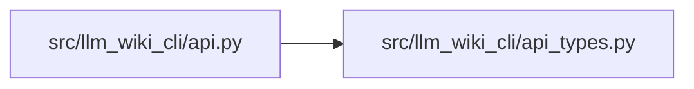

# api_types Module

**Path:** `src/llm_wiki_cli/api_types.py`

## Description

Static return contracts for the supported Python API.

These types describe the stable top-level response fields.  Nested extractor,
context, graph, and lifecycle records remain versioned wire payloads and are
therefore represented as ``Any`` where their shape belongs to another
contract.

## Imports

| Source | Symbols |
|--------|---------|
| `__future__` | `annotations` |
| `typing` | `Any`, `TypedDict` |

## Local dependency map

<!-- Auto-generated local dependency summary. Do not edit by hand. -->

### Internal neighbors

| Direction | Module |
|---|---|
| Inbound | [api](../modules/api.md) |

## Classes

| Class | Line | Bases | Description |
|-------|------|-------|-------------|
| [_ExtractSourceRequired](../entities/ExtractSourceRequired.md) | 14 | `TypedDict` | — |
| [ExtractSourceResult](../entities/ExtractSourceResult.md) | 20 | `_ExtractSourceRequired` | Top-level ``extract_source`` payload. |
| [_ContextRequired](../entities/ContextRequired.md) | 32 | `TypedDict` | — |
| [ContextPayload](../entities/ContextPayload.md) | 42 | `_ContextRequired` | Top-level JSON context payload. |
| [MarkdownContextResult](../entities/MarkdownContextResult.md) | 53 | `TypedDict` | Markdown rendering plus its source context payload. |
| [WikiPage](../entities/api_types_WikiPage.md) | 61 | `TypedDict` | One registry-backed wiki page. |
| [WikiPageCounts](../entities/WikiPageCounts.md) | 73 | `TypedDict` | Counts returned with a wiki-page listing. |
| [WikiPagesResult](../entities/WikiPagesResult.md) | 81 | `TypedDict` | Top-level ``list_wiki_pages`` payload. |
| [_BoundedQueryResult](../entities/BoundedQueryResult.md) | 89 | `TypedDict` | Fields shared by bounded documentation graph queries. |
| [FlowForEntrypointResult](../entities/FlowForEntrypointResult.md) | 100 | `_BoundedQueryResult` | — |
| [DataFlowForEntrypointResult](../entities/DataFlowForEntrypointResult.md) | 104 | `_BoundedQueryResult` | — |
| [CallersResult](../entities/CallersResult.md) | 108 | `_BoundedQueryResult` | — |
| [CalleesResult](../entities/CalleesResult.md) | 113 | `_BoundedQueryResult` | — |
| [DependencyNeighborhoodResult](../entities/DependencyNeighborhoodResult.md) | 118 | `_BoundedQueryResult` | — |
| [PagesForSymbolResult](../entities/PagesForSymbolResult.md) | 128 | `_BoundedQueryResult` | — |
| [ConceptResult](../entities/ConceptResult.md) | 133 | `_BoundedQueryResult` | — |
| [ConceptSectionsResult](../entities/ConceptSectionsResult.md) | 140 | `ConceptResult` | — |
| [RelatedConceptsResult](../entities/RelatedConceptsResult.md) | 146 | `ConceptResult` | — |
| [TypedGraphTraversalResult](../entities/TypedGraphTraversalResult.md) | 155 | `ConceptResult` | — |
| [EvidenceExplanationResult](../entities/EvidenceExplanationResult.md) | 165 | `ConceptResult` | — |
| [DocumentationExportResult](../entities/DocumentationExportResult.md) | 169 | `TypedDict` | Top-level documentation export and verification report. |
| [DoctorAvailability](../entities/DoctorAvailability.md) | 193 | `TypedDict` | — |
| [DoctorFreshness](../entities/DoctorFreshness.md) | 199 | `TypedDict` | — |
| [DoctorSnapshotParity](../entities/DoctorSnapshotParity.md) | 206 | `TypedDict` | — |
| [DoctorGovernance](../entities/DoctorGovernance.md) | 212 | `TypedDict` | — |
| [DoctorDrift](../entities/DoctorDrift.md) | 221 | `TypedDict` | — |
| [DoctorVerificationReceipt](../entities/DoctorVerificationReceipt.md) | 231 | `TypedDict` | — |
| [DoctorResult](../entities/DoctorResult.md) | 238 | `TypedDict` | Stable ``llm-wiki-doctor/v1`` Python API payload. |
