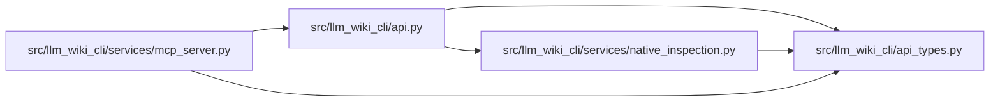

# api_types Module

**Path:** `src/llm_wiki_cli/api_types.py`

## Description

Static return contracts for the supported Python API.

These types describe the stable top-level response fields.  Nested extractor,
context, graph, and lifecycle records remain versioned wire payloads and are
therefore represented as ``Any`` where their shape belongs to another
contract.

## Imports

| Source | Symbols |
|--------|---------|
| `__future__` | `annotations` |
| `typing` | `Any`, `Literal`, `TypedDict` |

## Local dependency map

<!-- Auto-generated local dependency summary. Do not edit by hand. -->

### Internal neighbors

| Direction | Module |
|---|---|
| Inbound | [api](../modules/api.md) |
| Inbound | [mcp_server](../modules/mcp_server.md) |
| Inbound | [native_inspection](../modules/native_inspection.md) |

## Classes

| Class | Kind | Line | Bases / Target | Description |
|-------|------|------|----------------|-------------|
| [KnowledgeMode](../entities/KnowledgeMode.md) | Type alias | 14 | `Literal['off', 'auto', 'required']` | — |
| [KnowledgeCoverageCounts](../entities/KnowledgeCoverageCounts.md) | Class | 17 | `TypedDict` | — |
| [KnowledgeCoverageResult](../entities/KnowledgeCoverageResult.md) | Class | 25 | `TypedDict` | Versioned aggregate diagnostics without identities or raw evidence. |
| [ResultBounds](../entities/ResultBounds.md) | Class | 38 | `TypedDict` | Exact size disclosure for one bounded result collection. |
| [ByteResultBounds](../entities/ByteResultBounds.md) | Class | 46 | `ResultBounds` | Serialized-byte bound with its independent hard limit. |
| [KnowledgeStatus](../entities/KnowledgeStatus.md) | Class | 52 | `TypedDict` | Compact availability and freshness status shared by query adapters. |
| [ContextKnowledgeSelection](../entities/ContextKnowledgeSelection.md) | Class | 61 | `TypedDict` | Bounded inert content selected by explicit knowledge mode. |
| [_ContextKnowledgeRequired](../entities/ContextKnowledgeRequired.md) | Class | 70 | `TypedDict` | — |
| [ContextKnowledgeResult](../entities/ContextKnowledgeResult.md) | Class | 81 | `_ContextKnowledgeRequired` | Canonical explicit-mode knowledge outcome. |
| [RankingPolicy](../entities/RankingPolicy.md) | Class | 87 | `TypedDict` | Disclosure for optional current-first budget ranking. |
| [RequiredKnowledgeErrorDetails](../entities/RequiredKnowledgeErrorDetails.md) | Class | 98 | `TypedDict` | Stable details attached to required-mode interface failures. |
| [_ExtractSourceRequired](../entities/ExtractSourceRequired.md) | Class | 111 | `TypedDict` | — |
| [ExtractSourceResult](../entities/ExtractSourceResult.md) | Class | 117 | `_ExtractSourceRequired` | Top-level ``extract_source`` payload. |
| [_ContextRequired](../entities/ContextRequired.md) | Class | 129 | `TypedDict` | — |
| [ContextPayload](../entities/ContextPayload.md) | Class | 139 | `_ContextRequired` | Top-level JSON context payload. |
| [MarkdownContextResult](../entities/MarkdownContextResult.md) | Class | 150 | `TypedDict` | Markdown rendering plus its source context payload. |
| [WikiPage](../entities/api_types_WikiPage.md) | Class | 158 | `TypedDict` | One registry-backed wiki page. |
| [WikiPageCounts](../entities/WikiPageCounts.md) | Class | 170 | `TypedDict` | Counts returned with a wiki-page listing. |
| [WikiPagesResult](../entities/WikiPagesResult.md) | Class | 178 | `TypedDict` | Top-level ``list_wiki_pages`` payload. |
| [_BoundedQueryResult](../entities/BoundedQueryResult.md) | Class | 186 | `TypedDict` | Fields shared by bounded documentation graph queries. |
| [FlowForEntrypointResult](../entities/FlowForEntrypointResult.md) | Class | 197 | `_BoundedQueryResult` | — |
| [DataFlowForEntrypointResult](../entities/DataFlowForEntrypointResult.md) | Class | 201 | `_BoundedQueryResult` | — |
| [CallersResult](../entities/CallersResult.md) | Class | 205 | `_BoundedQueryResult` | — |
| [CalleesResult](../entities/CalleesResult.md) | Class | 210 | `_BoundedQueryResult` | — |
| [DependencyNeighborhoodResult](../entities/DependencyNeighborhoodResult.md) | Class | 215 | `_BoundedQueryResult` | — |
| [PagesForSymbolResult](../entities/PagesForSymbolResult.md) | Class | 225 | `_BoundedQueryResult` | — |
| [ConceptResult](../entities/ConceptResult.md) | Class | 230 | `_BoundedQueryResult` | — |
| [ConceptSectionsResult](../entities/ConceptSectionsResult.md) | Class | 237 | `ConceptResult` | — |
| [RelatedConceptsResult](../entities/RelatedConceptsResult.md) | Class | 243 | `ConceptResult` | — |
| [TypedGraphTraversalResult](../entities/TypedGraphTraversalResult.md) | Class | 252 | `ConceptResult` | — |
| [EvidenceExplanationResult](../entities/EvidenceExplanationResult.md) | Class | 262 | `ConceptResult` | — |
| [QueryCostDisclosure](../entities/QueryCostDisclosure.md) | Class | 266 | `TypedDict` | Deterministic disclosure of work selected for a query. |
| [_DocumentationQueryRequired](../entities/DocumentationQueryRequired.md) | Class | 278 | `TypedDict` | — |
| [DocumentationQueryResult](../entities/DocumentationQueryResult.md) | Class | 290 | `_DocumentationQueryRequired` | Common envelope returned by the shared bounded query dispatcher. |
| [DocumentationExportResult](../entities/DocumentationExportResult.md) | Class | 326 | `TypedDict` | Top-level documentation export and verification report. |
| [DoctorAvailability](../entities/DoctorAvailability.md) | Class | 350 | `TypedDict` | — |
| [DoctorFreshness](../entities/DoctorFreshness.md) | Class | 356 | `TypedDict` | — |
| [DoctorSnapshotParity](../entities/DoctorSnapshotParity.md) | Class | 363 | `TypedDict` | — |
| [DoctorGovernance](../entities/DoctorGovernance.md) | Class | 369 | `TypedDict` | — |
| [DoctorDrift](../entities/DoctorDrift.md) | Class | 378 | `TypedDict` | — |
| [DoctorVerificationReceipt](../entities/DoctorVerificationReceipt.md) | Class | 388 | `TypedDict` | — |
| [DoctorResult](../entities/DoctorResult.md) | Class | 395 | `TypedDict` | Stable ``llm-wiki-doctor/v1`` Python API payload. |
| [NativeInspectionResult](../entities/NativeInspectionResult.md) | Class | 414 | `TypedDict` | Bounded component results sharing one source/wiki read scope. |
