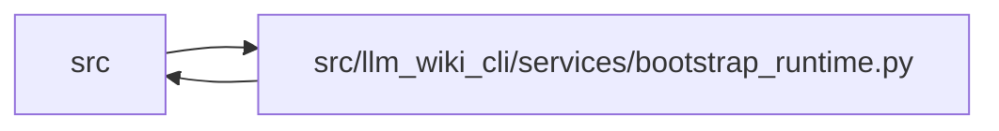

# bootstrap_runtime Module

**Path:** `src/llm_wiki_cli/services/bootstrap_runtime.py`

## Description

Orchestrates deterministic first-use wiki generation. It turns a validated
source inventory into disambiguated entity and module pages, workflows, entry-
point flows, infrastructure and dependency views, the landing page, and the
architectural log. Finalization commits the manifest and generated knowledge
artifacts only after the public Markdown surface has been written.

## Imports

| Source | Symbols |
|--------|---------|
| `..` | `__version__` |
| `..config` | `DEFAULT_WIKI_DIR`, `validate_path`, `validate_source_root` |
| `.api_contracts` | `ApiContractError`, `attach_routes_to_entry_points`, `build_api_contracts`, `render_api_contracts_markdown`, `render_flow_api_contract_section` |
| `.bootstrap_service` | `BootstrapContractError`, `BootstrapExtractionError`, `BootstrapRequestError`, `BootstrapRequest`, `BootstrapResult` |
| `.contracts` | `BOOTSTRAP_SUMMARY_SCHEMA_VERSION`, `KNOWLEDGE_SCHEMA_VERSION` |
| `.data_flow` | `analyze_data_flow`, `analyze_data_flow_detailed`, `build_data_flow_context` |
| `.dependencies` | `analyze_dependencies`, `build_dependency_observations`, `build_external_dependency_observations`, `package_dependency_graph`, `top_level_package` |
| `.diagrams` | `GENERATED_DIAGRAM_CHAR_LIMIT`, `GENERATED_DIAGRAM_LINE_LIMIT`, `GENERATED_DIAGRAM_NODE_LIMIT`, `data_flow_diagram`, `flowchart`, `resolve_diagram_style`, `sequence_diagram` |
| `.entrypoints` | `build_flow`, `build_flow_detailed`, `entry_points_from_detailed_observations`, `get_detailed_entry_points`, `read_console_scripts` |
| `.extraction_service` | `InventoryResult`, `get_call_graph`, `get_docker_inventory`, `get_inventory_result`, `print_inventory_failures`, `resolve_call_observations`, `resolve_call_edges` |
| `.imports` | `ModulePathResolver`, `build_module_path_resolver` |
| `.infrastructure_inventory` | `RUNTIME_CONFIG_TYPES`, `get_yaml_infrastructure_inventory`, `infrastructure_display_label` |
| `.infrastructure_sync` | `INFRASTRUCTURE_GENERATION_INPUT_KEY`, `INFRASTRUCTURE_SYNC_SCHEMA_VERSION`, `InfrastructureSyncError`, `build_infrastructure_page_map`, `build_infrastructure_sync_plan`, `validate_infrastructure_generation_input`, `with_infrastructure_generation_input` |
| `.io` | `read_md`, `write_md` |
| `.knowledge_artifacts` | `ArtifactWriteState`, `KnowledgeCommitResult` |
| `.knowledge_governance` | `GOVERNANCE_FILENAME`, `GovernanceError`, `load_governance` |
| `.knowledge_orchestration` | `RUNTIME_GENERATION_OPTION_DEFAULTS`, `RuntimeKnowledgeInputs`, `collect_runtime_repository_evidence`, `committed_governance_bundle_id`, `finalize_runtime_knowledge`, `persist_runtime_generation_policy`, `runtime_generation_options`, `runtime_source_snapshot_hash` |
| `.markdown_sections` | `GENERATED_INDEX_ENTRY_POINT_FLOWS_HEADING`, `GENERATED_INDEX_HTTP_API_CONTRACTS_HEADING`, `GENERATED_INDEX_INTRO_WITH_GUIDES`, `GENERATED_INDEX_INTRO_WITHOUT_GUIDES`, `preserve_level_two_section_exact` |
| `.module_maps` | `build_module_dependency_maps` |
| `.paths` | `normalize_source_path`, `portable_source_root_label` |
| `.relationships` | `build_entity_relationship_summaries` |
| `.schema` | `ALL_SCHEMA_FILES`, `CONSTRAINT_END`, `CONSTRAINT_START`, `pin_source_selection_command_recipes` |
| `.source_selection` | `SourceSelectionError`, `resolve_source_selection`, `validate_persisted_source_selection_identity` |
| `.source_snapshot` | `SourceSnapshot`, `build_source_snapshot`, `format_unsupported_source_summary`, `unsupported_source_summary` |
| `.sync_manifest` | `SyncManifest`, `SyncManifestError` |
| `.validation` | `portable_page_component`, `posix_path_text` |
| `.wiki_lifecycle` | `WikiLifecycleState`, `classify_wiki_lifecycle`, `is_pristine_wiki_target`, `migration_guidance`, `sync_guidance` |
| `.wiki_surface` | `PageKind`, `WikiSurfaceError`, `canonical_path`, `iter_page_kinds`, `mcp_uri` |
| `.wiki_surface_index` | `evaluate_surface_index` |
| `__future__` | `annotations` |
| `collections` | `defaultdict`, `Counter`, `defaultdict`, `Counter` |
| `collections.abc` | `Iterable`, `Mapping`, `Sequence` |
| `copy` | `deepcopy` |
| `dataclasses` | `dataclass`, `field`, `replace` |
| `datetime` | `date` |
| `io` | `io` |
| `json` | `json` |
| `pathlib` | `Path` |
| `re` | `re` |
| `shlex` | `shlex` |
| `sys` | `sys` |
| `typing` | `Any`, `TextIO` |

## Local dependency map

<!-- Auto-generated local dependency summary. Do not edit by hand. -->

> Module-level dependencies exceed the generated-diagram limits, so the diagram and table below group them by top-level package. Counts report the number of module neighbors in each package.

### Internal neighbors

| Direction | Module |
|---|---|
| Inbound | `src` (13) |
| Outbound | `src` (28) |

> All 41 module neighbor(s) are summarized by package because the module-level view exceeds the 12-node limit.

## Classes

| Class | Line | Bases | Description |
|-------|------|-------|-------------|
| [_BoundedGeneratedDiagram](../entities/BoundedGeneratedDiagram.md) | 696 | — | — |
| [_ModuleDependencyDiagram](../entities/ModuleDependencyDiagram.md) | 954 | — | — |
| [_RootDependencyDiagram](../entities/RootDependencyDiagram.md) | 2827 | — | — |
| [_BootstrapRunOptions](../entities/BootstrapRunOptions.md) | 4058 | — | — |
| [_BootstrapRunState](../entities/BootstrapRunState.md) | 4082 | — | — |
| [_BootstrapPageMaps](../entities/BootstrapPageMaps.md) | 4095 | — | — |
| [_EntityModuleResult](../entities/EntityModuleResult.md) | 4102 | — | — |
| [_WorkflowResult](../entities/WorkflowResult.md) | 4110 | — | — |
| [_FlowResult](../entities/FlowResult.md) | 4116 | — | — |
| [_InfrastructureResult](../entities/InfrastructureResult.md) | 4126 | — | — |
| [_DependencyResult](../entities/DependencyResult.md) | 4137 | — | — |
| [_ApiContractResult](../entities/ApiContractResult.md) | 4145 | — | — |
| [_BootstrapGenerationResult](../entities/BootstrapGenerationResult.md) | 4152 | — | — |

## Functions

| Function | Signature | Decorators | Description |
|----------|-----------|------------|-------------|
| `_preserve_source_doc_link` | `(target: str) -> bool` | — | — |
| `_sanitize_source_doc_markdown` | `(value: object) -> str` | — | Keep extracted source prose readable without creating broken wiki links. |
| `_source_doc_first_line` | `(value: object) -> str` | — | — |
| `_source_doc_first_paragraph` | `(value: object) -> str` | — | Return a whitespace-normalized first paragraph from extracted prose. |
| `_generated_diagram_style` | `(surface: str, *, root: str \| Path = '.', fallback_root: str \| Path \| None = None, include_plugins: bool = True, **context: Any) -> dict[str, Any]` | — | — |
| `_module_name_from_path` | `(filepath: str) -> str` | — | Derive a short module name from a file path. |
| `_is_haskell_filepath` | `(filepath: str) -> bool` | — | — |
| `_is_haskell_file_data` | `(file_data: Mapping \| None) -> bool` | — | — |
| `_haskell_module_name` | `(file_data: Mapping \| None) -> str` | — | — |
| `_display_module_name` | `(filepath: str, file_data: Mapping \| None = None) -> str` | — | — |
| `_safe_page_component` | `(value: object, *, fallback: str = 'page') -> str` | — | — |
| `_page_name_for_module` | `(filepath: str) -> str` | — | Return the wiki page stem for a module. |
| `_page_name_for_entity` | `(cls_name: str) -> str` | — | Return the wiki page stem for an entity. |
| `_disambiguate_paths` | `(fps: list[str], stem: str) -> dict[str, str]` | — | Given filepaths sharing *stem*, return ``{filepath: unique_name}``. |
| `_page_name_with_extension` | `(filepath: str) -> str` | — | Return a page-safe path stem that includes the source extension. |
| `_page_name_from_source_path` | `(filepath: str) -> str` | — | Return a page-safe stem from the full source path without extension. |
| `_globally_disambiguate_module_pages` | `(page_map: dict[str, str]) -> dict[str, str]` | — | Resolve page-id collisions left after stem-group disambiguation. |
| `build_module_page_map` | `(inventory: dict) -> dict[str, str]` | — | Return ``{filepath: page_stem}`` qualifying colliding stems. |
| `_entity_occurrences` | `(inventory: Mapping[str, Mapping]) -> list[tuple[EntityOccurrenceKey, Mapping]]` | — | — |
| `_legacy_entity_page_map` | `(occurrence_page_map: Mapping[EntityOccurrenceKey, str]) -> dict[tuple[str, str], str]` | — | — |
| `build_entity_occurrence_page_map` | `(inventory: dict, module_page_map: Mapping[str, str] \| None = None) -> dict[EntityOccurrenceKey, str]` | — | Return occurrence-aware ``{(class_name, filepath, occurrence): page_stem}``. |
| `build_entity_page_map` | `(inventory: dict) -> dict[tuple[str, str], str]` | — | Return ``{(class_name, filepath): page_stem}`` qualifying collisions. |
| `_build_relationships` | `(inventory: dict, module_page_map: dict[str, str] \| None = None, *, target_entities: set[tuple[str, str]] \| None = None, resolver: ModulePathResolver \| None = None) -> dict` | — | Cross-reference imports against known entity identities to build a usage graph. |
| `_format_signature` | `(fn: dict) -> str` | — | Build a readable function signature string. |
| `_table_text` | `(value: object) -> str` | — | — |
| `_table_inline_code` | `(value: object) -> str` | — | — |
| `_haskell_declaration_label` | `(kind: object) -> str` | — | — |
| `_haskell_function_label` | `(kind: object) -> str` | — | — |
| `_dash` | `(value: object) -> str` | — | — |
| `_code_or_dash` | `(value: object) -> str` | — | — |
| `_yes_no` | `(value: object) -> str` | — | — |
| `_line_sort_value` | `(value: object) -> int` | — | — |
| `_module_page_stem` | `(filepath: str \| None, module_page_map: Mapping[str, str] \| None = None) -> str \| None` | — | — |
| `_module_link` | `(filepath: str \| None, module_page_map: Mapping[str, str] \| None = None) -> str` | — | — |
| `_code_join` | `(values: list[str]) -> str` | — | — |
| `_entity_node_label` | `(summary: Mapping) -> str` | — | — |
| `_class_ref_label` | `(ref: Mapping) -> str` | — | — |
| `_reference_label` | `(ref: Mapping) -> str` | — | — |
| `_entity_relationship_projection` | `(summary: Mapping, module_page_map: Mapping[str, str] \| None, diagram_style: Mapping[str, Any] \| None = None) -> _BoundedGeneratedDiagram` | — | Render the longest bounded relationship prefix. |
| `_entity_relationship_graph` | `(summary: Mapping, module_page_map: Mapping[str, str] \| None, diagram_style: Mapping[str, Any] \| None = None) -> str \| None` | — | — |
| `_relationship_source_cell` | `(record: Mapping, module_page_map: Mapping[str, str] \| None) -> str` | — | — |
| `_is_haskell_declaration_summary` | `(summary: Mapping) -> bool` | — | — |
| `_append_haskell_relationship_summary_table` | `(lines: list[str], summary: Mapping, module_page_map: Mapping[str, str] \| None) -> None` | — | — |
| `_append_default_relationship_summary_table` | `(lines: list[str], summary: Mapping, module_page_map: Mapping[str, str] \| None) -> None` | — | — |
| `_append_entity_relationship_tables` | `(lines: list[str], summary: Mapping, module_page_map: Mapping[str, str] \| None) -> None` | — | — |
| `_generate_entity_relationship_section` | `(summary: Mapping \| None, module_page_map: Mapping[str, str] \| None = None, diagram_style: Mapping[str, Any] \| None = None) -> list[str]` | — | — |
| `_module_map_node_link` | `(node: str, module_page_map: Mapping[str, str] \| None = None) -> str \| None` | — | — |
| `_dependency_sort_key` | `(value: object) -> tuple[str, str]` | — | — |
| `_normalized_dependency_nodes` | `(summary: Mapping) -> list[str]` | — | — |
| `_normalized_dependency_edges` | `(raw_edges: Iterable[object], nodes: Iterable[str]) -> list[tuple[str, str]]` | — | — |
| `_mermaid_body` | `(diagram: str) -> list[str]` | — | — |
| `_generated_diagram_fits` | `(diagram: str, *, node_count: int) -> bool` | — | — |
| `_rendered_flowchart_node_count` | `(diagram: str) -> int` | — | Count serialized flowchart node declarations, excluding edges/styles. |
| `_dependency_edge_priority` | `(edge: tuple[str, str], *, focal_module: str, cycle_edges: set[tuple[str, str]]) -> tuple[int, tuple[str, str], tuple[str, str]]` | — | — |
| `_render_module_dependency_projection` | `(*, nodes: list[str], edges: list[tuple[str, str]], links: Mapping[str, str], cycle_edges: set[tuple[str, str]], focal_module: str, diagram_style: Mapping[str, Any] \| None, projection: str, allow_edge_omission: bool) -> _ModuleDependencyDiagram \| None` | — | — |
| `_package_dependency_projection` | `(summary: Mapping, cycle_edges: set[tuple[str, str]]) -> tuple[list[str], list[tuple[str, str]], set[tuple[str, str]]] \| None` | — | — |
| `_module_dependency_graph` | `(summary: Mapping, module_page_map: Mapping[str, str] \| None, diagram_style: Mapping[str, Any] \| None = None) -> _ModuleDependencyDiagram \| None` | — | — |
| `_module_dependency_cell` | `(item: object, module_page_map: Mapping[str, str] \| None) -> str` | — | — |
| `_append_module_dependency_tables` | `(lines: list[str], summary: Mapping, module_page_map: Mapping[str, str] \| None) -> None` | — | — |
| `_generate_module_dependency_section` | `(summary: Mapping \| None, module_page_map: Mapping[str, str] \| None = None, diagram_style: Mapping[str, Any] \| None = None) -> list[str]` | — | — |
| `_append_relationships_to_entity` | `(lines: list[str], name: str, filepath: str, relationships: dict, *, relationship_summary: Mapping \| None, module_page_map: Mapping[str, str] \| None, diagram_style: Mapping[str, Any] \| None) -> None` | — | — |
| `_generate_haskell_entity_md` | `(class_info: dict, filepath: str, relationships: dict, mod_page_name: str \| None = None, *, relationship_summary: Mapping \| None = None, module_page_map: Mapping[str, str] \| None = None, diagram_style: Mapping[str, Any] \| None = None) -> str` | — | — |
| `_append_import_section` | `(lines: list[str], imports: list[dict], *, haskell: bool) -> None` | — | — |
| `_append_haskell_declarations` | `(lines: list[str], declarations: list[dict], entity_page_map: Mapping \| None, *, filepath: str \| None = None, entity_occurrence_page_map: Mapping[EntityOccurrenceKey, str] \| None = None) -> None` | — | — |
| `_entity_page_from_maps` | `(name: str, filepath: str \| None, occurrence: int, entity_page_map: Mapping \| None, entity_occurrence_page_map: Mapping[EntityOccurrenceKey, str] \| None = None) -> str` | — | — |
| `_append_haskell_functions` | `(lines: list[str], functions: list[dict]) -> None` | — | — |
| `_append_module_signals_section` | `(lines: list[str], file_data: Mapping) -> None` | — | — |
| `_entity_kind_label` | `(class_info: Mapping) -> str` | — | — |
| `_field_wire_name` | `(attribute: Mapping) -> str` | — | — |
| `_field_default` | `(attribute: Mapping) -> str` | — | — |
| `_field_constraints` | `(attribute: Mapping) -> str` | — | — |
| `_model_config_value` | `(setting: Mapping) -> str` | — | — |
| `_append_model_contract_sections` | `(lines: list[str], class_info: Mapping) -> None` | — | — |
| `_append_attribute_contract` | `(lines: list[str], class_info: Mapping) -> None` | — | — |
| `_generate_entity_md` | `(class_info: dict, filepath: str, relationships: dict, mod_page_name: str \| None = None, *, relationship_summary: Mapping \| None = None, module_page_map: Mapping[str, str] \| None = None, diagram_style: Mapping[str, Any] \| None = None) -> str` | — | Generate comprehensive markdown for a class entity. |
| `_generate_module_md` | `(filepath: str, file_data: dict, entity_page_map: dict \| None = None, *, module_dependency_map: Mapping \| None = None, module_page_map: Mapping[str, str] \| None = None, entity_occurrence_page_map: Mapping[EntityOccurrenceKey, str] \| None = None, diagram_style: Mapping[str, Any] \| None = None) -> str` | — | Generate comprehensive markdown for a module page. |
| `_flow_index_category` | `(flow: dict) -> str` | — | Category for a flow index entry, derived from the id prefix when absent. |
| `_overview_target` | `(count: int, heading: str) -> str` | — | — |
| `_overview_row` | `(label: str, count: int, target: str) -> str` | — | — |
| `_append_surface_overview` | `(lines: list[str], *, entity_count: int, module_count: int, workflow_count: int, guide_count: int, flow_count: int, infrastructure_count: int, api_contracts_present: bool, architecture_count: int, log_present: bool) -> None` | — | — |
| `_append_index_entities` | `(lines: list[str], entity_names: list[str]) -> None` | — | — |
| `_append_index_modules` | `(lines: list[str], module_entries: list[dict]) -> None` | — | — |
| `_append_index_workflows` | `(lines: list[str], workflow_entries: list[dict] \| None) -> None` | — | — |
| `_append_index_guides` | `(lines: list[str], guide_entries: list[dict] \| None) -> None` | — | — |
| `_append_index_entry_point_flows` | `(lines: list[str], flow_entries: list[dict] \| None) -> None` | — | Append the grouped entry-point flow section to *lines* (in place). |
| `_append_index_infrastructure` | `(lines: list[str], infra_entries: list[dict] \| None) -> None` | — | — |
| `_append_index_api_contracts` | `(lines: list[str], *, api_contracts_present: bool) -> None` | — | — |
| `_architecture_path` | `(page: str) -> str` | — | — |
| `_architecture_order` | `(entry: dict) -> int` | — | — |
| `_append_index_architecture` | `(lines: list[str], architecture_entries: list[dict] \| None) -> None` | — | Append the dependency architecture section linking top-level analysis pages. |
| `_append_index_log` | `(lines: list[str], *, log_present: bool) -> None` | — | — |
| `_generate_index_md` | `(entity_names: list[str], module_entries: list[dict], workflow_entries: list[dict] \| None = None, guide_entries: list[dict] \| None = None, infra_entries: list[dict] \| None = None, flow_entries: list[dict] \| None = None, architecture_entries: list[dict] \| None = None, *, api_contracts_present: bool = False, log_present: bool = True) -> str` | — | Generate the full index.md content. |
| `_workflow_module_refs` | `(wf: dict, module_page_map: Mapping[str, str] \| None = None) -> list[tuple[str, str]]` | — | Return ``(label, page_stem)`` pairs for workflow module links. |
| `_generate_workflow_md` | `(name: str, wf: dict, module_page_map: Mapping[str, str] \| None = None) -> str` | — | Generate a workflow page from call-graph data. |
| `_flow_module_refs` | `(flow: dict, module_page_map: Mapping[str, str] \| None = None) -> list[tuple[str, str]]` | — | Return sorted ``(label, page_stem)`` pairs for a flow's touched modules. |
| `_flow_related_module_refs` | `(flow: dict, module_page_map: Mapping[str, str] \| None = None) -> list[tuple[str, str]]` | — | Return sorted module links for process-related internal imports. |
| `_flow_module_link` | `(ref: tuple[str, str]) -> str` | — | — |
| `_append_flow_module_summary` | `(lines: list[str], label: str, refs: list[tuple[str, str]]) -> None` | — | Render compact flow metadata and retain a complete linked list when long. |
| `_flow_interactions` | `(flow: dict) -> list[dict]` | — | Convert depth-tagged flow steps into caller→callee sequence interactions. |
| `_bounded_sequence_diagram` | `(interactions: list[dict]) -> _BoundedGeneratedDiagram` | — | — |
| `_md_cell` | `(value: object) -> str` | — | — |
| `_effect_label` | `(effect: Mapping) -> str` | — | — |
| `_effects_cell` | `(effects: list[Mapping]) -> str` | — | — |
| `_bounded_data_flow_diagram` | `(data_flow: Mapping, module_page_map: Mapping[str, str] \| None, diagram_style: Mapping[str, Any] \| None) -> _BoundedGeneratedDiagram` | — | Keep all step nodes and the longest fitting transfer/boundary prefixes. |
| `_generate_data_flow_section` | `(data_flow: Mapping, module_page_map: Mapping[str, str] \| None = None, diagram_style: Mapping[str, Any] \| None = None) -> list[str]` | — | — |
| `_generate_flow_md` | `(flow: dict, module_page_map: Mapping[str, str] \| None = None, *, data_flow: Mapping \| None = None, diagram_style: Mapping[str, Any] \| None = None, api_contract_operations: Sequence[Mapping[str, Any]] \| None = None) -> str` | — | Generate a user-flow page with a Mermaid sequence diagram from *flow*. |
| `_preserve_level_two_section` | `(existing: str, generated: str, heading: str) -> str` | — | Carry one human-owned level-two section into regenerated Markdown. |
| `_dependency_module_link` | `(filepath: str, module_page_map: Mapping[str, str]) -> str` | — | Markdown link from an architecture page (wiki root) to a module page. |
| `_cyclic_edges` | `(edges: list[tuple[str, str]], cycles: list[list[str]]) -> set[tuple[str, str]]` | — | Return the edges whose endpoints sit in the same import cycle. |
| `_render_root_dependency_projection` | `(*, nodes: list[str], edges: list[tuple[str, str]], links: Mapping[str, str], highlight_edges: set[tuple[str, str]], diagram_style: Mapping[str, Any] \| None, rendered_detail: str) -> _RootDependencyDiagram` | — | Render cycle-first edges within the shared generated-diagram limits. |
| `_package_cycle_edges` | `(cyclic_edges: Iterable[tuple[str, str]]) -> set[tuple[str, str]]` | — | — |
| `_render_dependency_graph_result` | `(analysis: dict, module_page_map: Mapping[str, str], detail: str, diagram_style: Mapping[str, Any] \| None = None) -> _RootDependencyDiagram` | — | Render a bounded dependency projection, choosing module or package detail. |
| `_render_dependency_graph` | `(analysis: dict, module_page_map: Mapping[str, str], detail: str, diagram_style: Mapping[str, Any] \| None = None) -> tuple[str \| None, str]` | — | Return the bounded diagram and rendered detail for compatibility. |
| `_format_package_list` | `(packages: list[str]) -> str` | — | — |
| `_append_external_dependencies` | `(lines: list[str], reconciliation: dict) -> None` | — | Append the per-language external-dependency section to *lines*. |
| `_generate_dependencies_md` | `(analysis: dict, module_page_map: Mapping[str, str] \| None = None, *, detail: str = 'auto', diagram_style: Mapping[str, Any] \| None = None) -> str` | — | Render ``dependencies.md`` from a :func:`analyze_dependencies` bundle. |
| `_format_side_effect_call` | `(call: Mapping) -> str` | — | Render a ``module_calls`` record as ``target = label`` or ``label``. |
| `_generate_load_order_md` | `(analysis: dict, module_page_map: Mapping[str, str] \| None = None) -> str` | — | Render ``load-order.md`` from a :func:`analyze_dependencies` bundle. |
| `_normalize_source_path` | `(path: str) -> str` | — | Normalize Docker COPY source paths for comparison with inventory keys. |
| `_coerce_module_links` | `(module_links: Mapping[str, str] \| set[str] \| None) -> dict[str, str]` | — | Return ``{source_path: module_page_stem}`` for Docker COPY linking. |
| `_copy_source_candidates` | `(source: str, docker_filename: str) -> list[str]` | — | Return likely project-relative source paths for a Docker COPY source. |
| `_module_page_for_copy_source` | `(source: str, docker_filename: str, module_links: Mapping[str, str] \| set[str] \| None) -> str \| None` | — | Resolve a Docker COPY source to a module page stem if unambiguous. |
| `_split_copy_sources` | `(source: str) -> list[str]` | — | Split a Docker COPY source field while preserving a safe fallback. |
| `_format_copy_source_links` | `(source: str, docker_filename: str, module_links: Mapping[str, str] \| set[str] \| None) -> str` | — | Format a Docker COPY source cell with module links where safe. |
| `_unsupported_source_path_map` | `(unsupported_sources: dict[str, dict[str, object]] \| None) -> dict[str, str]` | — | Return ``{source_path: language}`` for unsupported-source advisories. |
| `_unsupported_copy_source_matches` | `(source: str, docker_filename: str, unsupported_sources: dict[str, dict[str, object]] \| None) -> list[dict[str, str]]` | — | Resolve Docker COPY sources to known unsupported source paths. |
| `_unsupported_language_label` | `(language: str) -> str` | — | — |
| `_generate_docker_md` | `(filename: str, info: dict, module_links: Mapping[str, str] \| set[str] \| None = None, *, module_stems: set[str] \| None = None, unsupported_sources: dict[str, dict[str, object]] \| None = None) -> str` | — | Generate a wiki page for a Dockerfile or docker-compose file. |
| `_generate_infrastructure_md` | `(filename: str, info: dict, module_links: Mapping[str, str] \| set[str] \| None = None, unsupported_sources: dict[str, dict[str, object]] \| None = None) -> str` | — | Generate a wiki page for any supported infrastructure inventory entry. |
| `_with_infrastructure_notes_placeholder` | `(markdown: str) -> str` | — | Append the sole supported semantic surface to generated infra pages. |
| `_append_infrastructure_advisories` | `(lines: list[str], advisories: list[str]) -> None` | — | — |
| `_generate_github_actions_md` | `(filename: str, info: dict) -> str` | — | Generate markdown for a GitHub Actions workflow file. |
| `_generate_kubernetes_md` | `(filename: str, info: dict) -> str` | — | Generate markdown for a Kubernetes manifest file. |
| `_format_resource_map` | `(values: Mapping[str, str]) -> str` | — | — |
| `_runtime_config_header` | `(filename: str, info: dict) -> list[str]` | — | — |
| `_append_value_list` | `(lines: list[str], title: str, values: Iterable[str]) -> None` | — | — |
| `_append_setting_table` | `(lines: list[str], settings: Mapping[str, str]) -> None` | — | — |
| `_generate_runtime_config_md` | `(filename: str, info: dict) -> str` | — | — |
| `_generate_prometheus_md` | `(filename: str, info: dict) -> str` | — | — |
| `_generate_prometheus_rules_md` | `(filename: str, info: dict) -> str` | — | — |
| `_generate_grafana_provisioning_md` | `(filename: str, info: dict) -> str` | — | — |
| `_generate_promtail_md` | `(filename: str, info: dict) -> str` | — | — |
| `_generate_loki_md` | `(filename: str, info: dict) -> str` | — | — |
| `_generate_envoy_md` | `(filename: str, info: dict) -> str` | — | — |
| `_generate_buf_md` | `(filename: str, info: dict) -> str` | — | — |
| `_generate_model_service_config_md` | `(filename: str, info: dict) -> str` | — | — |
| `_generate_unsupported_infrastructure_md` | `(filename: str, info: dict) -> str` | — | — |
| `_dockerfile_base_images` | `(stages: list[dict]) -> list[str]` | — | — |
| `_dockerfile_header_lines` | `(filename: str, stages: list[dict]) -> list[str]` | — | — |
| `_append_dockerfile_build_stages` | `(lines: list[str], stages: list[dict]) -> None` | — | — |
| `_append_dockerfile_list_section` | `(lines: list[str], title: str, values: list[str]) -> None` | — | — |
| `_append_dockerfile_default_table` | `(lines: list[str], title: str, first_column: str, rows: list[dict]) -> None` | — | — |
| `_append_dockerfile_workdir` | `(lines: list[str], workdir: str) -> None` | — | — |
| `_append_dockerfile_entrypoint` | `(lines: list[str], entrypoint: str, cmd: str) -> None` | — | — |
| `_append_dockerfile_copies` | `(lines: list[str], copies: list[dict], filename: str, module_links: Mapping[str, str] \| set[str] \| None) -> None` | — | — |
| `_append_dockerfile_unsupported_copies` | `(lines: list[str], copies: list[dict], filename: str, unsupported_sources: dict[str, dict[str, object]] \| None) -> None` | — | — |
| `_append_dockerfile_labels` | `(lines: list[str], labels: dict[str, str]) -> None` | — | — |
| `_append_dockerfile_healthcheck` | `(lines: list[str], healthcheck: str) -> None` | — | — |
| `_generate_dockerfile_md` | `(filename: str, info: dict, module_links: Mapping[str, str] \| set[str] \| None = None, unsupported_sources: dict[str, dict[str, object]] \| None = None) -> str` | — | Generate markdown for a Dockerfile. |
| `_generate_compose_md` | `(filename: str, info: dict, module_links: Mapping[str, str] \| set[str] \| None = None) -> str` | — | Generate markdown for a docker-compose / compose file. |
| `_data_flow_summary` | `(*, generated: bool, analyzed: int = 0, boundary_effects: int = 0, gaps: int = 0) -> dict` | — | — |
| `_with_unsupported_sources` | `(payload: dict, unsupported_sources: dict[str, dict[str, object]]) -> dict` | — | — |
| `_bootstrap_run_options_from_args` | `(args) -> _BootstrapRunOptions` | — | — |
| `_bootstrap_run_options_from_request` | `(request: BootstrapRequest, *, progress_stream: TextIO) -> _BootstrapRunOptions` | — | — |
| `_path_text` | `(path: Path) -> str` | — | — |
| `_emit_bootstrap` | `(state: _BootstrapRunState, message: str = '', *, flush: bool = False) -> None` | — | — |
| `_emit_bootstrap_warnings` | `(state: _BootstrapRunState, warnings: list[str]) -> None` | — | — |
| `_record_bootstrap_write` | `(state: _BootstrapRunState, path: Path, existed: bool) -> None` | — | — |
| `_bootstrap_plugin_roots` | `(state: _BootstrapRunState) -> tuple[str \| Path, str \| Path \| None]` | — | — |
| `_write_bootstrap_file` | `(state: _BootstrapRunState, path: Path, text: str) -> None` | — | — |
| `_start_bootstrap` | `(state: _BootstrapRunState) -> None` | — | — |
| `_extract_bootstrap_inventory` | `(state: _BootstrapRunState)` | — | — |
| `_finish_if_empty_bootstrap_inventory` | `(state: _BootstrapRunState, inventory: dict) -> bool` | — | — |
| `_prepare_bootstrap_page_maps` | `(inventory: dict) -> _BootstrapPageMaps` | — | — |
| `_build_bootstrap_relationships` | `(state: _BootstrapRunState, inventory: dict, module_page_map: dict[str, str]) -> tuple[dict, int]` | — | — |
| `_build_entity_relationship_summary_map` | `(inventory: dict, call_edges: Sequence[Mapping]) -> dict[tuple[str, str], Mapping]` | — | — |
| `_build_bootstrap_dependency_analysis` | `(state: _BootstrapRunState, inventory: dict) -> dict \| None` | — | — |
| `_write_bootstrap_entity_pages` | `(state: _BootstrapRunState, filepath: str, file_data: dict, relationships: dict, mod_page_name: str, module_page_map: Mapping[str, str], entity_relationship_summaries: Mapping[tuple[str, str], Mapping] \| None, entity_occurrence_page_map: Mapping[EntityOccurrenceKey, str], seen_entity_pages: set[str], all_entity_names: list[str]) -> int` | — | — |
| `_write_bootstrap_module_page` | `(state: _BootstrapRunState, filepath: str, file_data: dict, mod_page_name: str, file_entity_page_map: dict[str, str], entity_occurrence_page_map: Mapping[EntityOccurrenceKey, str], module_dependency_map: Mapping \| None, module_page_map: Mapping[str, str]) -> bool` | — | — |
| `_file_entity_page_map_from_occurrences` | `(filepath: str, file_data: Mapping, entity_occurrence_page_map: Mapping[EntityOccurrenceKey, str]) -> dict[str, str]` | — | — |
| `_write_entity_and_module_pages` | `(state: _BootstrapRunState, inventory: dict, page_maps: _BootstrapPageMaps, relationships: dict, entity_relationship_summaries: Mapping[tuple[str, str], Mapping] \| None, module_dependency_maps: Mapping[str, Mapping] \| None) -> _EntityModuleResult` | — | — |
| `_write_bootstrap_workflow_pages` | `(state: _BootstrapRunState, inventory: dict, module_page_map: dict[str, str]) -> _WorkflowResult` | — | — |
| `_build_bootstrap_api_contracts` | `(state: _BootstrapRunState, inventory: dict) -> dict \| None` | — | — |
| `_write_bootstrap_api_contract_page` | `(state: _BootstrapRunState, contracts: dict \| None, page_maps: _BootstrapPageMaps) -> _ApiContractResult` | — | — |
| `_api_operations_for_entry_point` | `(contracts: Mapping[str, Any] \| None, entry_point: Mapping[str, Any]) -> list[Mapping[str, Any]]` | — | — |
| `_write_bootstrap_flow_pages` | `(state: _BootstrapRunState, inventory: dict, module_page_map: dict[str, str], call_edges: Sequence[Mapping] \| None = None, api_contracts: Mapping[str, Any] \| None = None, data_effect_observations: Mapping \| None = None) -> _FlowResult` | — | — |
| `_write_bootstrap_infrastructure_pages` | `(state: _BootstrapRunState, module_page_map: dict[str, str]) -> _InfrastructureResult` | — | — |
| `_dependency_counts` | `(analysis: dict) -> dict` | — | Scalar counts about *analysis* for the bootstrap JSON summary. |
| `_infrastructure_type_count` | `(infrastructure_result: _InfrastructureResult, entry_type: str) -> int` | — | — |
| `_runtime_config_type_counts` | `(infrastructure_result: _InfrastructureResult) -> dict[str, int]` | — | — |
| `_runtime_config_count` | `(infrastructure_result: _InfrastructureResult) -> int` | — | — |
| `_write_bootstrap_dependency_pages` | `(state: _BootstrapRunState, inventory: dict, module_page_map: dict[str, str], *, analysis: dict \| None = None) -> _DependencyResult` | — | — |
| `_write_bootstrap_index` | `(state: _BootstrapRunState, entity_result: _EntityModuleResult, workflow_result: _WorkflowResult, flow_result: _FlowResult, infrastructure_result: _InfrastructureResult, dependency_result: _DependencyResult, api_contract_result: _ApiContractResult) -> None` | — | — |
| `_append_bootstrap_log` | `(state: _BootstrapRunState, inventory: dict, entity_result: _EntityModuleResult, workflow_result: _WorkflowResult, flow_result: _FlowResult, infrastructure_result: _InfrastructureResult, dependency_result: _DependencyResult, api_contract_result: _ApiContractResult, cross_reference_count: int, *, generation_inputs: Mapping[str, object], plugin_lock_path: str \| None, plugin_lock_hash: str \| None) -> None` | — | — |
| `_source_snapshot_log_lines` | `(snapshot: SourceSnapshot, *, generation_inputs: Mapping[str, object] \| None = None, plugin_lock_path: str \| None = None, plugin_lock_hash: str \| None = None) -> str` | — | Render portable public provenance for an evaluated source snapshot. |
| `_emit_bootstrap_complete` | `(state: _BootstrapRunState, inventory: dict, entity_result: _EntityModuleResult, workflow_result: _WorkflowResult, flow_result: _FlowResult, infrastructure_result: _InfrastructureResult, dependency_result: _DependencyResult, api_contract_result: _ApiContractResult, cross_reference_count: int) -> None` | — | — |
| `_update_bootstrap_agent_constraints` | `(state: _BootstrapRunState) -> None` | — | — |
| `_bootstrap_manifest_generation_state` | `(state: _BootstrapRunState, api_contract_result: _ApiContractResult, infrastructure_result: _InfrastructureResult, *, previous_manifest: SyncManifest \| None) -> tuple[dict[str, dict[str, object]], dict[str, object]]` | — | — |
| `_load_previous_bootstrap_manifest` | `(wiki_dir: Path) -> SyncManifest \| None` | — | — |
| `_governance_moves_for_bootstrap` | `(manifest: SyncManifest \| None, inventory: Mapping[str, Mapping], page_maps: _BootstrapPageMaps) -> dict[str, str]` | — | Carry IDs only across one-to-one page renames observed by bootstrap. |
| `_record_bootstrap_artifact` | `(state: _BootstrapRunState, *, path: Path, write_state: ArtifactWriteState) -> None` | — | — |
| `_finalize_bootstrap_artifacts` | `(state: _BootstrapRunState, inventory_result: InventoryResult, page_maps: _BootstrapPageMaps, result: _BootstrapGenerationResult, *, previous_manifest: SyncManifest \| None, surfaces: Mapping[str, Mapping[str, object]], generation_inputs: Mapping[str, object]) -> KnowledgeCommitResult` | — | — |
| `_emit_bootstrap_json_summary` | `(state: _BootstrapRunState, inventory: dict, workflow_result: _WorkflowResult, flow_result: _FlowResult, infrastructure_result: _InfrastructureResult, dependency_result: _DependencyResult, api_contract_result: _ApiContractResult, cross_reference_count: int, artifacts: KnowledgeCommitResult) -> dict[str, Any]` | — | — |
| `_generate_bootstrap_content` | `(state: _BootstrapRunState, inventory: dict, page_maps: _BootstrapPageMaps, *, data_effect_observations: Mapping \| None = None, import_observations: Mapping \| None = None) -> _BootstrapGenerationResult` | — | — |
| `_finalize_bootstrap` | `(state: _BootstrapRunState, inventory_result: InventoryResult, page_maps: _BootstrapPageMaps, result: _BootstrapGenerationResult) -> BootstrapResult` | — | — |
| `_bootstrap_result` | `(state: _BootstrapRunState) -> BootstrapResult` | — | — |
| `_is_pristine_bootstrap_target` | `(wiki_dir: Path) -> bool` | — | Return whether *wiki_dir* is empty or is the complete init scaffold. |
| `_first_use_guidance` | `(options: _BootstrapRunOptions) -> str` | — | — |
| `_preflight_public_bootstrap` | `(options: _BootstrapRunOptions) -> None` | — | Reject overwrite and existing wiki content without reading source. |
| `_preflight_bootstrap_source_selection` | `(options: _BootstrapRunOptions) -> None` | — | Protect private workspace refreshes from configured-to-broad downgrade. |
| `_execute_bootstrap_options` | `(options: _BootstrapRunOptions, *, _workspace_refresh_authorized: bool = False) -> BootstrapResult` | — | — |
| `_preflight_bootstrap_governance` | `(wiki_dir: Path) -> None` | — | Reject corrupt or missing committed governance before creating pages. |
| `execute_bootstrap` | `(request: BootstrapRequest, *, progress_stream: TextIO \| None = None) -> BootstrapResult` | — | Execute first-use deterministic bootstrap without argparse or exits. |
| `_execute_documentation_workspace_refresh` | `(request: BootstrapRequest, *, workspace_root: str \| Path, progress_stream: TextIO \| None = None) -> BootstrapResult` | — | Refresh an isolated documentation-workspace snapshot. |
| `run` | `(args)` | — | — |
| `_update_agent_constraints` | `(wiki_dir: str, *, source_selection: str \| Path \| None = None, file = None) -> None` | — | Replace docs/llm_wiki path references inside the constraint block |
