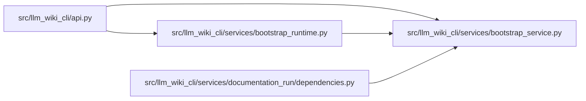

# bootstrap_service Module

**Path:** `src/llm_wiki_cli/services/bootstrap_service.py`

## Description

Typed request/result contract for deterministic wiki bootstrap.

## Imports

| Source | Symbols |
|--------|---------|
| `__future__` | `annotations` |
| `dataclasses` | `dataclass`, `field` |
| `pathlib` | `Path` |
| `typing` | `Any`, `Iterable` |

## Local dependency map

<!-- Auto-generated local dependency summary. Do not edit by hand. -->

### Internal neighbors

| Direction | Module |
|---|---|
| Inbound | [api](../modules/api.md) |
| Inbound | [bootstrap_runtime](../modules/bootstrap_runtime.md) |
| Inbound | [documentation_run_dependencies](../modules/documentation_run_dependencies.md) |

## Classes

| Class | Line | Bases | Description |
|-------|------|-------|-------------|
| [BootstrapServiceError](../entities/BootstrapServiceError.md) | 10 | `RuntimeError` | Base error raised by the library bootstrap boundary. |
| [BootstrapExtractionError](../entities/BootstrapExtractionError.md) | 14 | `BootstrapServiceError` | Raised when one or more required extractors fail. |
| [BootstrapContractError](../entities/BootstrapContractError.md) | 18 | `BootstrapServiceError` | Raised when bootstrap input or generated contracts are invalid. |
| [BootstrapRequestError](../entities/BootstrapRequestError.md) | 22 | `BootstrapContractError` | Raised when caller-supplied bootstrap options violate the contract. |
| [BootstrapRequest](../entities/BootstrapRequest.md) | 27 | — | Deterministic bootstrap inputs shared by CLI and library callers. |
| [BootstrapResult](../entities/BootstrapResult.md) | 58 | — | Typed bootstrap result shared by the CLI and Python API. |
