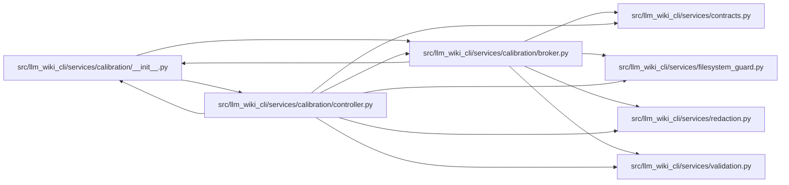

# broker Module

**Path:** `src/llm_wiki_cli/services/calibration/broker.py`

## Description

Provider-neutral OCI broker for qualifying documentation calibration agents.

The broker deliberately owns no model-provider SDK, endpoint, or credential.
For the qualifying ``local_no_egress`` profile it invokes a caller-resolved
Docker or Podman executable with fixed argument vectors, a minimal host
environment, a digest-pinned image, and exactly two bind mounts: one JSON packet
mounted read-only for the container and one pre-created result artifact.  The
surrounding container root is read-only, so the artifact is the only persistent
writable target; an exact ``RLIMIT_FSIZE`` bounds it while the process is
running.

This module is intentionally separate from the documentation-run v1 lifecycle.
The protected calibration controller owns authority, state transitions, and
artifact persistence; the broker only validates one frozen OCI runtime section,
executes a bounded process, and returns hash-bound evidence.

Frozen value objects and hash bindings provide application-level
content-integrity checks within the host trust domain.  They do not authenticate
evidence against the filesystem owner, root, or offline modification.

## Imports

| Source | Symbols |
|--------|---------|
| `.` | `_restore_legacy_definition_modules` |
| `..contracts` | `OCI_MAX_PACKET_BYTES`, `P0_CALIBRATION_AGENT_RESULT_SCHEMA_VERSION`, `P0_CALIBRATION_DISPATCH_RECEIPT_SCHEMA_VERSION`, `P0_CALIBRATION_EXECUTION_MANIFEST_SCHEMA_VERSION`, `P0_CALIBRATION_ISOLATION_PROBE_REQUEST_SCHEMA_VERSION`, `P0_CALIBRATION_ISOLATION_PROBE_RESULT_SCHEMA_VERSION` |
| `..filesystem_guard` | `atomic_write_private_bytes` |
| `..redaction` | `LIKELY_SECRET_RE`, `SENSITIVE_KEYS` |
| `..validation` | `is_canonical_uuid`, `path_is_within`, `require_bounded_int`, `require_bounded_text`, `require_exact_fields`, `require_int`, `require_mapping`, `require_nonempty_text`, `require_sha256`, `require_string_tuple`, `require_uuid` |
| `__future__` | `annotations` |
| `contextlib` | `contextmanager` |
| `dataclasses` | `dataclass` |
| `hashlib` | `hashlib` |
| `json` | `json` |
| `os` | `os` |
| `pathlib` | `Path`, `PurePosixPath` |
| `re` | `re` |
| `secrets` | `secrets` |
| `socket` | `socket` |
| `stat` | `stat` |
| `subprocess` | `subprocess` |
| `tempfile` | `tempfile` |
| `threading` | `threading` |
| `typing` | `Any`, `Iterator`, `Mapping`, `Optional`, `Protocol`, `Sequence` |
| `uuid` | `uuid` |

## Local dependency map

<!-- Auto-generated local dependency summary. Do not edit by hand. -->

### Internal neighbors

| Direction | Module |
|---|---|
| Inbound | [calibration___init__](../modules/calibration___init__.md) |
| Inbound | [controller](../modules/controller.md) |
| Outbound | [calibration___init__](../modules/calibration___init__.md) |
| Outbound | [services_contracts](../modules/services_contracts.md) |
| Outbound | [filesystem_guard](../modules/filesystem_guard.md) |
| Outbound | [redaction](../modules/redaction.md) |
| Outbound | [validation](../modules/validation.md) |

## Classes

| Class | Line | Bases | Description |
|-------|------|-------|-------------|
| [OciBrokerError](../entities/OciBrokerError.md) | 133 | `ValueError` | Raised when OCI configuration or dispatch evidence is unsafe. |
| [OciProcessRunner](../entities/OciProcessRunner.md) | 137 | `Protocol` | Dependency-injected bounded process runner. |
| [OciImageCommand](../entities/OciImageCommand.md) | 155 | — | One digest-pinned OCI image and its fixed in-container entrypoint. |
| [OciResourceLimits](../entities/OciResourceLimits.md) | 209 | — | Portable Docker/Podman resource ceilings. |
| [OciOutputLimits](../entities/OciOutputLimits.md) | 257 | — | Bounded process and result capture sizes. |
| [OciRuntimeConfig](../entities/OciRuntimeConfig.md) | 306 | — | Strict local-no-egress section of a frozen execution manifest. |
| [BoundedProcessResult](../entities/BoundedProcessResult.md) | 637 | — | Bounded in-memory output plus complete stream hashes and byte counts. |
| [OciDispatchContext](../entities/OciDispatchContext.md) | 728 | — | Controller-owned frozen value bindings for one agent attempt. |
| [OciStreamEvidence](../entities/OciStreamEvidence.md) | 763 | — | Complete hash/count evidence with only a bounded captured prefix. |
| [OciDispatchReceipt](../entities/OciDispatchReceipt.md) | 830 | — | Application-level hash-bound evidence for one broker attempt. |
| [OciDispatchOutcome](../entities/OciDispatchOutcome.md) | 1155 | — | Bounded local evidence and a hash-bound receipt returned to the controller. |
| [OciProbeSentinel](../entities/OciProbeSentinel.md) | 1165 | — | One real host file that must remain inaccessible to the probe container. |
| [OciNetworkCanaryBinding](../entities/OciNetworkCanaryBinding.md) | 1227 | — | Host-controlled loopback canary with a successful pre-probe control. |
| [_LocalEgressCanary](../entities/LocalEgressCanary.md) | 1304 | — | Small host-loopback challenge server used only during one admission probe. |
| [OciAdmissionProbeEnvironment](../entities/OciAdmissionProbeEnvironment.md) | 1458 | — | Live host evidence required to execute one admission probe. |
| [OciProbeCheck](../entities/OciProbeCheck.md) | 1548 | — | One mandatory, request-bound adversarial isolation attempt. |
| [OciAdmissionProbeRequest](../entities/OciAdmissionProbeRequest.md) | 1744 | — | Evidence-bound request consumed by the pinned adversarial probe image. |
| [OciAdmissionProbeResult](../entities/OciAdmissionProbeResult.md) | 1910 | — | Strict result emitted by the pinned adversarial probe image. |
| [OciAdmissionProbeOutcome](../entities/OciAdmissionProbeOutcome.md) | 1996 | — | Execution and result evidence for admission; never an authority grant. |
| [_CapturedStream](../entities/CapturedStream.md) | 2528 | — | — |
| [_StreamCapture](../entities/StreamCapture.md) | 2535 | — | — |
| [_ResultArtifactError](../entities/ResultArtifactError.md) | 2571 | `OciBrokerError` | — |

## Functions

| Function | Signature | Decorators | Description |
|----------|-----------|------------|-------------|
| `validate_execution_manifest` | `(payload: Mapping[str, Any]) -> dict[str, Any]` | — | Validate and normalize either supported credential-free broker profile. |
| `_validate_external_routes` | `(raw_routes: Sequence[Any], *, max_total_calls: int, max_packet_bytes: int, max_result_bytes: int) -> list[dict[str, Any]]` | — | — |
| `create_oci_admission_probe_environment` | `(*, probe_id: str) -> Iterator[OciAdmissionProbeEnvironment]` | `@contextmanager` | Create real host sentinels and a reachable loopback canary for one probe. |
| `canonical_result_json_bytes` | `(payload: Mapping[str, Any]) -> bytes` | — | Encode a broker JSON object using the supported artifact hash contract. |
| `sanitized_oci_environment` | `(source: Optional[Mapping[str, str]] = None) -> dict[str, str]` | — | Return a minimal host environment with credential/proxy settings removed. |
| `build_oci_dispatch_command` | `(config: OciRuntimeConfig, *, packet_path: str \| Path, output_dir: str \| Path, context: OciDispatchContext) -> tuple[str, ...]` | — | Build the exact no-shell Docker/Podman argv for one agent attempt. |
| `build_oci_probe_command` | `(config: OciRuntimeConfig, *, request_path: str \| Path, output_dir: str \| Path, probe_id: str) -> tuple[str, ...]` | — | Build the exact no-shell argv for the adversarial admission probe. |
| `dispatch_oci_agent` | `(config: OciRuntimeConfig, *, context: OciDispatchContext, packet_path: str \| Path, output_dir: str \| Path, runner: Optional[OciProcessRunner] = None, environment: Optional[Mapping[str, str]] = None) -> OciDispatchOutcome` | — | Execute one bounded local agent and return a hash-bound receipt. |
| `execute_oci_admission_probe` | `(config: OciRuntimeConfig, *, request_path: str \| Path, output_dir: str \| Path, probe_environment: OciAdmissionProbeEnvironment, runner: Optional[OciProcessRunner] = None, environment: Optional[Mapping[str, str]] = None) -> OciAdmissionProbeOutcome` | — | Run the pinned adversarial image and validate every mandatory denial. |
| `_validate_probe_result_bindings` | `(result: OciAdmissionProbeResult, *, request: OciAdmissionProbeRequest, probe_environment: OciAdmissionProbeEnvironment) -> None` | — | — |
| `run_bounded_process` | `(argv: Sequence[str], *, env: Mapping[str, str], timeout_seconds: int, termination_grace_seconds: int, stdout_limit: int, stderr_limit: int) -> BoundedProcessResult` | — | Execute fixed argv, draining complete streams while retaining bounded bytes. |
| `_build_oci_run_command` | `(config: OciRuntimeConfig, *, image_command: OciImageCommand, input_path: Path, input_container_path: str, output_path: Path, output_container_path: str, workload_args: tuple[str, ...], container_name: str) -> tuple[str, ...]` | — | — |
| `_mount_argument` | `(path: Path, target: str, *, readonly: bool) -> str` | — | — |
| `_validate_mount_paths` | `(packet_path: str \| Path, output_dir: str \| Path, *, packet_limit: int, require_empty_output: bool) -> tuple[Path, Path]` | — | — |
| `_validate_runtime_executable_identity` | `(config: OciRuntimeConfig) -> None` | — | — |
| `_prepare_single_result_artifact` | `(output_dir: Path, *, filename: str) -> tuple[Path, tuple[int, int, int, int]]` | — | Create the sole persistent writable container target as a private file. |
| `_load_agent_result` | `(output_dir: Path, *, context: OciDispatchContext, maximum: int) -> tuple[str, Optional[Mapping[str, Any]], Optional[str], int]` | — | — |
| `_load_single_json_result` | `(output_dir: Path, *, filename: str, maximum: int, label: str) -> tuple[Mapping[str, Any], str, int]` | — | — |
| `_load_bounded_json_object` | `(path: Path, *, maximum: int, label: str) -> tuple[Mapping[str, Any], str, int]` | — | — |
| `_cleanup_timed_out_container` | `(config: OciRuntimeConfig, *, container_name: str, runner: OciProcessRunner, environment: Optional[Mapping[str, str]]) -> str` | — | — |
| `_execute_container_command` | `(config: OciRuntimeConfig, *, command: tuple[str, ...], container_name: str, runner: OciProcessRunner, environment: Optional[Mapping[str, str]]) -> BoundedProcessResult` | — | Run one named container and fail closed when exception cleanup is unknown. |
| `_process_status` | `(process: BoundedProcessResult) -> str` | — | — |
| `_validate_process_result_bounds` | `(process: BoundedProcessResult, limits: OciOutputLimits) -> None` | — | — |
| `_dispatch_container_name` | `(context: OciDispatchContext) -> str` | — | — |
| `_probe_container_name` | `(probe_id: str) -> str` | — | — |
| `_validate_digest_pinned_image` | `(image: str) -> None` | — | — |
| `_validate_runtime_executable_name` | `(runtime: str, executable: str) -> None` | — | — |
| `_absolute_regular_file` | `(path: str \| Path, *, label: str, maximum: int) -> Path` | — | — |
| `_absolute_regular_directory` | `(path: str \| Path, *, label: str) -> Path` | — | — |
| `_strict_absolute_path` | `(path: str \| Path, *, label: str) -> Path` | — | — |
| `_bounded_file_sha256` | `(path: Path, *, maximum: int, label: str) -> tuple[str, int]` | — | — |
| `_read_bounded_file` | `(path: Path, *, maximum: int, label: str, retain: bool = True) -> tuple[str, int, bytes]` | — | — |
| `_file_identity` | `(path: Path) -> tuple[int, int, int, int]` | — | — |
| `_identity_matches` | `(path: Path, expected: tuple[int, int, int, int]) -> bool` | — | — |
| `_input_file_unchanged` | `(path: Path, *, expected_identity: tuple[int, int, int, int], expected_hash: str, maximum: int, label: str) -> bool` | — | — |
| `_is_windows_reparse` | `(metadata: os.stat_result) -> bool` | — | — |
| `_is_relative_to` | `(path: Path, parent: Path) -> bool` | — | — |
| `_validate_object` | `(payload: Mapping[str, Any], expected: set[str], label: str) -> None` | — | — |
| `_object_fields_error` | `(label: str, missing: tuple[str, ...], unexpected: tuple[str, ...]) -> OciBrokerError` | — | — |
| `_required_mapping` | `(value: Any, label: str) -> Mapping[str, Any]` | — | — |
| `_required_text` | `(value: Any, label: str) -> str` | — | Retain the broker protocol's historical non-normalizing text policy. |
| `_bounded_text` | `(value: str, label: str, *, maximum: int) -> None` | — | — |
| `_required_int` | `(value: Any, label: str) -> int` | — | — |
| `_bounded_int` | `(value: int, label: str, *, minimum: int, maximum: int) -> None` | — | — |
| `_text_tuple` | `(value: Any, label: str, *, maximum: int) -> tuple[str, ...]` | — | — |
| `_validate_slug` | `(value: str, label: str) -> None` | — | — |
| `_is_canonical_uuid` | `(value: Any) -> bool` | — | — |
| `_validate_uuid` | `(value: str, label: str) -> None` | — | — |
| `_validate_hash` | `(value: str, label: str) -> None` | — | — |
| `_validate_argv_value` | `(value: str, label: str) -> None` | — | — |
| `_validate_mount_text` | `(value: str, label: str) -> None` | — | — |
| `_reject_sensitive_material` | `(value: Any, label: str) -> None` | — | — |
| `_network_canary_response` | `(challenge: str) -> bytes` | — | — |
| `_read_socket_line` | `(connection: socket.socket, *, maximum: int) -> bytes` | — | — |
| `_write_exclusive_sentinel` | `(path: Path, content: bytes) -> None` | — | — |
| `_canonical_sha256` | `(value: Any) -> str` | — | — |
| `_bytes_sha256` | `(value: bytes) -> str` | — | — |
| `_receipt_id` | `(receipt_hash: str) -> str` | — | — |
