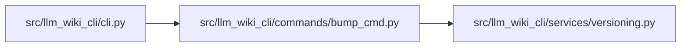

# bump_cmd Module

**Path:** `src/llm_wiki_cli/commands/bump_cmd.py`

## Description

_Auto-generated from `src/llm_wiki_cli/commands/bump_cmd.py`._

## Imports

| Source | Symbols |
|--------|---------|
| `..services.versioning` | `find_version_file`, `read_version`, `write_version`, `bump_patch`, `bump_minor` |
| `subprocess` | `subprocess` |
| `sys` | `sys` |

## Local dependency map

<!-- Auto-generated local dependency summary. Do not edit by hand. -->

### Internal neighbors

| Direction | Module |
|---|---|
| Inbound | [cli](../modules/cli.md) |
| Outbound | [versioning](../modules/versioning.md) |

## Functions

| Function | Signature | Decorators | Description |
|----------|-----------|------------|-------------|
| `run` | `(args)` | — | — |
