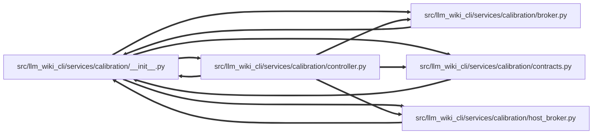

# __init__ Module

**Path:** `src/llm_wiki_cli/services/calibration/__init__.py`

## Description

Isolated calibration services.

The base CLI must not import this package while it registers ordinary commands.
Calibration command adapters cross this boundary explicitly and lazily.  Keep
this initializer free of implementation imports so contracts, controllers, and
OCI broker code load only when their corresponding capability is requested.

The historical ``services.documentation_calibration*`` modules remain aliases
of the implementation modules for source, monkeypatch, and pickle compatibility.

## Imports

| Source | Symbols |
|--------|---------|
| `.` | `broker`, `contracts`, `controller`, `host_broker` |
| `__future__` | `annotations` |
| `collections.abc` | `MutableMapping` |
| `types` | `_types` |
| `typing` | `TYPE_CHECKING` |

## Local dependency map

<!-- Auto-generated local dependency summary. Do not edit by hand. -->
<!-- Thick arrows (==>) mark edges inside an import cycle. -->

### Internal neighbors

| Direction | Module |
|---|---|
| Inbound | [broker](../modules/broker.md) |
| Inbound | [calibration_contracts](../modules/calibration_contracts.md) |
| Inbound | [controller](../modules/controller.md) |
| Inbound | [host_broker](../modules/host_broker.md) |
| Outbound | [broker](../modules/broker.md) |
| Outbound | [calibration_contracts](../modules/calibration_contracts.md) |
| Outbound | [controller](../modules/controller.md) |
| Outbound | [host_broker](../modules/host_broker.md) |

## Functions

| Function | Signature | Decorators | Description |
|----------|-----------|------------|-------------|
| `_restore_legacy_definition_modules` | `(namespace: _MutableMapping[str, object], *, legacy_module: str) -> None` | — | Retain historical callable/type module names used by persisted pickles. |
