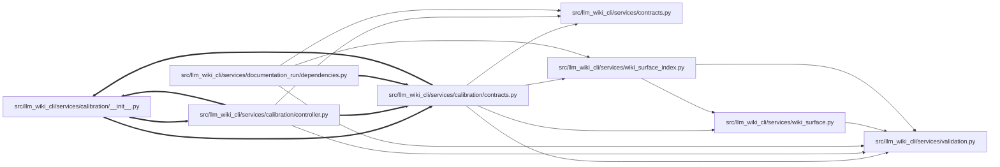

# contracts Module

**Path:** `src/llm_wiki_cli/services/calibration/contracts.py`

## Description

Deterministic evidence contracts for standalone documentation calibration.

This module deliberately does not classify, label, rank, or promote flows.  Its
v1 preflight, shadow, and verdict records are diagnostic-only: they cannot admit
or qualify a calibration cohort.  The module preserves bounded source-backed
evidence in a portable census, emits an evidence-only shadow record beside the
frozen v1 worklist, and applies the calibration plan's terminal decision
precedence to already-produced gate records.  Agent inference, holdout custody,
admission authority, enforced isolation, and provider execution remain host
responsibilities outside the core package.

## Imports

| Source | Symbols |
|--------|---------|
| `.` | `_restore_legacy_definition_modules` |
| `..contracts` | `P0_CALIBRATION_PREFLIGHT_SCHEMA_VERSION`, `P0_CALIBRATION_SHADOW_SCHEMA_VERSION`, `P0_CALIBRATION_VERDICT_SCHEMA_VERSION`, `P0_FLOW_CENSUS_SCHEMA_VERSION` |
| `..validation` | `bool_or_none`, `filtered_trimmed_text_list`, `nonnegative_int_or_none`, `normalize_optional_portable_relative_path`, `trimmed_text_or_none` |
| `..wiki_surface` | `is_safe_page_id` |
| `..wiki_surface_index` | `SURFACE_INDEX_FILENAME` |
| `__future__` | `annotations` |
| `collections` | `Counter`, `defaultdict` |
| `hashlib` | `hashlib` |
| `json` | `json` |
| `pathlib` | `Path`, `PurePosixPath` |
| `re` | `re` |
| `typing` | `Any`, `Iterable`, `Mapping`, `Optional`, `Sequence` |
| `unicodedata` | `unicodedata` |

## Local dependency map

<!-- Auto-generated local dependency summary. Do not edit by hand. -->
<!-- Thick arrows (==>) mark edges inside an import cycle. -->

### Internal neighbors

| Direction | Module |
|---|---|
| Inbound | [calibration___init__](../modules/calibration___init__.md) |
| Inbound | [controller](../modules/controller.md) |
| Inbound | [documentation_run_dependencies](../modules/documentation_run_dependencies.md) |
| Outbound | [calibration___init__](../modules/calibration___init__.md) |
| Outbound | [services_contracts](../modules/services_contracts.md) |
| Outbound | [validation](../modules/validation.md) |
| Outbound | [wiki_surface](../modules/wiki_surface.md) |
| Outbound | [wiki_surface_index](../modules/wiki_surface_index.md) |

## Classes

| Class | Line | Bases | Description |
|-------|------|-------|-------------|
| [DocumentationCalibrationError](../entities/DocumentationCalibrationError.md) | 91 | `ValueError` | Raised when a calibration evidence contract is malformed. |

## Functions

| Function | Signature | Decorators | Description |
|----------|-----------|------------|-------------|
| `canonical_json_sha256` | `(payload: Mapping[str, Any]) -> str` | — | Return a stable prefixed digest for a JSON-compatible mapping. |
| `build_flow_evidence_census` | `(wiki_dir: str, *, source_root: Optional[str] = None, source_revision: str = 'unknown', source_fingerprint: str = 'unknown', dependency_evidence: Optional[Mapping[str, Any]] = None, tool_revision: str = 'unknown', allow_surface_fallback: bool = False) -> dict[str, Any]` | — | Build a deterministic, priority-blind flow evidence census. |
| `validate_flow_evidence_census` | `(payload: Mapping[str, Any]) -> None` | — | Validate census invariants required by downstream calibration stages. |
| `build_p0_calibration_shadow` | `(worklist: Mapping[str, Any], census: Mapping[str, Any], *, candidate_records: Optional[Iterable[Mapping[str, Any]]] = None, policy_version: str = 'unscored-shadow/v1') -> dict[str, Any]` | — | Emit current semantics beside optional, explicitly separate candidates. |
| `evaluate_calibration_preflight` | `(checks: Mapping[str, bool]) -> dict[str, Any]` | — | Evaluate diagnostic-only P0C-000 v1 checks without discretionary waivers. |
| `mechanical_calibration_verdict` | `(*, reject_reasons: Sequence[str] = (), blocked_reasons: Sequence[str] = (), revision_reasons: Sequence[str] = (), mandatory_gates_complete: bool, diversity_complete: bool) -> dict[str, Any]` | — | Apply diagnostic v1 precedence to already-audited gate reasons. |
| `validate_source_citation` | `(citation: Mapping[str, Any], source_root: str) -> bool` | — | Recompute a census citation against a frozen source snapshot. |
| `_flow_capsule` | `(raw: Mapping[str, Any], *, wiki: Path, source_root: Optional[Path], source_revision: str, dependency_metrics: Mapping[str, Mapping[str, int]]) -> dict[str, Any]` | — | — |
| `_candidate_shadow` | `(candidate: Optional[Mapping[str, Any]]) -> dict[str, Any]` | — | — |
| `_critical_review_reasons` | `(capsule: Mapping[str, Any]) -> list[str]` | — | — |
| `_source_citation` | `(source_root: Optional[Path], source_path: Optional[str], symbol: Optional[str], language: str) -> Optional[dict[str, Any]]` | — | — |
| `_definition_line` | `(lines: Sequence[str], symbol: str, language: str) -> Optional[int]` | — | — |
| `_evidence_completeness` | `(*, source_path: Optional[str], source_citation: Optional[Mapping[str, Any]], flow: Mapping[str, Any], data_flow: Optional[Mapping[str, Any]], dependency: Optional[Mapping[str, int]]) -> dict[str, str]` | — | — |
| `_dependency_metric_map` | `(evidence: Mapping[str, Any]) -> dict[str, dict[str, int]]` | — | — |
| `_operation_family_key` | `(value: str, category: str) -> str` | — | — |
| `_source_provenance` | `(source_path: Optional[str]) -> str` | — | — |
| `_language_for_path` | `(source_path: Optional[str]) -> Optional[str]` | — | — |
| `_safe_source_file` | `(root: Path, relative: str) -> Optional[Path]` | — | — |
| `_read_json_mapping` | `(path: Path, label: str) -> Mapping[str, Any]` | — | — |
| `_fallback_flow_records` | `(wiki: Path) -> list[dict[str, str]]` | — | — |
| `_required_flow_id` | `(raw: Mapping[str, Any]) -> str` | — | — |
| `_portable_relative_path` | `(value: object) -> Optional[str]` | — | Normalize legacy observation spelling without admitting unsafe paths. |
| `_portable_path_list` | `(value: object, *, limit: int) -> list[str]` | — | — |
| `_bounded_mapping_list` | `(value: object, *, limit: int) -> list[dict[str, Any]]` | — | — |
| `_json_mapping` | `(value: Mapping[str, Any]) -> dict[str, Any]` | — | — |
| `_text_list` | `(value: object, *, limit: int) -> list[str]` | — | Normalize loose diagnostic text while discarding malformed observations. |
| `_optional_text` | `(value: object) -> Optional[str]` | — | — |
| `_safe_non_negative_int` | `(value: object) -> int` | — | — |
| `_non_negative_int_or_none` | `(value: object) -> Optional[int]` | — | — |
| `_bool_or_none` | `(value: object) -> Optional[bool]` | — | — |
| `_file_sha256` | `(path: Path) -> str` | — | — |
| `_case_id` | `(source_revision: str, flow_id: str) -> str` | — | — |
| `_digest` | `(value: str) -> str` | — | — |
| `_reason_tuple` | `(values: Sequence[str], field_name: str) -> tuple[str, ...]` | — | — |
