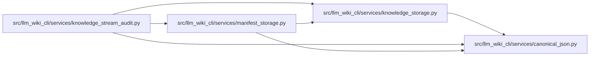

# canonical_json Module

**Path:** `src/llm_wiki_cli/services/canonical_json.py`

## Description

Streams the existing compact, sorted UTF-8 JSON representation in bounded chunks and computes exact scalar sizes. Small validated subtrees use the standard encoder; larger containers are traversed incrementally. Short-string size caching stores pure encoding results and does not establish filesystem freshness.

## Imports

| Source | Symbols |
|--------|---------|
| `__future__` | `annotations` |
| `collections.abc` | `Iterator`, `Mapping` |
| `functools` | `lru_cache` |
| `json` | `json` |
| `math` | `math` |
| `re` | `re` |
| `typing` | `Any` |

## Local dependency map

<!-- Auto-generated local dependency summary. Do not edit by hand. -->

### Internal neighbors

| Direction | Module |
|---|---|
| Inbound | [knowledge_storage](../modules/knowledge_storage.md) |
| Inbound | [knowledge_stream_audit](../modules/knowledge_stream_audit.md) |
| Inbound | [manifest_storage](../modules/manifest_storage.md) |

## Classes

| Class | Line | Bases | Description |
|-------|------|-------|-------------|
| [CanonicalArray](../entities/CanonicalArray.md) | 21 | — | Explicit repeatable array stream for internal spill-backed operations. |

## Functions

| Function | Signature | Decorators | Description |
|----------|-----------|------------|-------------|
| `_string_size` | `(value: str) -> int` | — | — |
| `scalar_size` | `(value: Any) -> int` | — | Exact encoded bytes, excluding a trailing newline, without JSON buffers. |
| `_fits` | `(value: Any, budget: int) -> bool` | — | — |
| `canonical_chunks` | `(value: Any, *, chunk_bytes: int = CHUNK_BYTES) -> Iterator[bytes]` | — | Emit exactly json.dumps(sort_keys=True, ensure_ascii=False, compact)+LF. |