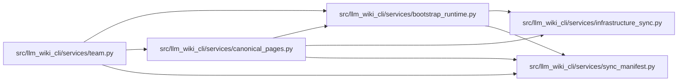

# canonical_pages Module

**Path:** `src/llm_wiki_cli/services/canonical_pages.py`

## Description

Canonical generated page names and explicitly retained removal history.

## Imports

| Source | Symbols |
|--------|---------|
| `.bootstrap_runtime` | `build_entity_occurrence_page_map`, `build_module_page_map` |
| `.infrastructure_sync` | `build_infrastructure_page_map`, `infrastructure_evidence_by_page` |
| `.sync_manifest` | `SyncManifest`, `TOMBSTONE_SOURCE_MISSING` |
| `__future__` | `annotations` |
| `collections.abc` | `Mapping` |

## Local dependency map

<!-- Auto-generated local dependency summary. Do not edit by hand. -->

### Internal neighbors

| Direction | Module |
|---|---|
| Inbound | [team](../modules/team.md) |
| Outbound | [bootstrap_runtime](../modules/bootstrap_runtime.md) |
| Outbound | [infrastructure_sync](../modules/infrastructure_sync.md) |
| Outbound | [sync_manifest](../modules/sync_manifest.md) |

## Functions

| Function | Signature | Decorators | Description |
|----------|-----------|------------|-------------|
| `canonical_generated_pages` | `(inventory: dict, infrastructure_inventory: Mapping[str, object], *, manifest: SyncManifest \| None = None) -> dict[str, set[str]]` | — | Use the generator's mappers; only known removal records extend live names. |
