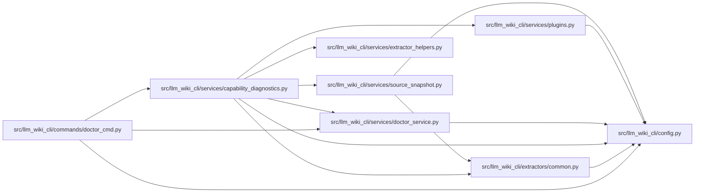

# capability_diagnostics Module

**Path:** `src/llm_wiki_cli/services/capability_diagnostics.py`

## Description

Inspects selected languages, available tool executables, prepared helpers,
unsupported inputs, and installed plugin metadata. Reports provider states and
explicit preparation or validation commands without downloading helpers or
loading project plugin code. The v2 doctor combines these diagnostics with the
existing health report; text output includes failure reasons and shell-labelled,
quoted commands, while JSON retains structured argument lists.

Each provider explains its missing prerequisite, available commands, and next
step. Blocked reports include a recheck command that preserves the source,
wiki, selection, and helper-cache settings. A prepared TypeScript helper that
lacks Node.js requires runtime setup without rebuilding the helper. Tool
overrides follow the same resolution rules as explicit preparation.

## Imports

| Source | Symbols |
|--------|---------|
| `.` | `extractor_helpers`, `plugins` |
| `..config` | `validate_source_root` |
| `..extractors.common` | `LANGUAGE_EXTENSIONS` |
| `.doctor_service` | `build_doctor_report`, `_render_doctor_payload` |
| `.source_snapshot` | `build_source_snapshot` |
| `__future__` | `annotations` |
| `os` | `os` |
| `pathlib` | `Path` |
| `shlex` | `shlex` |
| `shutil` | `shutil` |
| `sys` | `sys` |

## Local dependency map

<!-- Auto-generated local dependency summary. Do not edit by hand. -->

### Internal neighbors

| Direction | Module |
|---|---|
| Inbound | [doctor_cmd](../modules/doctor_cmd.md) |
| Outbound | [config](../modules/config.md) |
| Outbound | [common](../modules/common.md) |
| Outbound | [doctor_service](../modules/doctor_service.md) |
| Outbound | [extractor_helpers](../modules/extractor_helpers.md) |
| Outbound | [plugins](../modules/plugins.md) |
| Outbound | [source_snapshot](../modules/source_snapshot.md) |

## Functions

| Function | Signature | Decorators | Description |
|----------|-----------|------------|-------------|
| `build_capability_diagnostics` | `(src_dir = '.', *, helper_cache_dir = None, source_selection = None, allow_external_src = False, include_tests = None)` | — | — |
| `build_capability_doctor` | `(wiki_dir = 'docs/llm_wiki', src_dir = '.', **kwargs)` | — | — |
| `render_capability_doctor` | `(report)` | — | — |
