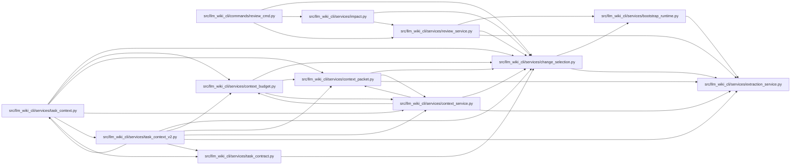

# change_selection Module

**Path:** `src/llm_wiki_cli/services/change_selection.py`

## Description

Resolves supplied paths, Git ranges, staged changes, and patch file headers into
portable source-relative selections. Patch parsing handles quoted paths and
binary, mode, copy, and rename headers while respecting hunk boundaries.

Shared page mapping uses exact generated module Path and entity Location
provenance to resolve naming collisions and conflicting retained mappings.
Callers can supply already captured page contents to preserve their read basis.

## Imports

| Source | Symbols |
|--------|---------|
| `.bootstrap_runtime` | `build_entity_occurrence_page_map`, `build_entity_page_map`, `build_module_page_map` |
| `.extraction_service` | `_git_name_status_paths`, `_partition_snapshot_git_changes` |
| `__future__` | `annotations` |
| `ast` | `ast` |
| `hashlib` | `hashlib` |
| `json` | `json` |
| `re` | `re` |
| `subprocess` | `subprocess` |
| `typing` | `Mapping` |

## Local dependency map

<!-- Auto-generated local dependency summary. Do not edit by hand. -->

### Internal neighbors

| Direction | Module |
|---|---|
| Inbound | [review_cmd](../modules/review_cmd.md) |
| Inbound | [context_budget](../modules/context_budget.md) |
| Inbound | [context_packet](../modules/context_packet.md) |
| Inbound | [context_service](../modules/context_service.md) |
| Inbound | [impact](../modules/impact.md) |
| Inbound | [review_service](../modules/review_service.md) |
| Inbound | [task_context](../modules/task_context.md) |
| Inbound | [task_context_v2](../modules/task_context_v2.md) |
| Inbound | [task_contract](../modules/task_contract.md) |
| Outbound | [bootstrap_runtime](../modules/bootstrap_runtime.md) |
| Outbound | [extraction_service](../modules/extraction_service.md) |

## Functions

| Function | Signature | Decorators | Description |
|----------|-----------|------------|-------------|
| `portable_path` | `(value: str) -> str` | — | — |
| `validate_changes` | `(value: object) -> dict` | — | — |
| `changes_from_args` | `(args) -> dict \| None` | — | — |
| `_git` | `(root, *arguments) -> str` | — | — |
| `source_relative_paths` | `(paths, root, *, prefix = None) -> list[str]` | — | Map repo-relative Git/patch paths through an exact source-root prefix. |
| `select_changes` | `(root, request, *, snapshot = None) -> dict` | — | — |
| `_patch_path` | `(value: str, *, git_prefix: bool = False) -> str \| None` | — | — |
| `_git_patch_header_paths` | `(line: str) -> set[str]` | — | — |
| `patch_paths` | `(text: str) -> list[str]` | — | Read file headers, including binary/mode changes, without reading hunks. |
| `affected_page_map` | `(paths, inventory: Mapping, surface_pages = (), *, page_contents: Mapping[str, str] \| None = None) -> dict[str, list[str]]` | — | Map exact sources to canonical pages; never match ambiguous suffixes. |