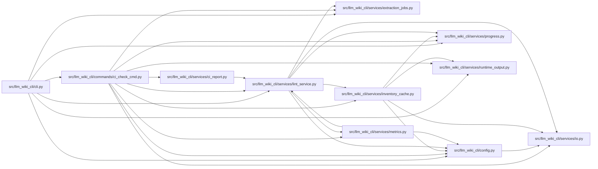

# ci_check_cmd Module

**Path:** `src/llm_wiki_cli/commands/ci_check_cmd.py`

## Description

Runs the lint service in strict mode for automation. The command validates
source and wiki paths, emits the selected console format, always writes a
Markdown report, records best-effort local metrics, and returns a failing exit
status when blocking wiki issues remain.

## Imports

| Source | Symbols |
|--------|---------|
| `..config` | `DEFAULT_WIKI_DIR`, `validate_path`, `validate_source_root` |
| `..services.ci_report` | `build_ci_check_payload` |
| `..services.extraction_jobs` | `extraction_job_request_from_args`, `print_extraction_job_plan` |
| `..services.inventory_cache` | `InventoryCacheStats`, `cache_options_from_args`, `format_cache_stats`, `prepare_cache_options` |
| `..services.io` | `write_bytes_atomic` |
| `..services.lint_service` | `build_report`, `render_markdown`, `render_text` |
| `..services.metrics` | `record_validation_event` |
| `..services.progress` | `observed_phase` |
| `..services.runtime_output` | `RuntimeDestination`, `RuntimeOutputError`, `prepare_destination`, `stderr_warning` |
| `__future__` | `annotations` |
| `dataclasses` | `replace` |
| `json` | `json` |
| `pathlib` | `Path` |
| `sys` | `sys` |
| `time` | `time` |

## Local dependency map

<!-- Auto-generated local dependency summary. Do not edit by hand. -->

### Internal neighbors

| Direction | Module |
|---|---|
| Inbound | [cli](../modules/cli.md) |
| Outbound | [config](../modules/config.md) |
| Outbound | [ci_report](../modules/ci_report.md) |
| Outbound | [extraction_jobs](../modules/extraction_jobs.md) |
| Outbound | [inventory_cache](../modules/inventory_cache.md) |
| Outbound | [io](../modules/io.md) |
| Outbound | [lint_service](../modules/lint_service.md) |
| Outbound | [metrics](../modules/metrics.md) |
| Outbound | [progress](../modules/progress.md) |
| Outbound | [runtime_output](../modules/runtime_output.md) |

## Functions

| Function | Signature | Decorators | Description |
|----------|-----------|------------|-------------|
| `_render_console` | `(report, output_format: str, **payload_options) -> str` | — | — |
| `_report_destination` | `(args) -> RuntimeDestination` | — | — |
| `_persist_report` | `(destination: RuntimeDestination, report) -> int` | `@observed_phase('report_persistence')` | — |
| `run` | `(args) -> None` | — | — |