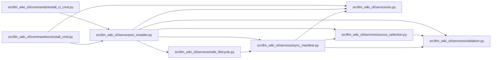

# ci_installer Module

**Path:** `src/llm_wiki_cli/services/ci_installer.py`

## Description

Portable installation of the managed LLM Wiki integrity workflow.

## Imports

| Source | Symbols |
|--------|---------|
| `.io` | `first_unsafe_path_component`, `write_bytes_atomic` |
| `.source_selection` | `SourceSelectionError`, `locate_exact_repository_path`, `resolve_source_selection`, `validate_persisted_source_selection_identity` |
| `.sync_manifest` | `MANIFEST_FILENAME`, `SyncManifest`, `SyncManifestError` |
| `.validation` | `require_repository_relative_path` |
| `.wiki_lifecycle` | `WikiLifecycleState`, `classify_wiki_lifecycle` |
| `__future__` | `annotations` |
| `dataclasses` | `dataclass` |
| `hashlib` | `hashlib` |
| `hmac` | `hmac` |
| `json` | `json` |
| `pathlib` | `Path` |
| `re` | `re` |

## Local dependency map

<!-- Auto-generated local dependency summary. Do not edit by hand. -->

### Internal neighbors

| Direction | Module |
|---|---|
| Inbound | [install_ci_cmd](../modules/install_ci_cmd.md) |
| Inbound | [uninstall_cmd](../modules/uninstall_cmd.md) |
| Outbound | [io](../modules/io.md) |
| Outbound | [source_selection](../modules/source_selection.md) |
| Outbound | [sync_manifest](../modules/sync_manifest.md) |
| Outbound | [validation](../modules/validation.md) |
| Outbound | [wiki_lifecycle](../modules/wiki_lifecycle.md) |

## Classes

| Class | Line | Bases | Description |
|-------|------|-------|-------------|
| [InstallCiError](../entities/InstallCiError.md) | 42 | `ValueError` | Raised when a portable CI workflow cannot be installed safely. |
| [InstallCiResult](../entities/InstallCiResult.md) | 47 | — | Outcome of one workflow installation attempt. |

## Functions

| Function | Signature | Decorators | Description |
|----------|-----------|------------|-------------|
| `normalize_action_ref` | `(value: object) -> str` | — | Return a canonical immutable Git commit for the reusable action. |
| `_validated_project_path` | `(value: object, *, label: str) -> str` | — | — |
| `_without_github_expression` | `(path: str, *, label: str) -> str` | — | — |
| `_portable_project_path` | `(value: object, *, label: str, allow_root: bool) -> str` | — | — |
| `_project_directory` | `(project_root: Path, relative_path: str, *, label: str) -> Path` | — | — |
| `_validate_default_selection_contract` | `(source_root: Path, wiki_dir: Path) -> None` | — | Prove the managed wiki can use default source-selection discovery. |
| `_workflow_body` | `(*, action_ref: str, src_dir: str, wiki_dir: str) -> str` | — | — |
| `render_managed_workflow` | `(*, action_ref: str, src_dir: str = '.', wiki_dir: str = 'docs/llm_wiki') -> bytes` | — | Render deterministic workflow bytes with a self-verifying owner marker. |
| `_normalize_newlines` | `(content: bytes) -> bytes \| None` | — | — |
| `is_unmodified_managed_workflow` | `(content: bytes) -> bool` | — | Return whether bytes carry a valid installer ownership checksum. |
| `_validate_workflow_target` | `(project_root: Path) -> Path` | — | — |
| `install_ci_workflow` | `(*, action_ref: str, src_dir: str = '.', wiki_dir: str = 'docs/llm_wiki', dry_run: bool = False, force: bool = False, project_root: str \| Path \| None = None) -> InstallCiResult` | — | Create or safely update the repository's managed integrity workflow. |
