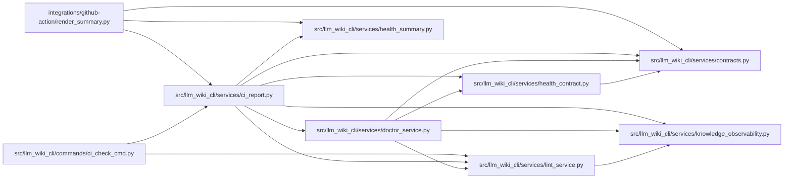

# ci_report Module

**Path:** `src/llm_wiki_cli/services/ci_report.py`

## Description

Versioned full-integrity CI report composition and validation.

The producer composes the knowledge-health projection from the exact
``LintReport`` already built by ``ci-check``.  It never invokes ``doctor`` or
performs another source extraction.  The strict loader and bounded renderer
are used by the portable GitHub integrity wrapper; broad ``ci-check`` policy
and its process exit remain authoritative over the nested health dashboard.

## Imports

| Source | Symbols |
|--------|---------|
| `.contracts` | `CI_CHECK_SCHEMA_VERSION`, `CI_CHECK_V2_SCHEMA_VERSION`, `CI_CHECK_V3_SCHEMA_VERSION`, `DOCTOR_SCHEMA_VERSION`, `DOCTOR_V3_SCHEMA_VERSION` |
| `.doctor_service` | `compose_doctor_report` |
| `.health_contract` | `HealthDetailsError`, `validate_health_details` |
| `.health_summary` | `FRESHNESS_DISCLOSURE`, `freshness_counts`, `reason_list`, `summary_cell` |
| `.knowledge_observability` | `KnowledgeAggregateSummary` |
| `.lint_service` | `LintReport`, `report_to_dict` |
| `__future__` | `annotations` |
| `argparse` | `argparse` |
| `collections` | `Counter` |
| `collections.abc` | `Mapping`, `Sequence` |
| `json` | `json` |
| `pathlib` | `Path` |
| `re` | `re` |
| `typing` | `Any` |

## Local dependency map

<!-- Auto-generated local dependency summary. Do not edit by hand. -->

### Internal neighbors

| Direction | Module |
|---|---|
| Inbound | [render_summary](../modules/render_summary.md) |
| Inbound | [ci_check_cmd](../modules/ci_check_cmd.md) |
| Outbound | [services_contracts](../modules/services_contracts.md) |
| Outbound | [doctor_service](../modules/doctor_service.md) |
| Outbound | [health_contract](../modules/health_contract.md) |
| Outbound | [health_summary](../modules/health_summary.md) |
| Outbound | [knowledge_observability](../modules/knowledge_observability.md) |
| Outbound | [lint_service](../modules/lint_service.md) |

## Classes

| Class | Line | Bases | Description |
|-------|------|-------|-------------|
| [CiCheckReportError](../entities/CiCheckReportError.md) | 186 | `ValueError` | A field-specific failure in the versioned CI report contract. |

## Functions

| Function | Signature | Decorators | Description |
|----------|-----------|------------|-------------|
| `build_ci_check_payload` | `(report: LintReport, *, report_schema: str = 'v1', runtime: Mapping[str, object] \| None = None, command_exit_code: int \| None = None) -> dict[str, object]` | — | Compose versioned CI and doctor results from one evaluated lint report. |
| `_strict_json_object` | `(pairs: list[tuple[str, Any]]) -> dict[str, Any]` | — | — |
| `_reject_nonfinite` | `(value: str) -> None` | — | — |
| `_object` | `(value: object, field: str) -> Mapping[str, Any]` | — | — |
| `_exact_object` | `(value: object, field: str, required: frozenset[str], optional: frozenset[str] = frozenset()) -> Mapping[str, Any]` | — | — |
| `_contract_object` | `(value: object, field: str, required: frozenset[str], *, allow_additive: bool) -> Mapping[str, Any]` | — | — |
| `_string` | `(value: object, field: str) -> str` | — | — |
| `_nullable_string` | `(value: object, field: str) -> str \| None` | — | — |
| `_boolean` | `(value: object, field: str) -> bool` | — | — |
| `_nullable_boolean` | `(value: object, field: str) -> bool \| None` | — | — |
| `_nullable_nonnegative_integer` | `(value: object, field: str) -> int \| None` | — | — |
| `_nonnegative_integer` | `(value: object, field: str) -> int` | — | — |
| `_positive_integer` | `(value: object, field: str) -> int` | — | — |
| `_enum` | `(value: object, field: str, allowed: Mapping[str, object] \| frozenset[str]) -> str` | — | — |
| `_array` | `(value: object, field: str) -> list[Any]` | — | — |
| `_string_array` | `(value: object, field: str) -> list[str]` | — | — |
| `_canonical_string_array` | `(value: object, field: str) -> list[str]` | — | — |
| `_count_mapping` | `(value: object, field: str, *, exact_keys: frozenset[str] \| None = None) -> dict[str, int]` | — | — |
| `_finding_reasons` | `(findings: Sequence[Mapping[str, Any]]) -> list[str]` | — | — |
| `_validate_lint_findings` | `(value: object, field: str) -> list[Mapping[str, Any]]` | — | — |
| `_canonical_plan_ids` | `(value: object, field: str) -> list[str]` | — | — |
| `_validate_execution` | `(value: object) -> None` | — | — |
| `_freshness_counts` | `(value: object, field: str) -> Mapping[str, Any] \| None` | — | — |
| `_validate_knowledge_summary` | `(value: object, *, health: Mapping[str, Any]) -> None` | — | — |
| `_expected_health_classification` | `(*, strict: bool, source_selection_mismatch: bool, availability_state: str, freshness_evaluated: bool, snapshot_state: str, governance_state: str, expired_reviews: int, drift_state: str, verification_state: str) -> tuple[str, list[str], list[str]]` | — | — |
| `_validate_doctor` | `(value: object, *, wiki_dir: str, src_dir: str, source_selection_mismatch: bool \| None, expected_strict: bool, allow_additive: bool = False) -> Mapping[str, Any]` | — | — |
| `validate_doctor_payload` | `(value: object, *, expected_strict: bool, source_selection_mismatch: bool \| None = None, allow_additive: bool = False) -> Mapping[str, Any]` | — | Validate supported health doctor contracts and their classification. |
| `_legacy_doctor_payload` | `(health: Mapping[str, Any]) -> dict[str, Any]` | — | — |
| `_validate_ci_v3` | `(value: Mapping[str, Any], *, cli_exit: int) -> Mapping[str, Any]` | — | — |
| `_validate_ci_v2` | `(value: object, *, cli_exit: int) -> Mapping[str, Any]` | — | — |
| `validate_ci_check_payload` | `(value: object, *, cli_exit: int) -> Mapping[str, Any]` | — | Validate CI v1/v2 and distinguish check and required-output failures. |
| `load_ci_check_payload` | `(path: str \| Path, *, cli_exit: int) -> Mapping[str, Any]` | — | Read strict UTF-8 JSON and validate the complete CI v1 contract. |
| `_health_detail_lines` | `(report: Mapping[str, Any]) -> list[str]` | — | Summarize the already validated diagnostics; never evaluate source. |
| `_bounded_summary` | `(core: list[str], details: list[str], suffix: list[str], *, max_lines: int, max_bytes: int) -> bytes` | — | Preserve status and dirty paths, disclosing any omitted health detail. |
| `render_ci_summary` | `(report: Mapping[str, Any] \| None, *, result: str, cli_exit: int, json_state: str, markdown_state: str, tree_state: str, status_records: Sequence[bytes], status_count: int, status_limit: int, max_lines: int, max_bytes: int, report_name: str = 'llm-wiki-ci-report.json', evidence_artifact: str \| None = None) -> bytes` | — | Render fixed-state integrity and health evidence within strict bounds. |
| `_arguments` | `(argv: Sequence[str] \| None = None) -> argparse.Namespace` | — | — |
| `main` | `(argv: Sequence[str] \| None = None) -> int` | — | Internal CLI used by the isolated GitHub integrity wrapper. |
