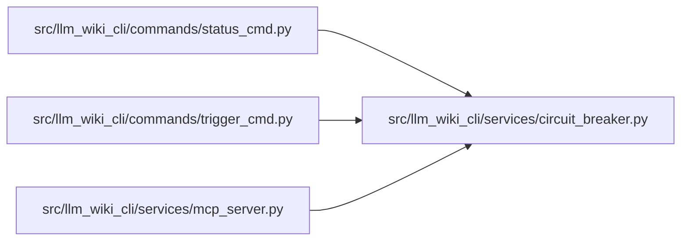

# circuit_breaker Module

**Path:** `src/llm_wiki_cli/services/circuit_breaker.py`

## Description

_Auto-generated from `src/llm_wiki_cli/services/circuit_breaker.py`._

## Imports

| Source | Symbols |
|--------|---------|
| `datetime` | `datetime`, `timezone` |
| `json` | `json` |
| `math` | `math` |
| `os` | `os` |
| `pathlib` | `Path` |
| `tempfile` | `tempfile` |

## Local dependency map

<!-- Auto-generated local dependency summary. Do not edit by hand. -->

### Internal neighbors

| Direction | Module |
|---|---|
| Inbound | [status_cmd](../modules/status_cmd.md) |
| Inbound | [trigger_cmd](../modules/trigger_cmd.md) |
| Inbound | [mcp_server](../modules/mcp_server.md) |

## Functions

| Function | Signature | Decorators | Description |
|----------|-----------|------------|-------------|
| `_state_path` | `(git_dir: Path) -> Path` | — | — |
| `load_state` | `(git_dir: Path) -> dict` | — | — |
| `save_state` | `(git_dir: Path, state: dict) -> None` | — | Persist state atomically (write to tmp + rename). |
| `check_breaker` | `(git_dir: Path) -> bool` | — | Return whether an open breaker or active half-open probe blocks execution. |
| `record_success` | `(git_dir: Path) -> None` | — | — |
| `record_failure` | `(git_dir: Path) -> None` | — | — |
| `reset_breaker` | `(git_dir: Path) -> None` | — | — |
| `breaker_ttl_seconds` | `() -> float` | — | Return the configured non-negative automatic-recovery TTL. |
| `_timestamp_expired` | `(value: object, *, ttl_seconds: float) -> bool` | — | — |
