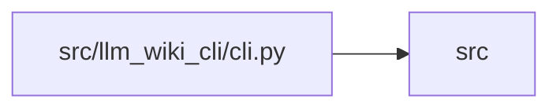

# cli Module

**Path:** `src/llm_wiki_cli/cli.py`

## Description

Defines the `llm-wiki` argument parser and dispatch boundary. It registers the
complete command tree, validates shared numeric and source-selection options,
and routes the parsed namespace to focused command or service modules. Optional
features such as MCP remain behind their command boundary so ordinary parser
startup does not require their runtime packages.

## Imports

| Source | Symbols |
|--------|---------|
| `.` | `__version__` |
| `.commands` | `bump_cmd`, `ci_check_cmd`, `docs_cmd`, `doctor_cmd`, `generate_prompt_cmd`, `hook_cmd`, `install_ci_cmd`, `init_cmd`, `install_cmd`, `knowledge_cmd`, `mcp_cmd`, `metrics_cmd`, `migrate_cmd`, `obsidian_cmd`, `plugins_cmd`, `prepare_extractors_cmd`, `release_cmd`, `review_cmd`, `site_cmd`, `skills_cmd`, `status_cmd`, `sync_cmd`, `team_cmd`, `trigger_cmd`, `uninstall_cmd`, `upgrade_cmd` |
| `.config` | `AGENT_CHOICES`, `DEFAULT_WIKI_DIR`, `PathValidationError` |
| `.services` | `bootstrap_runtime`, `context_service`, `extraction_service`, `lint_service` |
| `.services.contracts` | `BOOTSTRAP_SKIP_DATA_FLOW_FLAG` |
| `.services.extraction_jobs` | `ExtractionJobsAction` |
| `.services.resource_diagnostics` | `resource_failure_hint` |
| `argparse` | `argparse` |
| `os` | `os` |
| `sys` | `sys` |

## Local dependency map

<!-- Auto-generated local dependency summary. Do not edit by hand. -->

> Module-level dependencies exceed the generated-diagram limits, so the diagram and table below group them by top-level package. Counts report the number of module neighbors in each package.

### Internal neighbors

| Direction | Module |
|---|---|
| Outbound | `src` (35) |

> All 35 module neighbor(s) are summarized by package because the module-level view exceeds the 12-node limit.

## Functions

| Function | Signature | Decorators | Description |
|----------|-----------|------------|-------------|
| `_positive_int` | `(value: str) -> int` | — | — |
| `_nonnegative_int` | `(value: str) -> int` | — | — |
| `_surface_values` | `(value: str) -> tuple[str, ...]` | — | — |
| `_add_helper_cache_argument` | `(parser)` | — | — |
| `_add_include_tests_argument` | `(parser)` | — | — |
| `_add_source_selection_argument` | `(parser)` | — | — |
| `_add_jobs_argument` | `(parser)` | — | — |
| `_build_parser` | `()` | — | — |
| `_register_commands` | `(subparsers)` | — | — |
| `_add_doctor_command` | `(subparsers)` | — | — |
| `_add_init_command` | `(subparsers)` | — | — |
| `_add_extract_command` | `(subparsers)` | — | — |
| `_add_lint_command` | `(subparsers)` | — | — |
| `_add_prepare_extractors_command` | `(subparsers)` | — | — |
| `_add_ci_check_command` | `(subparsers)` | — | — |
| `_add_install_hook_command` | `(subparsers)` | — | — |
| `_add_install_ci_command` | `(subparsers)` | — | — |
| `_add_install_command` | `(subparsers)` | — | — |
| `_add_knowledge_wiki_argument` | `(parser)` | — | — |
| `_add_knowledge_dry_run` | `(parser)` | — | — |
| `_add_governance_actor_arguments` | `(parser)` | — | — |
| `_add_lifecycle_arguments` | `(parser, *, reason: str, successor: bool = False)` | — | — |
| `_add_knowledge_command` | `(subparsers)` | — | — |
| `_add_plugins_command` | `(subparsers)` | — | — |
| `_add_team_command` | `(subparsers)` | — | — |
| `_add_trigger_agent_command` | `(subparsers)` | — | — |
| `_add_bootstrap_command` | `(subparsers)` | — | — |
| `_add_bump_command` | `(subparsers)` | — | — |
| `_add_generate_prompt_command` | `(subparsers)` | — | — |
| `_add_metrics_command` | `(subparsers)` | — | — |
| `_add_review_command` | `(subparsers)` | — | — |
| `_add_uninstall_command` | `(subparsers)` | — | — |
| `_add_status_command` | `(subparsers)` | — | — |
| `_add_mcp_command` | `(subparsers)` | — | — |
| `_add_obsidian_command` | `(subparsers)` | — | — |
| `_add_site_command` | `(subparsers)` | — | — |
| `_add_projection_metadata_arguments` | `(parser, *, public_identity_dest: str)` | — | — |
| `_add_site_hub_arguments` | `(parser)` | — | — |
| `_add_skills_command` | `(subparsers)` | — | — |
| `_add_skills_selection_arguments` | `(parser)` | — | — |
| `_add_release_command` | `(subparsers)` | — | — |
| `_add_upgrade_command` | `(subparsers)` | — | — |
| `_add_sync_command` | `(subparsers)` | — | — |
| `_add_migrate_command` | `(subparsers)` | — | — |
| `_add_context_command` | `(subparsers)` | — | — |
| `_add_docs_command` | `(subparsers)` | — | — |
| `_dispatch_command` | `(args)` | — | — |
| `main` | `()` | — | — |