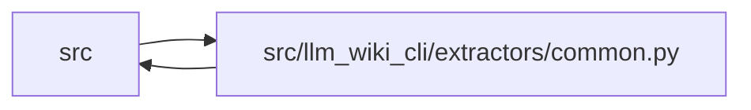

# common Module

**Path:** `src/llm_wiki_cli/extractors/common.py`

## Description

Shared helpers for source-file extractor discovery and filtering.

## Imports

| Source | Symbols |
|--------|---------|
| `..config` | `EXCLUDED_DIRS`, `GitIgnoreMatcher`, `build_gitignore_matcher`, `is_agent_worktree_path` |
| `__future__` | `annotations` |
| `os` | `os` |
| `pathlib` | `Path` |
| `posixpath` | `posixpath` |
| `re` | `re` |
| `typing` | `Iterable` |

## Local dependency map

<!-- Auto-generated local dependency summary. Do not edit by hand. -->

> Module-level dependencies exceed the generated-diagram limits, so the diagram and table below group them by top-level package. Counts report the number of module neighbors in each package.

### Internal neighbors

| Direction | Module |
|---|---|
| Inbound | `src` (11) |
| Outbound | `src` (1) |

> All 12 module neighbor(s) are summarized by package because the module-level view exceeds the 12-node limit.

## Functions

| Function | Signature | Decorators | Description |
|----------|-----------|------------|-------------|
| `normalize_include_tests` | `(include_tests: Iterable[str] \| None) -> frozenset[str]` | — | Return the normalized set of languages whose test files are included. |
| `inventory_language_for_path` | `(language: str, path: str \| Path) -> str` | — | Return the precise inventory language label for a discovered file. |
| `is_generated_javascript_bundle_path` | `(path: str \| Path) -> bool` | — | Return True for generated/minified JavaScript static asset bundles. |
| `_normalize_path_text` | `(path: str \| Path) -> str` | — | Return a separator-normalized lexical path without resolving it. |
| `_is_windows_absolute_path_text` | `(path: str) -> bool` | — | — |
| `_is_absolute_path_text` | `(path: str) -> bool` | — | — |
| `_path_is_within` | `(path: str, directory: str) -> bool` | — | — |
| `_path_text_equal` | `(left: str, right: str) -> bool` | — | — |
| `_helper_relative_path_matches` | `(relative_path: str, *, windows: bool) -> bool` | — | — |
| `_owned_package_sentinels_present` | `(package_root: str) -> bool` | — | Prove that an inferred root is an LLM Wiki package source tree. |
| `is_bundled_helper_implementation_path` | `(path: str \| Path, *, package_root: str \| Path \| None = None) -> bool` | — | Return whether *path* is one of this package's eight helper sources. |
| `_resolved_inventory_path` | `(path: str \| Path) -> Path \| None` | — | Resolve a concrete local path without interpreting foreign paths. |
| `_normalized_context_root` | `(root: str \| Path) -> str` | — | — |
| `_contextual_inventory_candidate` | `(root: str \| Path, relative_path: str) -> str \| Path` | — | — |
| `_inventory_classification_candidates` | `(path: str \| Path, *, source_root: str \| Path \| None, package_root: str \| Path \| None) -> tuple[str \| Path, ...]` | — | — |
| `is_bundled_inventory_path` | `(path: str \| Path, *, source_root: str \| Path \| None = None, package_root: str \| Path \| None = None) -> bool` | — | Classify an inventory key without consulting ambient CWD. |
| `_has_bundle_asset_directory` | `(directory_parts: tuple[str, ...]) -> bool` | — | — |
| `_looks_like_hashed_bundle_name` | `(name: str) -> bool` | — | — |
| `should_skip_source_path` | `(path: Path, src_path: Path, matcher: GitIgnoreMatcher \| None = None) -> bool` | — | Return True when *path* should be skipped for source extraction. |
| `discover_source_files` | `(src_dir: str, extensions: Iterable[str], *, only_files: list[str] \| None = None, language: str \| None = None, matcher: GitIgnoreMatcher \| None = None, include_tests: Iterable[str] \| None = None) -> list[str]` | — | Return matching source files relative to *src_dir*. |
| `filter_bundled_inventory` | `(inventory: dict, scripts_dir: Path, *, source_root: str \| Path \| None = None, package_root: str \| Path \| None = None) -> dict` | — | Remove bundled/package-cache implementation files from an inventory. |
| `filter_bundled_source_inventory` | `(inventory: dict, *, source_root: str \| Path, package_root: str \| Path \| None = None) -> dict` | — | Remove owned helper records while preserving all retained key identity. |
| `chunk_source_files_for_cli` | `(source_files: list[str], *, max_chars: int \| None = None) -> list[list[str]]` | — | Split source paths into chunks safe for ``--only-files`` CLI arguments. |
