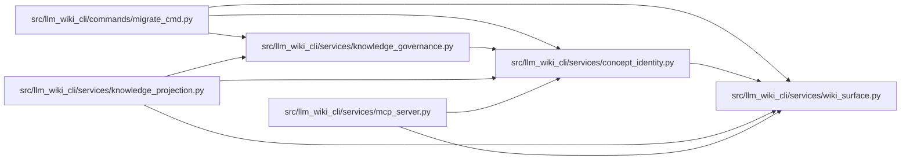

# concept_identity Module

**Path:** `src/llm_wiki_cli/services/concept_identity.py`

## Description

Pure stable-identity primitives for governed knowledge concepts.

The records in this module deliberately contain no filesystem behavior.  They
validate the small identity vocabulary used by a governance ledger, derive an
initial deterministic UID, detect registry collisions, and return immutable
move/alias updates.  Once an allocation is persisted, its ``uid`` is authority;
callers must carry it forward rather than deriving it again after a move.

## Imports

| Source | Symbols |
|--------|---------|
| `.wiki_surface` | `WikiSurfaceError`, `canonical_path`, `iter_page_kinds`, `mcp_uri`, `validate_exact_page_coordinate` |
| `__future__` | `annotations` |
| `collections` | `defaultdict` |
| `collections.abc` | `Iterable`, `Sequence` |
| `dataclasses` | `dataclass` |
| `enum` | `Enum` |
| `hashlib` | `hashlib` |
| `json` | `json` |
| `re` | `re` |
| `typing` | `TypeVar`, `cast` |
| `unicodedata` | `unicodedata` |
| `urllib.parse` | `quote`, `unquote`, `urlsplit` |

## Local dependency map

<!-- Auto-generated local dependency summary. Do not edit by hand. -->

### Internal neighbors

| Direction | Module |
|---|---|
| Inbound | [migrate_cmd](../modules/migrate_cmd.md) |
| Inbound | [knowledge_governance](../modules/knowledge_governance.md) |
| Inbound | [knowledge_projection](../modules/knowledge_projection.md) |
| Inbound | [mcp_server](../modules/mcp_server.md) |
| Outbound | [wiki_surface](../modules/wiki_surface.md) |

## Classes

| Class | Kind | Line | Bases / Target | Description |
|-------|------|------|----------------|-------------|
| [ConceptIdentityError](../entities/ConceptIdentityError.md) | Class | 75 | `ValueError` | Field-specific validation failure for stable concept identity. |
| [AliasType](../entities/AliasType.md) | Enum | 85 | `str`, `Enum` | The two coordinate namespaces that may retain historical aliases. |
| [ConceptReference](../entities/ConceptReference.md) | Class | 93 | — | One current, regenerable concept coordinate before UID allocation. |
| [ConceptAllocation](../entities/ConceptAllocation.md) | Class | 115 | — | A persisted UID bound to the concept's current coordinates. |
| [IdentityAlias](../entities/IdentityAlias.md) | Class | 153 | — | One historical locator or natural key owned by a persisted UID. |
| [IdentityCollision](../entities/IdentityCollision.md) | Class | 170 | — | One deterministic registry conflict found without resolving it. |
| [IdentityCollisionError](../entities/IdentityCollisionError.md) | Class | 214 | `ConceptIdentityError` | Raised when allocations or aliases do not form a unique registry. |
| [IdentityUpdate](../entities/IdentityUpdate.md) | Class | 232 | — | A replacement allocation and the complete canonical alias collection. |

## Functions

| Function | Signature | Decorators | Description |
|----------|-----------|------------|-------------|
| `validate_bundle_id` | `(value: object) -> str` | — | Validate a stored, checkout-independent bundle identifier. |
| `validate_concept_kind` | `(value: object) -> str` | — | Validate a core lowercase kind or a qualified extension kind. |
| `validate_natural_key` | `(value: object) -> str` | — | Validate one normalized, non-prose concept natural key. |
| `validate_locator` | `(value: object) -> str` | — | Validate an exact canonical Markdown route or ``llm-wiki`` URI. |
| `validate_concept_uid` | `(value: object) -> str` | — | Validate the persisted stable UID wire format. |
| `validate_alias_type` | `(value: AliasType \| str) -> AliasType` | — | Return a validated alias namespace. |
| `validate_alias_value` | `(alias_type: AliasType \| str, value: object) -> str` | — | Validate an alias according to its coordinate namespace. |
| `identity_coordinate_key` | `(alias_type: AliasType \| str, value: object) -> str` | — | Return a collision key shared by equivalent locator spellings. |
| `derive_concept_uid` | `(bundle_id: object, concept_kind: object, natural_key: object) -> str` | — | Derive the deterministic initial UID for one validated natural key. |
| `allocate_concept` | `(bundle_id: object, reference: ConceptReference, *, allocations: Iterable[ConceptAllocation] = (), aliases: Iterable[IdentityAlias] = ()) -> ConceptAllocation` | — | Return an existing exact identity or allocate a deterministic new UID. |
| `find_identity_collisions` | `(allocations: Iterable[ConceptAllocation], aliases: Iterable[IdentityAlias] = ()) -> tuple[IdentityCollision, ...]` | — | Return every deterministic UID/current-coordinate/alias conflict. |
| `validate_identity_registry` | `(allocations: Iterable[ConceptAllocation], aliases: Iterable[IdentityAlias] = ()) -> tuple[tuple[ConceptAllocation, ...], tuple[IdentityAlias, ...]]` | — | Validate uniqueness and return canonical immutable registry records. |
| `aliases_for_move` | `(allocation: ConceptAllocation, new_reference: ConceptReference, *, aliases: Iterable[IdentityAlias] = ()) -> tuple[IdentityAlias, ...]` | — | Retain prior natural key/locator values as immutable aliases. |
| `move_allocation` | `(allocation: ConceptAllocation, new_reference: ConceptReference, *, allocations: Iterable[ConceptAllocation] = (), aliases: Iterable[IdentityAlias] = ()) -> IdentityUpdate` | — | Carry a UID to new coordinates and retain both prior aliases. |
| `add_identity_alias` | `(allocation: ConceptAllocation, alias_type: AliasType \| str, value: object, *, allocations: Iterable[ConceptAllocation] = (), aliases: Iterable[IdentityAlias] = ()) -> IdentityUpdate` | — | Add one explicit alias idempotently after full collision validation. |
| `_uid_tag` | `(concept_kind: str) -> str` | — | — |
| `_machine_text` | `(value: object, field: str, *, maximum: int) -> str` | — | — |
| `_safe_decoded_coordinate` | `(value: str, field: str) -> None` | — | — |
| `_looks_absolute_path` | `(value: str) -> bool` | — | — |
| `_contains_uri_userinfo` | `(value: str) -> bool` | — | — |
| `_contains_coordinate_userinfo` | `(value: str) -> bool` | — | — |
| `_typed_tuple` | `(values: Iterable[_RecordT], expected_type: type[_RecordT], field: str) -> tuple[_RecordT, ...]` | — | — |
| `_sorted_aliases` | `(values: Iterable[IdentityAlias]) -> tuple[IdentityAlias, ...]` | — | — |
| `_deduplicated_aliases` | `(values: Iterable[IdentityAlias]) -> tuple[IdentityAlias, ...]` | — | — |
