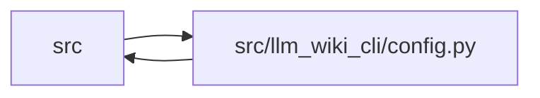

# config Module

**Path:** `src/llm_wiki_cli/config.py`

## Description

Shared constants and utilities for agent-wiki-cli.

## Imports

| Source | Symbols |
|--------|---------|
| `.services.filesystem_guard` | `WindowsSecurityGuardError`, `windows_current_user_sid`, `windows_path_owner_sid` |
| `.services.io` | `first_unsafe_path_component` |
| `__future__` | `annotations` |
| `collections.abc` | `Callable` |
| `dataclasses` | `dataclass` |
| `fnmatch` | `fnmatch` |
| `json` | `json` |
| `os` | `os` |
| `pathlib` | `Path` |
| `sys` | `sys` |
| `warnings` | `warnings` |

## Local dependency map

<!-- Auto-generated local dependency summary. Do not edit by hand. -->

> Module-level dependencies exceed the generated-diagram limits, so the diagram and table below group them by top-level package. Counts report the number of module neighbors in each package.

### Internal neighbors

| Direction | Module |
|---|---|
| Inbound | `src` (46) |
| Outbound | `src` (2) |

> All 48 module neighbor(s) are summarized by package because the module-level view exceeds the 12-node limit.

## Classes

| Class | Line | Bases | Description |
|-------|------|-------|-------------|
| [PathValidationError](../entities/PathValidationError.md) | 117 | `ValueError` | Raised when a user-provided path escapes the project root. |
| [_GitignoreRule](../entities/GitignoreRule.md) | 315 | — | — |
| [GitIgnoreMatcher](../entities/GitIgnoreMatcher.md) | 323 | — | Ordered gitignore matcher for repository scans. |

## Functions

| Function | Signature | Decorators | Description |
|----------|-----------|------------|-------------|
| `_normalized_rel_parts` | `(path: 'str \| Path') -> tuple[str, ...]` | — | — |
| `is_agent_worktree_path` | `(path: 'str \| Path') -> bool` | — | Return whether *path* is inside a generated agent worktree subtree. |
| `validate_path` | `(path: str, label: str = 'path') -> Path` | — | Ensure *path* resolves inside the current working directory. |
| `validate_source_root` | `(path: str, label: str = '--src-dir', *, allow_external: bool = False) -> Path` | — | Validate a source root according to the CLI source-read policy. |
| `validate_source_paths` | `(src_dir: str \| Path, paths: list[str] \| tuple[str, ...] \| None, label: str = '--paths') -> None` | — | Ensure requested source file paths stay inside *src_dir*. |
| `get_agent_config_path` | `(wiki_dir: 'str \| Path') -> Path` | — | Return the local-only agent config file path. |
| `_normalize_gitignore_trailing_spaces` | `(line: str) -> str` | — | Remove Git-insignificant trailing spaces from one ignore pattern. |
| `_parse_gitignore_text` | `(raw_text: str, base: str = '') -> list[_GitignoreRule]` | — | Parse already captured gitignore text without performing file I/O. |
| `_parse_gitignore_file` | `(gitignore_path: Path, base: str = '') -> list[_GitignoreRule]` | — | — |
| `_match_gitignore_pattern` | `(rel_path: str, pattern: str, *, directory_only: bool = False) -> bool` | — | Check if a relative path matches a gitignore pattern. |
| `_rule_matches` | `(rel_path: str, rule: _GitignoreRule) -> bool` | — | — |
| `build_gitignore_matcher` | `(root: 'str \| Path') -> GitIgnoreMatcher` | — | Parse root and nested .gitignore files once for a source scan. |
| `is_ignored_by_gitignore` | `(rel_path: str, gitignore_path: Path = Path('.gitignore')) -> bool` | — | Check if a relative path is ignored according to one .gitignore file. |
| `read_config` | `(wiki_dir: 'str \| Path') -> dict` | — | Read the persisted llm-wiki config as a dict. |
| `write_config` | `(wiki_dir: 'str \| Path', data: dict) -> None` | — | Persist the llm-wiki config dict to the agent config file. |
