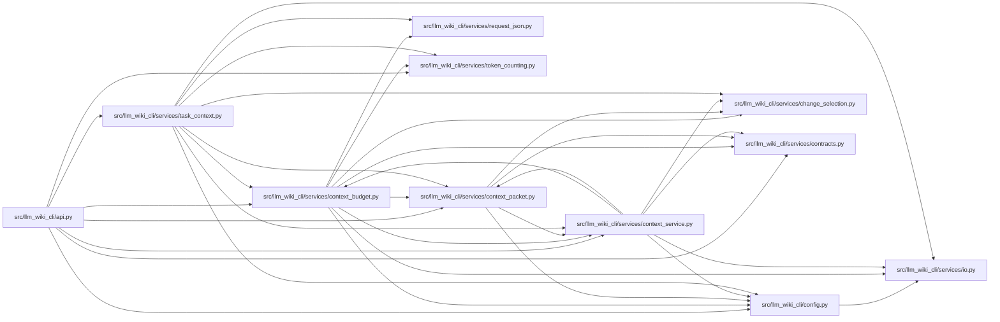

# context_budget Module

**Path:** `src/llm_wiki_cli/services/context_budget.py`

## Description

Implements opt-in v3 budgets for the complete emitted JSON, Markdown, or packet
representation, including metadata and omission evidence. It progressively
reduces whole source entries and reports `cannot-fit` when required evidence
alone exceeds the budget. Accounting identifies the host-supplied counter and
excludes host chat framing.

Context construction reuses one captured source/wiki read, retains explicit
change provenance, and revalidates that basis before returning the rendered
result. Exact mode requires a trusted exact counter; estimated mode labels its
weaker accounting explicitly.

## Imports

| Source | Symbols |
|--------|---------|
| `.` | `context_packet`, `context_service` |
| `..config` | `DEFAULT_WIKI_DIR` |
| `.change_selection` | `affected_page_map`, `changes_from_args`, `select_changes`, `validate_changes` |
| `.contracts` | `CONTEXT_BUDGET_PROTOCOL_VERSION` |
| `.io` | `write_text_output`, `write_utf8_stdout` |
| `.request_json` | `_pairs`, `_constant` |
| `.token_counting` | `EstimatedCounter`, `LocalTokenizerCounter`, `TokenCounter` |
| `__future__` | `annotations` |
| `copy` | `copy` |
| `dataclasses` | `dataclass`, `replace` |
| `hashlib` | `hashlib` |
| `json` | `json` |
| `sys` | `sys` |
| `typing` | `Any`, `Mapping` |

## Local dependency map

<!-- Auto-generated local dependency summary. Do not edit by hand. -->

### Internal neighbors

| Direction | Module |
|---|---|
| Inbound | [api](../modules/api.md) |
| Inbound | [context_service](../modules/context_service.md) |
| Inbound | [task_context](../modules/task_context.md) |
| Outbound | [config](../modules/config.md) |
| Outbound | [change_selection](../modules/change_selection.md) |
| Outbound | [context_packet](../modules/context_packet.md) |
| Outbound | [context_service](../modules/context_service.md) |
| Outbound | [services_contracts](../modules/services_contracts.md) |
| Outbound | [io](../modules/io.md) |
| Outbound | [request_json](../modules/request_json.md) |
| Outbound | [token_counting](../modules/token_counting.md) |

## Classes

| Class | Line | Bases | Description |
|-------|------|-------|-------------|
| [BudgetedContext](../entities/BudgetedContext.md) | 26 | — | — |

## Functions

| Function | Signature | Decorators | Description |
|----------|-----------|------------|-------------|
| `validate_request` | `(data: Mapping[str, Any]) -> dict[str, Any]` | — | — |
| `_accounted_render` | `(render, accounting, counter)` | — | — |
| `fit_payload` | `(payload, request, warnings, counter, *, packet_renderer = None, changes = None, envelope_renderer = None, freshness_rank_by_source = None)` | — | Select whole source entries; keep all enrichment and omission evidence. |
| `build_budgeted_context` | `(src_dir = '.', wiki_dir = DEFAULT_WIKI_DIR, request = None, *, counter: TokenCounter \| None = None, allow_external_src = False, source_selection = None) -> BudgetedContext` | — | — |
| `request_identity` | `(request: Mapping[str, Any]) -> str` | — | — |
| `validate_budgeted_context` | `(rendered: str, request: Mapping[str, Any], *, counter: TokenCounter) -> dict[str, Any]` | — | Independently validate the outer v3 binding, packet and emitted count. |
| `run` | `(args, request = None)` | — | — |