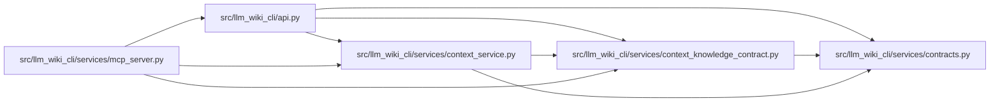

# context_knowledge_contract Module

**Path:** `src/llm_wiki_cli/services/context_knowledge_contract.py`

## Description

Frozen compatibility and failure contracts for context knowledge selection.

The v1 context and packet contracts remain frozen for omitted knowledge mode,
while explicit knowledge mode activates the v2 wire contract across the CLI,
Python API, MCP, raw protocol, and qualified packets.  This module keeps those
interfaces on one naming, fallback, recovery, and evidence contract.

The lifecycle and evidence matrices are data rather than prose.  Consumers can
validate a serialized copy before using it as implementation or release
evidence.  Nothing in this module reads, writes, initializes, or repairs a
knowledge projection or a managed reference.

## Imports

| Source | Symbols |
|--------|---------|
| `.contracts` | `CONTEXT_KNOWLEDGE_PROTOCOL_VERSION`, `CONTEXT_PROTOCOL_VERSION`, `QUALIFIED_CONTEXT_PACKET_KNOWLEDGE_SCHEMA_VERSION`, `QUALIFIED_CONTEXT_PACKET_SCHEMA_VERSION` |
| `__future__` | `annotations` |
| `collections.abc` | `Mapping`, `Sequence` |
| `copy` | `deepcopy` |
| `json` | `json` |
| `typing` | `Any` |

## Local dependency map

<!-- Auto-generated local dependency summary. Do not edit by hand. -->

### Internal neighbors

| Direction | Module |
|---|---|
| Inbound | [api](../modules/api.md) |
| Inbound | [context_service](../modules/context_service.md) |
| Inbound | [mcp_server](../modules/mcp_server.md) |
| Outbound | [services_contracts](../modules/services_contracts.md) |

## Classes

| Class | Line | Bases | Description |
|-------|------|-------|-------------|
| [ContextKnowledgeContractError](../entities/ContextKnowledgeContractError.md) | 1369 | `ValueError` | A serialized context-knowledge contract violates the frozen shape. |

## Functions

| Function | Signature | Decorators | Description |
|----------|-----------|------------|-------------|
| `_signal` | `(level: str, code: str \| None) -> dict[str, str \| None]` | — | — |
| `_wire_mapping` | `(*, availability: str, reason: str, auto_status: str, required_status: str, basis_state: str, basis_availability: str, basis_reason: str) -> dict[str, Any]` | — | — |
| `_combined_signals` | `(lifecycle: Mapping[str, Any], evidence: Mapping[str, Any]) -> dict[str, list[dict[str, str]]]` | — | — |
| `_combined_recovery_routes` | `(lifecycle: Mapping[str, Any], evidence: Mapping[str, Any]) -> list[dict[str, Any]]` | — | — |
| `_matrix_by_state` | `(value: object, *, field: str, expected_states: Sequence[str], required_fields: frozenset[str]) -> dict[str, Mapping[str, Any]]` | — | — |
| `_validate_context_knowledge_contract` | `(contract: Mapping[str, Any]) -> None` | — | Validate completeness and the fail-safe cross-row invariants. |
| `validate_context_knowledge_contract` | `(contract: Mapping[str, Any]) -> None` | — | Reject every non-canonical candidate with the declared error type. |
| `context_knowledge_contract` | `() -> dict[str, Any]` | — | Return a detached JSON-compatible copy of the frozen contract. |
