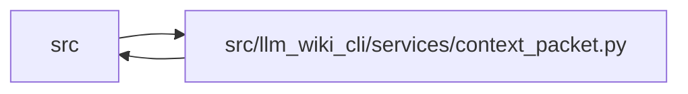

# context_packet Module

**Path:** `src/llm_wiki_cli/services/context_packet.py`

## Description

Canonical Qualified Context Packet construction and verification.

The packet builder coordinates one source inventory, one wiki surface
evaluation, and one native-knowledge read view.  Context response construction
then consumes only those captured values.  Optimistic source and wiki anchors
are checked before the canonical bytes are returned, so a mutation cannot
silently detach the response from its declared basis.

This module is deliberately provider- and persistence-free.  It returns bytes
in memory, never refreshes native artifacts, and keeps structural validation
separate from live reconciliation.

## Imports

| Source | Symbols |
|--------|---------|
| `.` | `context_service` |
| `..` | `__version__` |
| `..config` | `DEFAULT_WIKI_DIR`, `PathValidationError`, `validate_path` |
| `.contracts` | `QUALIFIED_CONTEXT_PACKET_SCHEMA_VERSION` |
| `.dependencies` | `analyze_dependencies` |
| `.documentation_queries` | `DocumentationGraphQueryService`, `DocumentationQueryError` |
| `.documentation_query_builder` | `validate_live_query_source_selection` |
| `.extraction_jobs` | `ExtractionJobPlan`, `ExtractionJobRequest` |
| `.extraction_service` | `InventoryResult` |
| `.knowledge_consumption` | `KnowledgeReadView` |
| `.knowledge_envelope` | `KnowledgeEnvelopeError`, `hash_source_snapshot`, `validate_configured_public_identity` |
| `.knowledge_evidence` | `canonical_json_bytes`, `is_valid_sha256`, `sha256_bytes` |
| `.knowledge_model` | `ComputedFreshness` |
| `.knowledge_observability` | `knowledge_freshness_disclosure` |
| `.knowledge_verification` | `verification_summaries_for_concepts` |
| `.plugins` | `runtime_plugin_fallback_root` |
| `.source_snapshot` | `SourceSnapshot`, `SourceSnapshotError`, `build_source_snapshot`, `capture_source_selection_inputs` |
| `.validation` | `require_repository_relative_path` |
| `.wiki_surface_index` | `SurfaceIndexEvaluation`, `evaluate_surface_index` |
| `__future__` | `annotations` |
| `collections.abc` | `Callable`, `Mapping`, `Sequence` |
| `copy` | `deepcopy` |
| `dataclasses` | `dataclass` |
| `enum` | `Enum` |
| `json` | `json` |
| `math` | `math` |
| `os` | `os` |
| `pathlib` | `Path` |
| `re` | `re` |
| `types` | `MappingProxyType` |
| `typing` | `Any` |

## Local dependency map

<!-- Auto-generated local dependency summary. Do not edit by hand. -->

> Module-level dependencies exceed the generated-diagram limits, so the diagram and table below group them by top-level package. Counts report the number of module neighbors in each package.

### Internal neighbors

| Direction | Module |
|---|---|
| Inbound | `src` (3) |
| Outbound | `src` (18) |

> All 20 module neighbor(s) are summarized by package because the module-level view exceeds the 12-node limit.

## Classes

| Class | Line | Bases | Description |
|-------|------|-------|-------------|
| [ContextPacketError](../entities/ContextPacketError.md) | 131 | `ValueError` | Base failure for context-packet construction and consumption. |
| [ContextPacketMalformedError](../entities/ContextPacketMalformedError.md) | 137 | `ContextPacketError` | The supplied bytes do not satisfy the canonical packet contract. |
| [ContextPacketSourceMutationError](../entities/ContextPacketSourceMutationError.md) | 148 | `ContextPacketError` | A captured source or wiki anchor changed before packet return. |
| [ContextPacketUnavailableError](../entities/ContextPacketUnavailableError.md) | 160 | `ContextPacketError` | A required read-only packet capability is unavailable. |
| [ContextPacketPathPolicyError](../entities/ContextPacketPathPolicyError.md) | 166 | `ContextPacketError` | A structural packet field violates its declared path policy. |
| [CapturedContextRead](../entities/CapturedContextRead.md) | 178 | — | One coordinated in-memory source/wiki read used by a packet response. |
| [QualifiedContextPacket](../entities/QualifiedContextPacket.md) | 217 | — | Immutable canonical packet bytes plus safe value accessors. |
| [ContextPacketValidation](../entities/ContextPacketValidation.md) | 254 | — | Successful structural validation with explicitly unevaluated freshness. |
| [ContextBasisComparison](../entities/ContextBasisComparison.md) | 299 | — | Comparison with caller data, which can never assert currentness. |
| [ContextPacketReconciliation](../entities/ContextPacketReconciliation.md) | 325 | — | Consumer-time comparison against one fresh official read. |

## Functions

| Function | Signature | Decorators | Description |
|----------|-----------|------------|-------------|
| `_validate_reconciliation_contract` | `(*, packet_id: object, policy: object, state: object, current: object, facets: object, limitations: object) -> None` | — | — |
| `capture_context_read` | `(src_dir: str = '.', wiki_dir: str = DEFAULT_WIKI_DIR, *, allow_external_src: bool = False, read_only: bool = True, job_request: ExtractionJobRequest \| None = None, plan_reporter: Callable[[ExtractionJobPlan], None] \| None = None, source_selection: str \| Path \| None = None) -> CapturedContextRead` | — | Capture one source inventory, wiki surface, and knowledge read view. |
| `build_context_from_captured_read` | `(captured: CapturedContextRead, request: Mapping[str, Any]) -> tuple[dict[str, Any], list[str]]` | — | Build the existing context payload solely from one captured read. |
| `build_qualified_context` | `(src_dir: str = '.', wiki_dir: str = DEFAULT_WIKI_DIR, request: Mapping[str, Any] \| None = None, *, allow_external_src: bool = False, read_only: bool = True, job_request: ExtractionJobRequest \| None = None, plan_reporter: Callable[[ExtractionJobPlan], None] \| None = None, source_selection: str \| Path \| None = None) -> QualifiedContextPacket` | — | Build a canonical packet in memory from one coordinated read view. |
| `validate_context_packet` | `(packet_bytes: bytes \| bytearray \| memoryview) -> ContextPacketValidation` | — | Strictly validate canonical bytes without performing live reads. |
| `compare_context_packet_basis` | `(packet_bytes: bytes \| bytearray \| memoryview, expected_basis: Mapping[str, Any]) -> ContextBasisComparison` | — | Compare caller-provided expected basis without claiming currentness. |
| `reconcile_context_packet` | `(packet_bytes: bytes \| bytearray \| memoryview, src_dir: str = '.', wiki_dir: str = DEFAULT_WIKI_DIR, *, allow_external_src: bool = False, read_only: bool = True, job_request: ExtractionJobRequest \| None = None, plan_reporter: Callable[[ExtractionJobPlan], None] \| None = None, source_selection: str \| Path \| None = None) -> ContextPacketReconciliation` | — | Validate first, then compare every packet facet with a fresh read. |
| `_build_protocol_enrichment_from_captured_read` | `(captured: CapturedContextRead, inventory: dict[str, Any], filters: dict[str, Any], warnings: list[str], *, prefer_fresh: bool = False, freshness_ranking_out: dict[str, int] \| None = None) -> dict[str, Any]` | — | — |
| `_normalized_request` | `(request: Mapping[str, Any]) -> dict[str, Any]` | — | — |
| `_packet_body` | `(captured: CapturedContextRead, request: Mapping[str, Any], response: Mapping[str, Any]) -> dict[str, Any]` | — | — |
| `_packet_basis` | `(captured: CapturedContextRead) -> dict[str, Any]` | — | — |
| `_freshness_basis` | `(view: KnowledgeReadView) -> dict[str, Any]` | — | — |
| `_packet_limitations` | `(response: Mapping[str, Any], basis: Mapping[str, Any]) -> list[str]` | — | — |
| `_context_policy_digest` | `() -> str` | — | — |
| `_path_policy_digest` | `() -> str` | — | — |
| `_path_policy_receipt` | `(value: Mapping[str, Any]) -> dict[str, Any]` | — | — |
| `_mapping_key_is_repository_path` | `(pointer: tuple[str, ...]) -> bool` | — | — |
| `_list_item_is_repository_path` | `(pointer: tuple[str, ...]) -> bool` | — | — |
| `_is_free_text_pointer` | `(pointer: tuple[str, ...]) -> bool` | — | — |
| `_repository_path` | `(value: object, field: str) -> str` | — | — |
| `_reject_machine_local_path` | `(value: object, error: ContextPacketPathPolicyError) -> None` | — | — |
| `_reconciliation_facets` | `(packet: Mapping[str, Any], live: Mapping[str, Any]) -> dict[str, dict[str, Any]]` | — | — |
| `_live_facet` | `(expected: Any, observed: Any, *, mismatch_reason: str) -> dict[str, Any]` | — | — |
| `_unevaluated_facet` | `(matches: bool, reason: str) -> dict[str, Any]` | — | — |
| `_packet_id` | `(body: Mapping[str, Any]) -> str` | — | — |
| `_encode_packet_payload` | `(payload: Mapping[str, Any]) -> bytes` | — | — |
| `_coerce_packet_bytes` | `(value: bytes \| bytearray \| memoryview) -> bytes` | — | — |
| `_strict_json_payload` | `(raw: bytes) -> dict[str, Any]` | — | — |
| `_validate_json_tree` | `(value: Any) -> None` | — | — |
| `_validate_packet_shape` | `(payload: Mapping[str, Any]) -> None` | — | — |
| `_validate_assurance` | `(value: Any) -> None` | — | — |
| `_validate_packet_request` | `(value: Any) -> dict[str, Any]` | — | — |
| `_validate_response` | `(value: Any, request: Mapping[str, Any]) -> None` | — | — |
| `_validate_basis` | `(value: Any) -> None` | — | — |
| `_validate_repository_basis` | `(value: Any) -> None` | — | — |
| `_validate_knowledge_basis` | `(value: Any) -> None` | — | — |
| `_validate_freshness_basis` | `(value: Any) -> None` | — | — |
| `_validate_response_basis_consistency` | `(response: Mapping[str, Any], basis: Mapping[str, Any]) -> None` | — | — |
| `_validate_delivery` | `(value: Any, response: Mapping[str, Any], basis: Mapping[str, Any]) -> None` | — | — |
| `_validate_path_policy_shape` | `(value: Any) -> None` | — | — |
| `_mapping` | `(value: Any, field: str) -> Mapping[str, Any]` | — | — |
| `_exact_fields` | `(value: Mapping[str, Any], allowed: set[str] \| frozenset[str], field: str, *, required: set[str] \| frozenset[str] \| None = None) -> None` | — | — |
| `_string_list` | `(value: Any, field: str) -> list[str]` | — | — |
| `_nonnegative_integer` | `(value: Any, field: str) -> int` | — | — |
| `_source_anchor` | `(snapshot: SourceSnapshot) -> str` | — | — |
| `_source_snapshot_anchor_payload` | `(snapshot: SourceSnapshot) -> dict[str, Any]` | — | — |
| `_assert_source_unchanged` | `(snapshot: SourceSnapshot, expected_anchor: str) -> None` | — | — |
| `_assert_selection_unchanged` | `(captured: CapturedContextRead) -> None` | — | — |
| `_wiki_anchor` | `(root: Path) -> str` | — | — |
| `_domain_hash` | `(domain: str, value: Mapping[str, Any]) -> str` | — | — |
| `_wire_value` | `(value: Any) -> Any` | — | — |
| `_freeze_json` | `(value: Any) -> Any` | — | — |
| `_thaw_json` | `(value: Any) -> Any` | — | — |
| `_pointer` | `(parts: Sequence[str]) -> str` | — | — |
