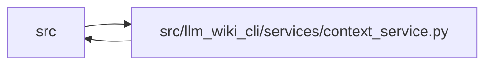

# context_service Module

**Path:** `src/llm_wiki_cli/services/context_service.py`

## Description

Structured context budgeting — return priority-ranked, token-budgeted
codebase context for LLM agents.

Priority tiers:

- **high**: files changed in the last commit → full deep inventory detail
- **medium**: 1-hop import neighbors of changed files → slim detail
- **low**: everything else → names only

Usage::

    llm-wiki context --budget 32000
    llm-wiki context --budget 8000 --format markdown
    llm-wiki context --budget 32000 --focus all

## Imports

| Source | Symbols |
|--------|---------|
| `.` | `wiki_surface` |
| `..config` | `DEFAULT_WIKI_DIR`, `PathValidationError`, `validate_path`, `validate_source_root` |
| `.context_knowledge_contract` | `KNOWLEDGE_MODE_VALUES` |
| `.context_packet` | `ContextPacketError`, `build_qualified_context` |
| `.contracts` | `CONTEXT_KNOWLEDGE_PROTOCOL_VERSION`, `CONTEXT_PROTOCOL_VERSION` |
| `.dependencies` | `analyze_dependencies` |
| `.documentation_queries` | `DocumentationGraphQueryService`, `DocumentationQueryError`, `knowledge_view_selection_eligible` |
| `.documentation_query_builder` | `validate_live_query_source_selection` |
| `.extraction_jobs` | `ExtractionJobPlan`, `ExtractionJobRequest`, `print_extraction_job_plan` |
| `.extraction_service` | `InventoryResult`, `_git_changed_files`, `_partition_snapshot_git_changes`, `analyze_data_flow`, `build_data_flow_context`, `build_flow`, `get_entry_points`, `get_docker_inventory`, `get_inventory_result`, `read_console_scripts`, `resolve_call_edges` |
| `.infrastructure_inventory` | `get_yaml_infrastructure_inventory` |
| `.io` | `write_text_output` |
| `.knowledge_artifacts` | `KNOWLEDGE_INDEX_FILENAME` |
| `.knowledge_consumption` | `KnowledgeAvailability`, `KnowledgeReadView`, `build_knowledge_read_view` |
| `.knowledge_graph` | `CORE_RELATIONSHIP_KINDS`, `GRAPH_ORIGINS`, `GRAPH_RESOLUTIONS` |
| `.knowledge_loader` | `KnowledgeLoadResult`, `KnowledgeMismatchPolicy`, `KnowledgeStateLoadError`, `load_knowledge_state` |
| `.knowledge_model` | `ComputedFreshness`, `EvidenceState`, `KnowledgeLoadState` |
| `.knowledge_observability` | `knowledge_freshness_hint` |
| `.knowledge_orchestration` | `RUNTIME_GENERATION_OPTION_DEFAULTS`, `RuntimeLiveEvaluationInputs`, `build_runtime_live_evaluation`, `runtime_generation_options` |
| `.knowledge_verification` | `attach_machine_verification_read_view`, `verification_summaries_for_concepts` |
| `.plugins` | `runtime_project_plugins_enabled` |
| `.source_selection` | `SourceSelectionError`, `resolve_source_selection` |
| `.source_snapshot` | `SourceSnapshot`, `build_source_snapshot`, `capture_source_selection_inputs` |
| `.sync_manifest` | `SyncManifest` |
| `.validation` | `nonnegative_int_or_none` |
| `.wiki_surface_index` | `SURFACE_INDEX_FILENAME`, `SurfaceIndexEvaluation`, `evaluate_surface_index` |
| `__future__` | `annotations` |
| `collections.abc` | `Callable`, `Mapping`, `Sequence` |
| `dataclasses` | `dataclass` |
| `fnmatch` | `fnmatch` |
| `json` | `json` |
| `pathlib` | `Path`, `PurePosixPath` |
| `re` | `re` |
| `shlex` | `shlex` |
| `sys` | `sys` |
| `typing` | `Any` |

## Local dependency map

<!-- Auto-generated local dependency summary. Do not edit by hand. -->

> Module-level dependencies exceed the generated-diagram limits, so the diagram and table below group them by top-level package. Counts report the number of module neighbors in each package.

### Internal neighbors

| Direction | Module |
|---|---|
| Inbound | `src` (6) |
| Outbound | `src` (26) |

> All 30 module neighbor(s) are summarized by package because the module-level view exceeds the 12-node limit.

## Classes

| Class | Line | Bases | Description |
|-------|------|-------|-------------|
| [ProtocolRequestError](../entities/ProtocolRequestError.md) | 176 | `ValueError` | Validation error for Wiki-as-Context protocol requests. |
| [KnowledgeRequiredUnavailableError](../entities/KnowledgeRequiredUnavailableError.md) | 191 | `RuntimeError` | Explicit required mode could not produce ready qualified knowledge. |
| [_ProtocolEnrichmentSession](../entities/ProtocolEnrichmentSession.md) | 1731 | — | Operation-scoped query state captured from one knowledge read. |

## Functions

| Function | Signature | Decorators | Description |
|----------|-----------|------------|-------------|
| `_extractor_failure_message` | `(inventory_result) -> str` | — | Return a compact, structured error message for extractor failures. |
| `get_inventory` | `(src_dir: str, *, deep: bool = False, return_result: bool = False, job_request: ExtractionJobRequest \| None = None, plan_reporter: Callable[[ExtractionJobPlan], None] \| None = None, include_plugins: bool = True, source_selection: str \| Path \| None = None, source_snapshot: SourceSnapshot \| None = None) -> dict \| InventoryResult` | — | Build command inventory, optionally returning extraction metadata. |
| `_selected_git_changed_files` | `(src_dir: str, source_snapshot: SourceSnapshot \| None) -> list[str] \| None` | — | — |
| `_estimate_tokens` | `(text: str) -> int` | — | Approximate token count using the ~4 chars/token heuristic. |
| `_build_import_graph` | `(inventory: dict) -> dict[str, set[str]]` | — | Build a bidirectional import adjacency map from a deep inventory. |
| `_filepath_to_module` | `(filepath: str) -> str \| None` | — | Convert ``"src/llm_wiki_cli/config.py"`` → ``"llm_wiki_cli.config"``. |
| `_classify_files` | `(all_files: list[str], changed: list[str] \| None, import_graph: dict[str, set[str]], focus: str, include_neighbors: bool = True) -> dict[str, str]` | — | Assign a priority tier to every file in the inventory. |
| `_deep_entry` | `(file_data: dict) -> dict` | — | Full detail: classes with methods, params, docstrings, imports. |
| `_slim_entry` | `(file_data: dict) -> dict` | — | Slim detail: class names/bases/line, function names/lines. |
| `_summary_entry` | `(file_data: dict) -> dict` | — | Names only: lists of class names and function names. |
| `_build_context_payload` | `(inventory: dict, classification: dict[str, str], budget: int, *, freshness_rank_by_source: Mapping[str, int] \| None = None) -> dict` | — | Build a token-budgeted context payload. |
| `_build_context_payload_with_freshness_preference` | `(inventory: dict, classification: dict[str, str], budget: int, *, freshness_rank_by_source: Mapping[str, int]) -> tuple[dict[str, Any], bool]` | — | Apply the freshness tie-break only when budget pressure is observed. |
| `_bounds_metadata` | `(*, total: int, returned: int) -> dict[str, int \| bool]` | — | Return exact response-layer collection bounds. |
| `_build_entry` | `(file_data: dict, priority: str, detail: str) -> dict` | — | Serialize one file at a specific detail level. |
| `_entry_tokens` | `(filepath: str, entry: dict) -> int` | — | — |
| `_render_markdown` | `(payload: dict) -> str` | — | Render the context payload as agent-friendly markdown. |
| `_markdown_context_coordinate` | `(value: object) -> str` | — | — |
| `_typed_graph_page_badge` | `(page: Mapping[str, Any]) -> str` | — | — |
| `_graph_query` | `(result: object) -> str` | — | — |
| `_graph_status` | `(result: object, collection_key: str) -> str` | — | — |
| `_read_protocol_request` | `(source: str) -> dict` | — | Read and validate a Wiki-as-Context protocol request. |
| `_validate_protocol_request` | `(data: object) -> dict` | — | Return a normalised protocol request or raise ``ProtocolRequestError``. |
| `_validate_protocol_request_impl` | `(data: object) -> dict` | — | — |
| `_normalise_protocol_focus` | `(raw_focus: object) -> list[str]` | — | — |
| `_normalise_protocol_filters` | `(raw_filters: object) -> dict` | — | — |
| `_validate_surface_filter` | `(value: str) -> None` | — | — |
| `_validate_enum_filter` | `(key: str, value: str, known: set[str]) -> None` | — | — |
| `_validate_relationship_kind_filter` | `(value: str) -> None` | — | — |
| `_protocol_error_payload` | `(error: ProtocolRequestError) -> dict` | — | — |
| `_emit_protocol_error` | `(error: ProtocolRequestError) -> None` | — | — |
| `_apply_protocol_filters` | `(inventory: dict, filters: dict) -> dict` | — | Filter inventory before prioritisation and budgeting. |
| `_matches_module_filter` | `(filepath: str, pattern: str) -> bool` | — | — |
| `_context_freshness_rank_by_source` | `(query_surface: Mapping[str, Any], query_service: DocumentationGraphQueryService) -> dict[str, int]` | — | Return CURRENT-first tie-break ranks for mapped source files. |
| `_freshness_ranking_policy` | `(status: Mapping[str, Any], freshness_rank_by_source: Mapping[str, int], *, budget_pressure: bool = False) -> dict[str, Any]` | — | — |
| `_empty_knowledge_bounds` | `() -> dict[str, dict[str, int \| bool]]` | — | — |
| `_knowledge_fallback_evidence` | `(knowledge_view: KnowledgeReadView \| None, *, surface_invalid: bool = False) -> list[str]` | — | — |
| `_knowledge_recovery_command` | `(reason: str, *, src_dir: str, wiki_dir: str, source_selection: str \| None = None, allow_external_src: bool = False) -> str` | — | — |
| `_build_explicit_knowledge_response` | `(knowledge_mode: str, knowledge_view: KnowledgeReadView \| None, query_service: DocumentationGraphQueryService \| None, source_priorities: Mapping[str, str], *, src_dir: str = '.', wiki_dir: str = DEFAULT_WIKI_DIR, basis_incompatible: bool = False, source_selection: str \| None = None, allow_external_src: bool = False) -> dict[str, Any]` | — | Resolve one v2 knowledge result without performing additional reads. |
| `_fit_explicit_knowledge_response` | `(knowledge: dict[str, Any], *, knowledge_mode: str, fallback_evidence: Sequence[str]) -> dict[str, Any]` | — | Deterministically bound the standalone v2 knowledge wire payload. |
| `_explicit_freshness_ranking_policy` | `(knowledge: Mapping[str, Any], freshness_rank_by_source: Mapping[str, int], budget_pressure: bool) -> dict[str, Any]` | — | Return the v2 disclosure for an explicitly requested freshness rank. |
| `_capture_protocol_enrichment_session` | `(inventory: dict, *, src_root: Path, wiki_dir: str, inventory_result: InventoryResult \| None, capture_knowledge: bool, validated_surface_only: bool = False, suppress_knowledge_query: bool = False, include_plugins: bool = True) -> _ProtocolEnrichmentSession` | — | Capture the immutable inputs shared by ranking and response assembly. |
| `_assemble_protocol_enrichment` | `(session: _ProtocolEnrichmentSession, filters: dict, *, warnings: list[str] \| None = None, prefer_fresh: bool = False, freshness_ranking_out: dict[str, int] \| None = None, knowledge_mode: str \| None = None, source_priorities: Mapping[str, str] \| None = None, src_dir: str = '.', wiki_dir: str = DEFAULT_WIKI_DIR, basis_incompatible: bool = False, source_selection: str \| None = None, allow_external_src: bool = False) -> dict` | — | — |
| `_build_protocol_enrichment` | `(inventory: dict, filters: dict, *, src_root: Path, wiki_dir: str, inventory_result: InventoryResult \| None = None, warnings: list[str] \| None = None, prefer_fresh: bool = False, freshness_ranking_out: dict[str, int] \| None = None, knowledge_mode: str \| None = None, source_priorities: Mapping[str, str] \| None = None, basis_incompatible: bool = False, include_plugins: bool = True, source_selection: str \| None = None, allow_external_src: bool = False) -> dict` | — | Compatibility wrapper around the operation-scoped enrichment session. |
| `_context_query_surface` | `(live_surface: Mapping[str, Any], knowledge_view: KnowledgeReadView \| None, *, validated_only: bool = False) -> dict[str, Any]` | — | — |
| `_page_with_committed_source` | `(page: Mapping[str, Any], committed_sources: Mapping[str, object]) -> dict[str, Any]` | — | — |
| `_surface_filter_payload` | `(surface_index: Mapping[str, Any], surface: str, *, limit: int, query_service: DocumentationGraphQueryService \| None = None, filters: dict \| None = None, observed: list[dict[str, Any]] \| None = None) -> dict` | — | — |
| `_symbol_pages_payload` | `(query_service: DocumentationGraphQueryService, surface_index: Mapping[str, Any], symbol: str, filters: dict, *, observed: list[dict[str, Any]]) -> dict` | — | — |
| `_select_knowledge_page_refs` | `(pages: list[dict], filters: dict, query_service: DocumentationGraphQueryService, *, limit: int, observed: list[dict[str, Any]] \| None) -> tuple[list[dict], dict[str, int \| bool]]` | — | — |
| `_surface_page_ref` | `(page: Mapping[str, Any]) -> dict` | — | — |
| `_knowledge_enriched_page_ref` | `(page: dict, query_service: DocumentationGraphQueryService) -> dict` | — | — |
| `_typed_graph_enriched_page_ref` | `(page: dict, filters: dict, query_service: DocumentationGraphQueryService) -> dict` | — | Add a compact persisted-graph selection without exposing edge evidence. |
| `_relationship_filter_summary` | `(filters: Mapping[str, Any]) -> dict[str, str]` | — | — |
| `_compact_typed_graph_status` | `(status: Mapping[str, Any]) -> dict[str, Any]` | — | — |
| `_compact_analyzer_coverage` | `(value: Mapping[str, Any]) -> dict[str, Any]` | — | — |
| `_compact_returned_edge_coverage` | `(value: object) -> dict[str, Any]` | — | — |
| `_empty_returned_edge_coverage` | `() -> dict[str, Any]` | — | — |
| `_nonnegative_count` | `(value: object) -> int` | — | — |
| `_compact_context_freshness` | `(value: object) -> dict[str, Any]` | — | — |
| `_compact_context_review` | `(value: Mapping[str, Any]) -> dict[str, Any]` | — | Summarize bounded section review without reviewer or event metadata. |
| `_compact_context_machine_verification` | `(value: Mapping[str, Any]) -> dict[str, Any]` | — | Summarize a receipt without scope identifiers or diagnostics. |
| `_matches_knowledge_refinement` | `(page: dict, filters: dict) -> bool` | — | — |
| `_matches_typed_graph_refinement` | `(page: dict, filters: dict) -> bool` | — | — |
| `_knowledge_page_sort_key` | `(page: dict, status: dict) -> tuple` | — | — |
| `_append_knowledge_context_warning` | `(status: dict, candidates: list[dict[str, Any]], filters: dict, warnings: list[str] \| None) -> None` | — | — |
| `_append_typed_graph_context_warning` | `(status: Mapping[str, Any], candidates: list[dict[str, Any]], warnings: list[str] \| None) -> None` | — | — |
| `_build_context_knowledge_view` | `(wiki_root: Path, surface_evaluation: SurfaceIndexEvaluation, inventory: dict, inventory_result: InventoryResult \| None) -> KnowledgeReadView` | — | — |
| `_context_knowledge_projection_declared` | `(wiki_root: Path, surface_path: Path, knowledge_path: Path) -> bool` | — | — |
| `_reliably_missing_context_sources` | `(knowledge, source_snapshot) -> frozenset[str]` | — | — |
| `_knowledge_error_view` | `(surface: Mapping[str, Any], error: KnowledgeStateLoadError) -> KnowledgeReadView` | — | — |
| `_build_context` | `(src_dir: str, budget: int, fmt: str, focus_values: list[str], filters: dict \| None = None, *, prefer_fresh: bool = False, emit_warnings: bool = True, allow_external_src: bool = False, read_only: bool = False, wiki_dir: str = DEFAULT_WIKI_DIR, job_request: ExtractionJobRequest \| None = None, plan_reporter: Callable[[ExtractionJobPlan], None] \| None = None, source_selection: str \| Path \| None = None, knowledge_mode: str \| None = None, include_plugins: bool = True) -> tuple[dict, list[str]]` | — | Build a context payload and return ``(payload, warnings)``. |
| `_build_context_impl` | `(src_dir: str, budget: int, fmt: str, focus_values: list[str], filters: dict \| None = None, *, prefer_fresh: bool, emit_warnings: bool, allow_external_src: bool, read_only: bool, wiki_dir: str, job_request: ExtractionJobRequest \| None, plan_reporter: Callable[[ExtractionJobPlan], None] \| None, source_selection: str \| Path \| None, knowledge_mode: str \| None, include_plugins: bool) -> tuple[dict, list[str]]` | — | — |
| `_context_enrichment_from_session` | `(session: _ProtocolEnrichmentSession \| None, filters: dict, *, warnings: list[str], prefer_fresh: bool, knowledge_mode: str \| None, source_priorities: Mapping[str, str], src_dir: str, wiki_dir: str, basis_incompatible: bool, source_selection: str \| None, allow_external_src: bool) -> dict[str, Any]` | — | — |
| `_emit_context_warnings` | `(warnings: list[str], *, enabled: bool) -> None` | — | — |
| `_protocol_success_payload` | `(request: dict, payload: dict, warnings: list[str]) -> dict` | — | — |
| `_run_protocol` | `(args) -> None` | — | — |
| `_run_packet_output` | `(*, src_dir: str, wiki_dir: str, budget: int, focus_values: list[str], prefer_fresh: bool, knowledge_mode: str \| None, output_path: str \| None, allow_external_src: bool, source_selection: str \| Path \| None) -> None` | — | Build and emit canonical QCP bytes for the CLI-only packet format. |
| `run` | `(args) -> None` | — | — |
| `_normalise_changed_paths` | `(changed: list[str], inventory: dict) -> list[str]` | — | Match git-reported changed paths to inventory keys. |
