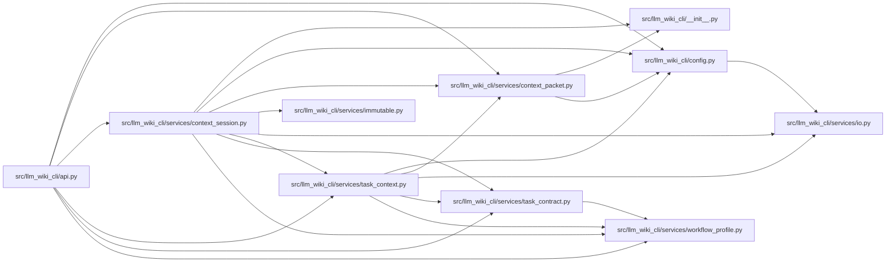

# context_session Module

**Path:** `src/llm_wiki_cli/services/context_session.py`

## Description

Provides bounded context reuse with private workspace ownership and authoritative on-disk validation. Scoped entries may share identical immutable byte buffers while retaining separate dependency observations; retained-memory accounting counts shared objects once. Read-only Git discovery is batched, and mutable producer sources remain fully checked. Supported deltas reconstruct the exact request/result schema; events are hints and unsaved buffers remain outside the on-disk contract.

## Imports

| Source | Symbols |
|--------|---------|
| `.` | `context_packet` |
| `..` | `__version__` |
| `..config` | `DEFAULT_WIKI_DIR`, `validate_path`, `validate_source_root` |
| `.immutable` | `freeze` |
| `.io` | `first_unsafe_path_component` |
| `.task_context` | `TaskCancelledError`, `TaskRead`, `_counter`, `build_task_read`, `plan_source_read`, `validate_task_context` |
| `.task_contract` | `TaskContext`, `normalize_task_request`, `TASK_REQUEST_SCHEMA_V2`, `TASK_RESULT_SCHEMA_V2` |
| `.workflow_profile` | `WorkflowRequestError`, `bounded_int`, `canonical_json`, `content_id`, `exact_fields` |
| `__future__` | `annotations` |
| `collections` | `OrderedDict` |
| `collections.abc` | `Callable`, `Mapping` |
| `dataclasses` | `dataclass`, `fields`, `is_dataclass`, `replace` |
| `hashlib` | `hashlib` |
| `json` | `json` |
| `math` | `math` |
| `os` | `os` |
| `pathlib` | `Path` |
| `shutil` | `shutil` |
| `subprocess` | `subprocess` |
| `sys` | `sys` |
| `threading` | `RLock` |
| `time` | `time` |
| `typing` | `Any` |

## Local dependency map

<!-- Auto-generated local dependency summary. Do not edit by hand. -->

### Internal neighbors

| Direction | Module |
|---|---|
| Inbound | [api](../modules/api.md) |
| Outbound | [llm_wiki_cli___init__](../modules/llm_wiki_cli___init__.md) |
| Outbound | [config](../modules/config.md) |
| Outbound | [context_packet](../modules/context_packet.md) |
| Outbound | [immutable](../modules/immutable.md) |
| Outbound | [io](../modules/io.md) |
| Outbound | [task_context](../modules/task_context.md) |
| Outbound | [task_contract](../modules/task_contract.md) |
| Outbound | [workflow_profile](../modules/workflow_profile.md) |

## Classes

| Class | Line | Bases | Description |
|-------|------|-------|-------------|
| [SessionReply](../entities/SessionReply.md) | 122 | — | Portable content and separate non-identity session work telemetry. |
| [_Entry](../entities/Entry.md) | 141 | — | — |
| [ContextSession](../entities/context_session_ContextSession.md) | 185 | — | A single trusted workspace. Methods serialize; events are hints only. |

## Functions

| Function | Signature | Decorators | Description |
|----------|-----------|------------|-------------|
| `_memory_size` | `(value, seen = None)` | — | — |
| `_root_stamp` | `(path)` | — | — |
| `_git_identity` | `(root, metrics = None)` | — | Hash local branch/index metadata; commands are fixed read-only Git queries. |
| `_producer_identity` | `(metrics = None)` | — | — |
| `json_detach` | `(value)` | — | — |
| `build_delta` | `(base: TaskContext, current: TaskContext) -> dict[str, Any]` | — | — |
| `apply_task_delta` | `(base: str, delta: Mapping[str, Any], request: Mapping[str, Any], **options) -> TaskContext` | — | — |