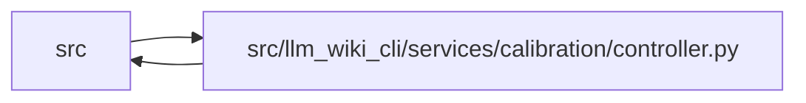

# controller Module

**Path:** `src/llm_wiki_cli/services/calibration/controller.py`

## Description

Evidence-backed admission and intake controller for documentation calibration.

This lifecycle is deliberately separate from ``documentation-run/v1``.  The
existing documentation workspaces are read-only controls; this controller
copies only bounded, priority-blind evidence into a fresh protected root and
records every mutation in an application-level, create-once hash-linked
transition ledger.  Its integrity checks inherit the same-user trust
assumptions documented by :mod:`protected_artifacts`; they do not authenticate
content against the filesystem owner, root, or offline modification.

## Imports

| Source | Symbols |
|--------|---------|
| `.` | `_restore_legacy_definition_modules` |
| `..contracts` | `CALIBRATION_CONTROLLER_MAX_PACKET_BYTES`, `P0_CALIBRATION_ACCESS_EVENT_SCHEMA_VERSION`, `P0_CALIBRATION_ADMISSION_SCHEMA_VERSION`, `P0_CALIBRATION_AMBIGUOUS_RECOVERY_SCHEMA_VERSION`, `P0_CALIBRATION_AGENT_PACKET_SCHEMA_VERSION`, `P0_CALIBRATION_AGENT_RESULT_SCHEMA_VERSION`, `P0_CALIBRATION_AUTHORITY_GRANT_SCHEMA_VERSION`, `P0_CALIBRATION_CONTROL_RECORD_SCHEMA_VERSION`, `P0_CALIBRATION_DECISION_SCOPE`, `P0_CALIBRATION_DISPATCH_RECEIPT_SCHEMA_VERSION`, `P0_CALIBRATION_EMERGENCY_REJECTION_SCHEMA_VERSION`, `P0_CALIBRATION_EVIDENCE_BUNDLE_SCHEMA_VERSION`, `P0_CALIBRATION_EXECUTION_MANIFEST_SCHEMA_VERSION`, `P0_CALIBRATION_FROZEN_INTAKE_SCHEMA_VERSION`, `P0_CALIBRATION_ISOLATION_ATTESTATION_SCHEMA_VERSION`, `P0_CALIBRATION_LABEL_FIELD_CONTRACT_SCHEMA_VERSION`, `P0_CALIBRATION_OPTIMIZER_SEARCH_CONTRACT_SCHEMA_VERSION`, `P0_CALIBRATION_ROLE_CAPABILITY_MATRIX_SCHEMA_VERSION`, `P0_CALIBRATION_RUN_SCHEMA_VERSION`, `P0_CALIBRATION_RUNTIME_BINDINGS_SCHEMA_VERSION`, `P0_CALIBRATION_TASK_ORACLE_SCHEMA_VERSION`, `P0_CALIBRATION_TRANSITION_SCHEMA_VERSION`, `P0_CALIBRATION_TRANSACTION_SCHEMA_VERSION`, `P0_CALIBRATION_VERIFICATION_REPORT_SCHEMA_VERSION` |
| `..documentation_policy` | `DocumentationPolicyError`, `TreeBaseline`, `compare_tree_baseline`, `hash_bytes` |
| `..documentation_run` | `POLICY_FILENAME`, `RUN_CONTROL_DIR`, `DocumentationRun`, `DocumentationRunError` |
| `..documentation_worklist` | `DOCUMENTATION_WORKLIST_SCHEMA_VERSION`, `WORK_ITEM_PRIORITIES`, `WORK_ITEM_STATUSES` |
| `..filesystem_guard` | `WindowsDirectoryGuardError`, `WindowsFileGuardError`, `guard_windows_directory_chain`, `open_windows_readonly_file` |
| `..protected_artifacts` | `ProtectedArtifactError`, `ProtectedArtifactIntegrityError`, `ProtectedArtifactStore`, `canonical_json_bytes`, `validate_portable_relative_path` |
| `..redaction` | `COMMON_TOKEN_PATTERNS`, `PRIVATE_KEY_BLOCK_RE`, `SENSITIVE_ASSIGNMENT_RE`, `SENSITIVE_NATURAL_LANGUAGE_RE`, `URI_USERINFO_RE` |
| `..validation` | `format_field_differences`, `parse_utc_timestamp`, `paths_overlap`, `require_bool`, `require_choice`, `require_exact_fields`, `require_mapping`, `require_nonnegative_int`, `require_positive_int`, `require_sha256`, `require_trimmed_text`, `require_trimmed_text_list`, `require_uuid` |
| `.broker` | `OciAdmissionProbeRequest`, `OciRuntimeConfig`, `create_oci_admission_probe_environment`, `execute_oci_admission_probe`, `OciDispatchContext`, `OciRuntimeConfig`, `dispatch_oci_agent`, `OciDispatchReceipt`, `OciRuntimeConfig`, `OciRuntimeConfig`, `validate_execution_manifest` |
| `.contracts` | `DocumentationCalibrationError`, `validate_flow_evidence_census` |
| `.host_broker` | `require_attestation_authentication`, `HostBrokerAuthenticationError`, `HostBrokerAuthenticationUnavailable`, `require_receipt_authentication` |
| `__future__` | `annotations` |
| `dataclasses` | `dataclass` |
| `datetime` | `datetime`, `timedelta`, `timezone` |
| `functools` | `wraps` |
| `hashlib` | `hashlib` |
| `json` | `json` |
| `os` | `os` |
| `pathlib` | `Path`, `PurePosixPath` |
| `re` | `re` |
| `stat` | `stat` |
| `tempfile` | `tempfile` |
| `typing` | `Any`, `BinaryIO`, `Callable`, `Iterable`, `Mapping`, `Sequence` |
| `unicodedata` | `unicodedata` |
| `uuid` | `uuid` |
| `warnings` | `warnings` |

## Local dependency map

<!-- Auto-generated local dependency summary. Do not edit by hand. -->

> Module-level dependencies exceed the generated-diagram limits, so the diagram and table below group them by top-level package. Counts report the number of module neighbors in each package.

### Internal neighbors

| Direction | Module |
|---|---|
| Inbound | `src` (3) |
| Outbound | `src` (12) |

> All 14 module neighbor(s) are summarized by package because the module-level view exceeds the 12-node limit.

## Classes

| Class | Line | Bases | Description |
|-------|------|-------|-------------|
| [P0CalibrationError](../entities/P0CalibrationError.md) | 225 | `RuntimeError` | Base error raised by the protected calibration lifecycle. |
| [P0CalibrationSchemaError](../entities/P0CalibrationSchemaError.md) | 229 | `P0CalibrationError` | Raised when a calibration contract is malformed. |
| [P0CalibrationIntegrityError](../entities/P0CalibrationIntegrityError.md) | 233 | `P0CalibrationError` | Raised when protected evidence or ledger integrity is violated. |
| [P0CalibrationTransitionError](../entities/P0CalibrationTransitionError.md) | 237 | `P0CalibrationError` | Raised when a lifecycle transition is illegal or stale. |
| [P0CalibrationRecoveryError](../entities/P0CalibrationRecoveryError.md) | 241 | `P0CalibrationError` | Raised when a crash marker cannot be recovered unambiguously. |
| [_ExternalBrokerAuthenticationUnavailable](../entities/ExternalBrokerAuthenticationUnavailable.md) | 245 | `P0CalibrationError` | Raised when external receipt authentication cannot be performed. |
| [_EvidenceFileSnapshot](../entities/EvidenceFileSnapshot.md) | 250 | — | Bytes, size, and hashes derived from one pinned evidence handle. |
| [P0CalibrationRun](../entities/P0CalibrationRun.md) | 261 | — | Current protected controller snapshot. |
| [P0CalibrationStatus](../entities/P0CalibrationStatus.md) | 299 | — | Operator-facing status for one calibration cohort. |
| [P0CalibrationAgentPacket](../entities/P0CalibrationAgentPacket.md) | 385 | — | One bounded, provider-neutral role packet. |
| [P0CalibrationAgentResult](../entities/P0CalibrationAgentResult.md) | 415 | — | Strict result returned by an intake or verifier role. |
| [P0CalibrationDispatchReceipt](../entities/P0CalibrationDispatchReceipt.md) | 445 | — | Broker receipt binding one invocation to protected controller state. |
| [P0CalibrationVerificationReport](../entities/P0CalibrationVerificationReport.md) | 471 | — | Recomputed evidence, citation, and transition gates. |

## Functions

| Function | Signature | Decorators | Description |
|----------|-----------|------------|-------------|
| `prepare_calibration_run` | `(root: str \| Path, *, control_workspaces: Sequence[str \| Path], execution_manifest: Mapping[str, Any]) -> P0CalibrationRun` | — | Freeze two matching documentation controls into a fresh cohort. |
| `get_calibration_run_status` | `(root: str \| Path) -> P0CalibrationStatus` | — | Return verified status without advancing the lifecycle. |
| `validate_p0_calibration_packet_output` | `(root: str \| Path, output: str \| Path) -> Path` | — | Resolve one private packet destination outside every frozen evidence root. |
| `admit_calibration_run` | `(root: str \| Path, *, authority_grant: Mapping[str, Any], broker_attestation: Mapping[str, Any] \| None = None) -> P0CalibrationRun` | — | Authorize one frozen cohort after authority and isolation checks. |
| `_admit_local_oci` | `(store: ProtectedArtifactStore, run: P0CalibrationRun, manifest: Mapping[str, Any], grant: Mapping[str, Any]) -> P0CalibrationRun` | — | — |
| `_admit_external_broker` | `(store: ProtectedArtifactStore, run: P0CalibrationRun, manifest: Mapping[str, Any], *, grant: Mapping[str, Any], broker_attestation: Mapping[str, Any] \| None) -> P0CalibrationRun` | — | — |
| `build_calibration_agent_packet` | `(root: str \| Path, *, role: str) -> P0CalibrationAgentPacket` | — | Build and persist one bounded role packet. |
| `_packet_budgets` | `(budgets: Mapping[str, Any]) -> dict[str, Any]` | — | — |
| `_result_contract_for_role` | `(role: str) -> dict[str, Any]` | — | — |
| `_frozen_intake_proposals` | `(store: ProtectedArtifactStore, run: P0CalibrationRun) -> list[dict[str, Any]]` | — | — |
| `_packet_path_for_role_state` | `(run: P0CalibrationRun, role_state: Mapping[str, Any], *, role: str) -> str` | — | — |
| `_build_host_authorization` | `(store: ProtectedArtifactStore, *, run: P0CalibrationRun, authority_hash: str) -> dict[str, Any]` | — | Derive operator trust from protected host state, not submitted JSON. |
| `_validate_host_authorization` | `(store: ProtectedArtifactStore, payload: Mapping[str, Any], *, run: P0CalibrationRun, expected_authority_hash: str \| None = None) -> None` | — | — |
| `_authenticate_external_attestation` | `(*, run: P0CalibrationRun, grant: Mapping[str, Any], manifest: Mapping[str, Any], attestation: Mapping[str, Any], attestation_hash: str) -> dict[str, Any]` | — | Require host-derived authentication for an external attestation. |
| `_validate_external_broker_authentication` | `(payload: Mapping[str, Any], *, run: P0CalibrationRun, attestation: Mapping[str, Any], attestation_hash: str, receipt: Mapping[str, Any] \| None = None, result_hash: str \| None = None) -> None` | — | — |
| `_authenticate_external_receipt` | `(*, run: P0CalibrationRun, manifest: Mapping[str, Any], attestation: Mapping[str, Any], receipt: Mapping[str, Any], result: Mapping[str, Any]) -> dict[str, Any]` | — | Require a host-authenticated proof for one external receipt. |
| `_validate_authority_grant` | `(payload: Mapping[str, Any], *, run: P0CalibrationRun, manifest: Mapping[str, Any], now: datetime) -> None` | — | — |
| `_validate_isolation_attestation` | `(payload: Mapping[str, Any], *, run: P0CalibrationRun, manifest: Mapping[str, Any], authority_hash: Any) -> None` | — | — |
| `_recheck_bound_controls` | `(store: ProtectedArtifactStore, run: P0CalibrationRun) -> str \| None` | — | — |
| `_bound_outbound_roots` | `(store: ProtectedArtifactStore) -> tuple[str, ...]` | — | — |
| `_pre_admission_authority_freshness_failure` | `(store: ProtectedArtifactStore, run: P0CalibrationRun) -> str \| None` | — | — |
| `_authority_freshness_failure` | `(store: ProtectedArtifactStore, run: P0CalibrationRun) -> str \| None` | — | — |
| `_has_indeterminate_admission_probe` | `(run: P0CalibrationRun) -> bool` | — | — |
| `_revalidate_external_receipt_authentications` | `(store: ProtectedArtifactStore, *, run: P0CalibrationRun, manifest: Mapping[str, Any], attestation: Mapping[str, Any]) -> None` | — | Reauthenticate every frozen external result against its stored proof. |
| `dispatch_calibration_agent` | `(root: str \| Path, *, role: str) -> P0CalibrationDispatchReceipt` | — | Invoke the frozen local OCI backend for one already-issued packet. |
| `record_calibration_agent_result` | `(root: str \| Path, *, dispatch_receipt: P0CalibrationDispatchReceipt \| Mapping[str, Any], result: P0CalibrationAgentResult \| Mapping[str, Any]) -> P0CalibrationRun` | — | Import one authenticated, hash-bound broker result. |
| `_record_p0_calibration_agent_result` | `(root: str \| Path, *, dispatch_receipt: P0CalibrationDispatchReceipt \| Mapping[str, Any], result: P0CalibrationAgentResult \| Mapping[str, Any], allow_local_dispatch: bool) -> P0CalibrationRun` | — | — |
| `_validate_result_import_bindings` | `(store: ProtectedArtifactStore, run: P0CalibrationRun, *, receipt: P0CalibrationDispatchReceipt, result: P0CalibrationAgentResult) -> dict[str, Any] \| None` | — | — |
| `verify_calibration_run` | `(root: str \| Path, *, advance: bool = True) -> P0CalibrationVerificationReport` | — | Recompute all frozen gates and optionally advance to ``INTAKE_FROZEN``. |
| `_validate_semantic_result` | `(payload: Mapping[str, Any], *, evidence: Mapping[str, Any], proposals: Sequence[Mapping[str, Any]] \| None = None) -> None` | — | — |
| `_proposal_claim_records` | `(proposals: Sequence[Mapping[str, Any]] \| None) -> dict[str, dict[str, Any]]` | — | — |
| `_validate_verifier_disposition_claim` | `(payload: Any, *, label: str, allowed_citations: set[Any], allowed_proposal_claims: frozenset[str], seen_claim_ids: set[str], dispositioned_claims: set[str], accepted_proposal_claims: set[str], accepted: bool) -> None` | — | — |
| `_validate_verifier_synthesis` | `(verification: Mapping[str, Any], *, proposal_claims: Mapping[str, Mapping[str, Any]], accepted_proposal_claims: set[str]) -> None` | — | — |
| `_validate_cited_claim` | `(payload: Any, *, label: str, allowed_citations: set[Any], seen_claim_ids: set[str]) -> None` | — | — |
| `_validate_coherent_verifier` | `(verification: Mapping[str, Any]) -> None` | — | — |
| `_build_task_oracle` | `(run: P0CalibrationRun, *, evidence: Mapping[str, Any], verification: Mapping[str, Any]) -> dict[str, Any]` | — | — |
| `_build_label_field_contract` | `(run: P0CalibrationRun) -> dict[str, Any]` | — | — |
| `_build_optimizer_search_contract` | `(run: P0CalibrationRun) -> dict[str, Any]` | — | — |
| `_json_round_trip_list` | `(value: Any) -> list[Any]` | — | — |
| `_load_control_workspace` | `(workspace: Path, *, index: int) -> dict[str, Any]` | — | — |
| `_assert_controls_match` | `(controls: Sequence[Mapping[str, Any]]) -> None` | — | — |
| `_portable_control_record` | `(control: Mapping[str, Any], *, cohort_id: str) -> dict[str, Any]` | — | — |
| `_compile_evidence_bundle` | `(control: Mapping[str, Any], *, bound_roots: Sequence[Path]) -> dict[str, Any]` | — | — |
| `_collect_priority_blind_documents` | `(control: Mapping[str, Any], *, bound_roots: Sequence[str]) -> tuple[list[dict[str, Any]], list[dict[str, str]]]` | — | — |
| `_ordered_priority_blind_document_candidates` | `(*, source_root: Path, wiki_root: Path) -> list[tuple[str, tuple[Path, str, str]]]` | — | — |
| `_snapshot_priority_blind_document_inputs` | `(*, source_root: Path, wiki_root: Path) -> dict[str, Any]` | — | — |
| `_build_role_capability_matrix` | `(cohort_id: str) -> dict[str, Any]` | — | — |
| `_initial_role_state` | `() -> dict[str, Any]` | — | — |
| `_commit_transition` | `(store: ProtectedArtifactStore, *, current: P0CalibrationRun \| None, expected_generation: int, expected_head: str, target_state: str, event_type: str, run_body: Mapping[str, Any] \| None = None, updates: Mapping[str, Any] \| None = None, artifacts: Sequence[tuple[str, Mapping[str, Any]]] = (), reason_codes: Sequence[str] = (), details: Mapping[str, Any] \| None = None) -> P0CalibrationRun` | — | — |
| `_recover_pending_transaction` | `(store: ProtectedArtifactStore) -> None` | — | — |
| `_validate_pending_transaction_for_recovery` | `(store: ProtectedArtifactStore, pending: Mapping[str, Any]) -> tuple[list[tuple[str, Mapping[str, Any]]], str, dict[str, Any], dict[str, Any]]` | — | — |
| `_load_run_locked` | `(store: ProtectedArtifactStore) -> P0CalibrationRun` | — | — |
| `_block_ambiguous_recovery` | `(store: ProtectedArtifactStore, error: BaseException) -> P0CalibrationRun` | — | — |
| `_persist_emergency_rejection` | `(store: ProtectedArtifactStore, error: BaseException) -> P0CalibrationRun` | — | — |
| `_load_emergency_rejection` | `(store: ProtectedArtifactStore) -> P0CalibrationRun` | — | — |
| `_load_transition_events` | `(store: ProtectedArtifactStore) -> list[dict[str, Any]]` | — | — |
| `_rebuild_transition_projection` | `(store: ProtectedArtifactStore, *, events: Sequence[Mapping[str, Any]] \| None = None) -> None` | — | — |
| `_terminal_transition_locked` | `(store: ProtectedArtifactStore, run: P0CalibrationRun, *, state: str, reason_codes: Sequence[str], details: Mapping[str, Any] \| None = None) -> P0CalibrationRun` | — | — |
| `_status_from_run` | `(run: P0CalibrationRun) -> P0CalibrationStatus` | — | — |
| `_validate_execution_manifest` | `(payload: Mapping[str, Any]) -> None` | — | — |
| `_validate_external_routes` | `(routes: Sequence[Any]) -> None` | — | — |
| `_validate_worklist` | `(payload: Mapping[str, Any]) -> dict[str, Any]` | — | — |
| `_load_control_runtime_policy` | `(workspace: Path, run: DocumentationRun) -> dict[str, Path \| None]` | — | — |
| `_required_evidence_path` | `(run: DocumentationRun, key: str) -> str` | — | — |
| `_read_workspace_json` | `(workspace: Path, relative: str) -> dict[str, Any]` | — | — |
| `_read_workspace_json_snapshot` | `(workspace: Path, relative: str) -> tuple[dict[str, Any], bytes]` | — | — |
| `_validate_bound_source_citation` | `(citation: Mapping[str, Any], *, source_root: Path) -> bool` | — | Validate one citation entirely from a safely pinned source handle. |
| `_read_bound_evidence_file` | `(root: Path, relative: str, *, included_maximum: int, maximum: int) -> _EvidenceFileSnapshot` | — | Read one source/wiki file without reopening its pathname. |
| `_read_bound_evidence_file_posix` | `(root: Path, relative: str, *, included_maximum: int, maximum: int) -> _EvidenceFileSnapshot` | — | — |
| `_read_bound_evidence_file_windows` | `(root: Path, relative: str, *, included_maximum: int, maximum: int) -> _EvidenceFileSnapshot` | — | — |
| `_snapshot_open_evidence_stream` | `(stream: BinaryIO, opened: os.stat_result, *, label: str, included_maximum: int, maximum: int) -> _EvidenceFileSnapshot` | — | — |
| `_assert_open_evidence_directory` | `(payload: os.stat_result, *, label: str) -> None` | — | — |
| `_assert_open_evidence_file` | `(payload: os.stat_result, *, label: str) -> None` | — | — |
| `_assert_stable_evidence_metadata` | `(before: os.stat_result, after: os.stat_result, *, label: str) -> None` | — | — |
| `_is_reparse_metadata` | `(payload: os.stat_result) -> bool` | — | — |
| `_walk_regular_files` | `(root: Path) -> Iterable[Path]` | — | — |
| `_validate_protected_root_placement` | `(requested: Path, *, control_roots: Sequence[Path], source_roots: Sequence[Path]) -> Path` | — | — |
| `_implementation_worktree_roots` | `() -> tuple[Path, ...]` | — | — |
| `_unknown_root_entries` | `(root: Path, *, events: Sequence[Mapping[str, Any]]) -> list[str]` | — | — |
| `_open_store` | `(root: str \| Path) -> ProtectedArtifactStore` | — | — |
| `_validate_run_snapshot` | `(payload: Mapping[str, Any]) -> None` | — | — |
| `_validate_run_body` | `(payload: Mapping[str, Any]) -> None` | — | — |
| `_run_body_fields` | `() -> set[str]` | — | — |
| `_validate_role_state` | `(payload: Any, *, role: str) -> None` | — | — |
| `_validate_active_dispatch` | `(payload: Any, *, role: str) -> None` | — | — |
| `_validate_transition` | `(payload: Mapping[str, Any]) -> None` | — | — |
| `_validate_agent_packet` | `(payload: Mapping[str, Any]) -> None` | — | — |
| `_validate_agent_result` | `(payload: Mapping[str, Any]) -> None` | — | — |
| `_validate_dispatch_receipt` | `(payload: Mapping[str, Any]) -> None` | — | — |
| `_validate_verification_report` | `(payload: Mapping[str, Any]) -> None` | — | — |
| `_normalize_bound_roots` | `(roots: Sequence[str \| Path]) -> tuple[str, ...]` | — | — |
| `_redact_outbound_text` | `(value: str, *, bound_roots: Sequence[str]) -> tuple[str, list[dict[str, Any]]]` | — | Deterministically remove path and credential material from one string. |
| `_sanitize_outbound_value` | `(value: Any, *, bound_roots: Sequence[str], json_path: str = '$') -> tuple[Any, list[dict[str, Any]]]` | — | — |
| `_assert_outbound_payload_safe` | `(payload: Any, *, bound_roots: Sequence[str]) -> None` | — | — |
| `_assert_packet_has_no_private_policy_fields` | `(payload: Mapping[str, Any]) -> None` | — | — |
| `_require_exact_fields` | `(payload: Mapping[str, Any], fields: set[str], *, label: str) -> None` | — | — |
| `_required_mapping` | `(value: Any, label: str) -> Mapping[str, Any]` | — | — |
| `_require_text` | `(value: Any, label: str) -> str` | — | Preserve calibration-v1 controls in otherwise trimmed free-form text. |
| `_require_text_list` | `(value: Any, label: str) -> list[str]` | — | Preserve calibration-v1 controls in trimmed free-form text arrays. |
| `_require_bool` | `(value: Any, label: str) -> bool` | — | — |
| `_require_nonnegative_int` | `(value: Any, label: str) -> int` | — | — |
| `_require_positive_int` | `(value: Any, label: str) -> int` | — | — |
| `_require_choice` | `(value: Any, choices: Iterable[str], label: str) -> str` | — | — |
| `_require_sha256` | `(value: Any, label: str) -> str` | — | — |
| `_require_uuid` | `(value: Any, label: str) -> str` | — | — |
| `_require_timestamp` | `(value: Any, label: str) -> str` | — | — |
| `_parse_timestamp` | `(value: Any, label: str) -> datetime` | — | — |
| `_portable_id` | `(value: Any, label: str) -> str` | — | — |
| `_portable_relative_path` | `(value: Any, *, label: str) -> str` | — | — |
| `_assert_not_link_or_reparse` | `(path: Path, label: str) -> None` | — | — |
| `_assert_regular_directory` | `(path: Path, label: str) -> None` | — | — |
| `_assert_portable_leaf_name` | `(value: str, label: str) -> None` | — | — |
| `_paths_overlap` | `(left: Path, right: Path) -> bool` | — | — |
| `_sha256_json` | `(payload: Mapping[str, Any]) -> str` | — | — |
| `_json_round_trip` | `(payload: Mapping[str, Any]) -> dict[str, Any]` | — | — |
| `_unique_json_object` | `(pairs: list[tuple[str, Any]]) -> dict[str, Any]` | — | — |
| `_reject_json_constant` | `(value: str) -> None` | — | — |
| `_utc_now` | `() -> str` | — | — |
| `_format_timestamp` | `(value: datetime) -> str` | — | — |
| `_stale_active_dispatches` | `(run: P0CalibrationRun) -> list[str]` | — | — |
| `_bounded_error` | `(error: BaseException) -> str` | — | — |
| `_deprecated_calibration_alias` | `(replacement: Callable[..., Any], legacy_name: str) -> Callable[..., Any]` | — | Return a signature-preserving compatibility wrapper. |
