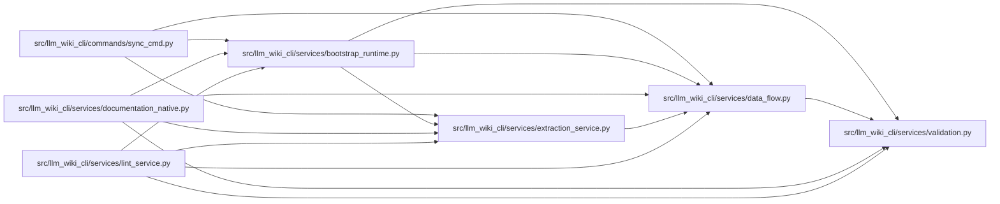

# data_flow Module

**Path:** `src/llm_wiki_cli/services/data_flow.py`

## Description

Static data-flow summaries for generated user-flow pages.

The analyzer combines the deep inventory effect metadata, resolved call edges,
and an already-built user flow. It performs no I/O and intentionally reports
bounded static observations rather than runtime guarantees.

## Imports

| Source | Symbols |
|--------|---------|
| `.validation` | `positive_int_or_none` |
| `__future__` | `annotations` |
| `collections` | `defaultdict`, `deque` |
| `collections.abc` | `Iterable`, `Mapping` |
| `dataclasses` | `dataclass`, `field` |

## Local dependency map

<!-- Auto-generated local dependency summary. Do not edit by hand. -->

### Internal neighbors

| Direction | Module |
|---|---|
| Inbound | [sync_cmd](../modules/sync_cmd.md) |
| Inbound | [bootstrap_runtime](../modules/bootstrap_runtime.md) |
| Inbound | [documentation_native](../modules/documentation_native.md) |
| Inbound | [extraction_service](../modules/extraction_service.md) |
| Inbound | [lint_service](../modules/lint_service.md) |
| Outbound | [validation](../modules/validation.md) |

## Classes

| Class | Line | Bases | Description |
|-------|------|-------|-------------|
| [DataFlowAnalysisContext](../entities/DataFlowAnalysisContext.md) | 164 | — | Precomputed indexes shared by all data-flow analyses in one run. |

## Functions

| Function | Signature | Decorators | Description |
|----------|-----------|------------|-------------|
| `data_flow_effective_limits` | `(*, flow_depth: int, flow_limit: int = DEFAULT_DATA_FLOW_DETAILS_FLOW_LIMIT) -> dict[str, int]` | — | Return the public static-analysis limits used by detailed flow output. |
| `_iter_callables` | `(inventory: dict) -> Iterable[tuple[str, str, dict]]` | — | — |
| `_callable_index` | `(inventory: dict) -> dict[tuple[str \| None, str \| None], dict]` | — | — |
| `_incoming_edge_queues` | `(edges: list[dict]) -> dict[tuple, tuple[dict, ...]]` | — | — |
| `_coverage_count` | `(value: object, field_name: str) -> int` | — | — |
| `_data_effect_coverage_index` | `(observations: Mapping \| None) -> dict[tuple[str, str], dict[str, dict]] \| None` | — | — |
| `build_data_flow_context` | `(inventory: dict, edges: list[dict], *, data_effect_observations: Mapping \| None = None) -> DataFlowAnalysisContext` | — | Build reusable indexes for analyzing one or more user flows. |
| `_effect_list` | `(effects: dict, key: str) -> list[dict]` | — | — |
| `_expr_text` | `(expr: dict) -> str` | — | — |
| `_call_args` | `(call: dict \| None) -> list[str]` | — | — |
| `_call_target` | `(call: dict \| None, edge: dict) -> str` | — | — |
| `_target_matches` | `(call: dict, edge: dict) -> bool` | — | — |
| `_find_call` | `(edge: dict, index: dict[tuple[str \| None, str \| None], dict]) -> dict \| None` | — | — |
| `_call_label` | `(edge: dict, call: dict \| None) -> tuple[str, list[str]]` | — | — |
| `_step_summary` | `(step: dict, index: dict[tuple[str \| None, str \| None], dict], step_index: int) -> dict` | — | — |
| `_boundary_rows` | `(step_summary: dict) -> list[dict]` | — | — |
| `_edge_is_explained_by_boundary` | `(edge: dict, boundaries: list[dict]) -> bool` | — | — |
| `_should_report_gap` | `(edge: dict, boundaries: list[dict]) -> bool` | — | — |
| `_add_gap` | `(gaps: list[dict], *, kind: str, step: str, target: str, line: int) -> None` | — | — |
| `_legacy_edge_for_step` | `(step: dict, incoming: dict[tuple, tuple[dict, ...]], incoming_offsets: dict[tuple, int]) -> dict \| None` | — | — |
| `_parent_step_for_depth` | `(stack: dict[int, int], depth: int) -> int \| None` | — | — |
| `analyze_data_flow` | `(inventory: dict, flow: dict, edges: list[dict], *, context: DataFlowAnalysisContext \| None = None) -> dict` | — | Return a bounded static data-flow summary for one built user flow. |
| `_edge_sort_key` | `(edge: Mapping) -> tuple` | — | — |
| `_detailed_context` | `(inventory: dict, edges: list[dict], context: DataFlowAnalysisContext \| None, data_effect_observations: Mapping \| None) -> DataFlowAnalysisContext` | — | — |
| `_flow_edge_observations` | `(flow: Mapping, incoming: dict[tuple, tuple[dict, ...]]) -> list[tuple[int, dict, int \| None]]` | — | — |
| `_raw_effects` | `(steps: Iterable[Mapping], index: dict[tuple[str \| None, str \| None], dict], effect_coverage: dict[tuple[str, str], dict[str, dict]] \| None) -> tuple[dict[str, int], bool]` | — | — |
| `_emitted_effects` | `(steps: Iterable[Mapping]) -> dict[str, int]` | — | — |
| `_positive_source_line` | `(value: object) -> int \| None` | — | — |
| `_normalize_detailed_value` | `(value: object, *, key: str \| None = None) -> object` | — | — |
| `_coverage_record` | `(observed: int, emitted: int, limit: int \| None, limitations: Iterable[str]) -> dict` | — | — |
| `_flow_step_observed_count` | `(flow: Mapping, emitted: int) -> int` | — | — |
| `_unbounded_gap_observations` | `(flow: Mapping, edge_observations: Iterable[tuple[int, dict, int \| None]], emitted_boundaries: list[dict]) -> list[dict]` | — | — |
| `analyze_data_flow_detailed` | `(inventory: dict, flow: dict, edges: list[dict], *, context: DataFlowAnalysisContext \| None = None, data_effect_observations: Mapping \| None = None) -> dict` | — | Return the legacy bounded analysis plus exact, versioned coverage. |
