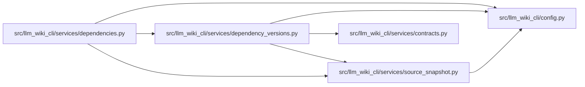

# dependency_versions Module

**Path:** `src/llm_wiki_cli/services/dependency_versions.py`

## Description

Lossless, scope-aware dependency version observations.

The legacy reconciliation contract intentionally keeps one convenient version
per package.  This module supplies the additive vulnerability-triage contract:
one deterministic record per declaration, selected resolution, or checksum
observation, retaining repository scope and ecosystem semantics.

## Imports

| Source | Symbols |
|--------|---------|
| `..config` | `is_agent_worktree_path` |
| `.contracts` | `DEPENDENCY_VERSION_DETAILS_SCHEMA_VERSION` |
| `.source_snapshot` | `SourceSnapshot` |
| `__future__` | `annotations` |
| `json` | `json` |
| `os` | `os` |
| `pathlib` | `Path` |
| `re` | `re` |
| `tomli` | `tomllib` |
| `tomllib` | `tomllib` |
| `typing` | `Any`, `Iterable`, `Mapping` |

## Local dependency map

<!-- Auto-generated local dependency summary. Do not edit by hand. -->

### Internal neighbors

| Direction | Module |
|---|---|
| Inbound | [services_dependencies](../modules/services_dependencies.md) |
| Outbound | [config](../modules/config.md) |
| Outbound | [services_contracts](../modules/services_contracts.md) |
| Outbound | [source_snapshot](../modules/source_snapshot.md) |

### External packages

| Language | Used packages | Undeclared packages |
|---|---:|---:|
| python | 1 | 0 |

## Functions

| Function | Signature | Decorators | Description |
|----------|-----------|------------|-------------|
| `_normal_python` | `(name: str) -> str` | — | — |
| `_normal_rust` | `(name: str) -> str` | — | — |
| `_scope` | `(root: Path, path: Path) -> str` | — | — |
| `_source_path` | `(root: Path, path: Path) -> str` | — | — |
| `_record` | `(*, ecosystem: str, package: str, version: str \| None, version_kind: str, selection_confidence: str, source_semantics: str, source_path: str, scope: str, declaration: str \| None, reach: str, declared_as: str \| None = None) -> dict[str, Any]` | — | — |
| `_record_sort_key` | `(record: Mapping[str, Any]) -> tuple[str, ...]` | — | — |
| `_deduplicate` | `(records: Iterable[dict[str, Any]]) -> list[dict[str, Any]]` | — | — |
| `_dependency_source_names` | `(files: Iterable[str]) -> set[str]` | — | — |
| `_snapshot_sources` | `(root: Path, snapshot: SourceSnapshot) -> list[Path]` | — | — |
| `_walk_sources` | `(root: Path) -> list[Path]` | — | — |
| `_load_toml` | `(path: Path) -> dict[str, Any] \| None` | — | — |
| `_load_json` | `(path: Path) -> dict[str, Any] \| None` | — | — |
| `_constraint` | `(value: object) -> tuple[str \| None, str]` | — | — |
| `_python_requirement` | `(spec: str) -> tuple[str, str \| None, str]` | — | — |
| `_append_python_declaration` | `(records: list[dict[str, Any]], *, root: Path, path: Path, spec: str, declaration: str, source_semantics: str) -> bool` | — | — |
| `_python_pyproject_records` | `(root: Path, path: Path, records: list[dict[str, Any]]) -> int` | — | — |
| `_requirements_records` | `(root: Path, path: Path, records: list[dict[str, Any]], *, omission_reasons: list[str] \| None = None) -> int` | — | — |
| `_selected_python_toml_records` | `(root: Path, path: Path, records: list[dict[str, Any]], *, local_projects: Iterable[tuple[str, str, str \| None]] = ()) -> int` | — | — |
| `_pipfile_records` | `(root: Path, path: Path, records: list[dict[str, Any]]) -> int` | — | — |
| `_pipfile_manifest_records` | `(root: Path, path: Path, records: list[dict[str, Any]]) -> int` | — | — |
| `_direct_packages` | `(records: Iterable[Mapping[str, Any]], ecosystem: str, scope: str) -> set[str]` | — | — |
| `_scope_is_within` | `(candidate: str, parent: str) -> bool` | — | — |
| `_direct_package_scopes` | `(records: Iterable[Mapping[str, Any]], ecosystem: str, lock_scope: str) -> dict[str, set[str]]` | — | Return declarations a lock may cover without claiming workspace ownership. |
| `_unstructured_lock_reach` | `(package: str, *, lock_scope: str, direct_scopes: Mapping[str, set[str]], selected_count: int = 1) -> str` | — | Classify a flat lock row conservatively across workspace scopes. |
| `_local_project_identities` | `(root: Path, paths: Iterable[Path], *, ecosystem: str) -> tuple[tuple[str, str, str \| None], ...]` | — | Read local package identities from already-discovered manifests. |
| `_is_local_project_selection` | `(package: str, version: str, *, lock_scope: str, local_projects: Iterable[tuple[str, str, str \| None]]) -> bool` | — | — |
| `_typescript_manifest_records` | `(root: Path, path: Path, records: list[dict[str, Any]]) -> int` | — | — |
| `_package_lock_package_name` | `(package_path: str, metadata: Mapping) -> str` | — | — |
| `_package_lock_install_scope` | `(package_path: str, lock_scope: str) -> str` | — | — |
| `_package_lock_project_direct_scopes` | `(packages: Mapping, *, lock_scope: str) -> tuple[dict[str, set[str]], int]` | — | Read direct declarations embedded in package-lock v2/v3 project rows. |
| `_package_lock_records` | `(root: Path, path: Path, records: list[dict[str, Any]]) -> int` | — | — |
| `_pnpm_key` | `(value: str) -> tuple[str, str]` | — | — |
| `_pnpm_records` | `(root: Path, path: Path, records: list[dict[str, Any]]) -> int` | — | — |
| `_go_mod_records` | `(root: Path, path: Path, records: list[dict[str, Any]], *, omission_reasons: list[str] \| None = None) -> int` | — | — |
| `_go_sum_records` | `(root: Path, path: Path, records: list[dict[str, Any]]) -> int` | — | — |
| `_rust_manifest_records` | `(root: Path, path: Path, records: list[dict[str, Any]]) -> int` | — | — |
| `_cargo_lock_records` | `(root: Path, path: Path, records: list[dict[str, Any]], *, local_projects: Iterable[tuple[str, str, str \| None]] = ()) -> int` | — | — |
| `build_dependency_version_details` | `(project_root: str \| Path = '.', *, source_snapshot: SourceSnapshot \| None = None) -> dict[str, Any]` | — | Return the additive complete, scoped dependency-version contract. |
