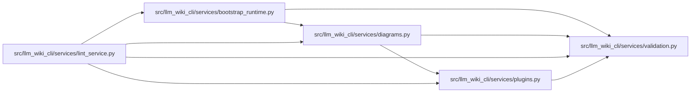

# diagrams Module

**Path:** `src/llm_wiki_cli/services/diagrams.py`

## Description

Pure Mermaid diagram renderers.

Renderer functions turn plain Python structures into fenced ``mermaid`` code
blocks. They perform no I/O, are deterministic (stable participant/node
ordering), and sanitize labels so generated diagrams render on GitHub and in
common Mermaid viewers. Plugin style resolution is the explicit runtime-loading
boundary.

## Imports

| Source | Symbols |
|--------|---------|
| `.plugins` | `PluginError`, `diagram_style_components`, `load_entry_point` |
| `.validation` | `resolved_paths_equal` |
| `__future__` | `annotations` |
| `pathlib` | `Path` |
| `re` | `re` |
| `typing` | `Any`, `Iterable`, `Mapping` |
| `unicodedata` | `unicodedata` |
| `urllib.parse` | `quote`, `unquote`, `urlsplit` |

## Local dependency map

<!-- Auto-generated local dependency summary. Do not edit by hand. -->

### Internal neighbors

| Direction | Module |
|---|---|
| Inbound | [bootstrap_runtime](../modules/bootstrap_runtime.md) |
| Inbound | [lint_service](../modules/lint_service.md) |
| Outbound | [plugins](../modules/plugins.md) |
| Outbound | [validation](../modules/validation.md) |

## Functions

| Function | Signature | Decorators | Description |
|----------|-----------|------------|-------------|
| `_normalize_display_text` | `(value: Any, *, replacements: str = '') -> str` | — | Return bounded NFC text with controls and whitespace collapsed. |
| `_flowchart_label` | `(value: Any) -> str` | — | Serialize arbitrary display text for a quoted Mermaid flowchart label. |
| `_sequence_text` | `(value: Any) -> str` | — | Serialize a participant or message for Mermaid sequence syntax. |
| `_sanitize_href` | `(href: str) -> str` | — | Return a safe encoded relative reference, or ``""`` when invalid. |
| `_class_name_is_safe` | `(value: Any) -> bool` | — | — |
| `_normalize_direction` | `(value: Any) -> str \| None` | — | — |
| `_normalize_node_classes` | `(value: Any, *, strict: bool = False) -> dict[str, str]` | — | — |
| `_normalize_category_colors` | `(value: Any, *, strict: bool = False) -> dict[str, str]` | — | — |
| `_normalize_style` | `(style: Mapping[str, Any] \| None, *, strict: bool = False) -> dict[str, Any]` | — | — |
| `_merge_style` | `(target: dict[str, Any], update: Mapping[str, Any]) -> None` | — | — |
| `_load_style_hook` | `(component: Mapping[str, Any], root: str \| Path)` | — | — |
| `_roots_equal` | `(left: str \| Path, right: str \| Path) -> bool` | — | — |
| `_read_style_components` | `(root: str \| Path, *, strict_plugin_errors: bool) -> list[dict[str, Any]]` | — | — |
| `_style_components` | `(root: str \| Path, *, fallback_root: str \| Path \| None, strict_plugin_errors: bool) -> list[tuple[dict[str, Any], str \| Path]]` | — | — |
| `resolve_diagram_style` | `(context: Mapping[str, Any] \| None, *, root: str \| Path = '.', fallback_root: str \| Path \| None = None, include_plugins: bool = True, strict_plugin_errors: bool = False) -> dict[str, Any]` | — | Return normalized style options from installed diagram-style hooks. |
| `_append_style_lines` | `(lines: list[str], aliases_by_node: Mapping[str, str] \| Iterable[tuple[str, str]], style: Mapping[str, Any] \| None, *, reserved_classes: set[str] \| None = None) -> None` | — | — |
| `_ordered_participants` | `(interactions: list[Mapping]) -> dict[str, str]` | — | Map each actor to a stable ``pN`` alias in first-seen order. |
| `sequence_diagram` | `(interactions: Iterable[Mapping]) -> str` | — | Render a Mermaid ``sequenceDiagram`` from caller→callee interactions. |
| `flowchart` | `(nodes: Iterable[str], edges: Iterable[tuple[str, str]], *, direction: str = 'TD', links: Mapping[str, str] \| None = None, highlight_edges: Iterable[tuple[str, str]] \| None = None, style: Mapping[str, Any] \| None = None) -> str` | — | Render a Mermaid ``flowchart`` from *nodes* and directed *edges*. |
| `_positive_index` | `(value: Any) -> int \| None` | — | — |
| `_transfer_endpoint` | `(transfer: Mapping, key: str, symbol_key: str, aliases_by_source_index: Mapping[int, str], aliases_by_ordinal: Mapping[int, str], aliases_by_symbol: Mapping[str, str]) -> str \| None` | — | — |
| `_link_for_step` | `(step: Mapping, module_page_map: Mapping[str, str]) -> str` | — | — |
| `_render_labeled_edge` | `(source: str, destination: str, label: Any, *, dashed: bool) -> str` | — | — |
| `data_flow_diagram` | `(data_flow: Mapping, module_page_map: Mapping[str, str] \| None = None, *, style: Mapping[str, Any] \| None = None) -> str` | — | Render a labeled Mermaid diagram for one static data-flow summary. |
