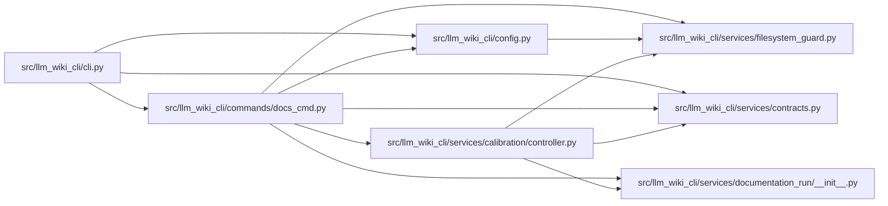

# docs_cmd Module

**Path:** `src/llm_wiki_cli/commands/docs_cmd.py`

## Description

Commands for deterministic standalone documentation workspaces.

## Imports

| Source | Symbols |
|--------|---------|
| `..config` | `PathValidationError`, `validate_source_root` |
| `..services.calibration` | `controller` |
| `..services.calibration.controller` | `P0CalibrationError` |
| `..services.contracts` | `CALIBRATION_CONTROLLER_MAX_PACKET_BYTES` |
| `..services.documentation_run` | `DocumentationAgentResult`, `DocumentationRunError`, `SUPPORTED_DOCUMENTATION_KNOWLEDGE_MODES`, `build_documentation_agent_packet`, `export_documentation_run`, `get_documentation_run_status`, `load_documentation_run`, `prepare_documentation_run`, `record_documentation_agent_result`, `verify_documentation_run` |
| `..services.filesystem_guard` | `atomic_write_private_bytes` |
| `__future__` | `annotations` |
| `json` | `json` |
| `pathlib` | `Path` |
| `sys` | `sys` |
| `typing` | `Any`, `Mapping` |

## Local dependency map

<!-- Auto-generated local dependency summary. Do not edit by hand. -->

### Internal neighbors

| Direction | Module |
|---|---|
| Inbound | [cli](../modules/cli.md) |
| Outbound | [config](../modules/config.md) |
| Outbound | [controller](../modules/controller.md) |
| Outbound | [services_contracts](../modules/services_contracts.md) |
| Outbound | [documentation_run___init__](../modules/documentation_run___init__.md) |
| Outbound | [filesystem_guard](../modules/filesystem_guard.md) |

## Functions

| Function | Signature | Decorators | Description |
|----------|-----------|------------|-------------|
| `_read_bounded_text` | `(path: str, *, label: str) -> str` | — | — |
| `_read_json_object` | `(path: str, *, label: str) -> dict[str, Any]` | — | — |
| `_read_calibration_json_object` | `(path: str, *, label: str) -> dict[str, Any]` | — | — |
| `_unique_json_object` | `(pairs: list[tuple[str, Any]]) -> dict[str, Any]` | — | — |
| `_reject_json_constant` | `(value: str) -> None` | — | — |
| `_parse_audiences` | `(values: list[str] \| None) -> list[str] \| None` | — | — |
| `_parse_audience_intent` | `(values: list[str] \| None) -> dict[str, str] \| None` | — | — |
| `_intake_from_args` | `(args) -> dict[str, Any]` | — | — |
| `_optional_string` | `(value: Any) -> str \| None` | — | — |
| `_validate_evidence_root` | `(value: str \| None, *, label: str, allow_external: bool) -> str \| None` | — | — |
| `_print_status` | `(payload: Mapping[str, Any], *, output_format: str) -> None` | — | — |
| `_print_run_status` | `(workspace: str, *, output_format: str) -> None` | — | — |
| `_prepare` | `(args) -> None` | — | — |
| `_status` | `(args) -> None` | — | — |
| `_packet` | `(args) -> None` | — | — |
| `_record_result` | `(args) -> None` | — | — |
| `_verify` | `(args) -> None` | — | — |
| `_calibration_controller` | `()` | — | — |
| `_calibration_error_type` | `() -> type[RuntimeError]` | — | — |
| `_calibration_json_payload` | `(value: object, *, label: str) -> dict[str, Any]` | — | — |
| `_bounded_calibration_json` | `(value: object, *, label: str, max_bytes: int \| None = None, canonical: bool = False) -> str` | — | — |
| `_print_calibration_json` | `(value: object, *, label: str) -> None` | — | — |
| `_require_distinct_stdin_inputs` | `(*paths: str \| None) -> None` | — | — |
| `_calibration_prepare` | `(args) -> None` | — | — |
| `_calibration_admit` | `(args) -> None` | — | — |
| `_calibration_status` | `(args) -> None` | — | — |
| `_calibration_packet` | `(args) -> None` | — | — |
| `_calibration_dispatch` | `(args) -> None` | — | — |
| `_calibration_record_result` | `(args) -> None` | — | — |
| `_calibration_verify` | `(args) -> None` | — | — |
| `_calibration` | `(args) -> None` | — | — |
| `_assert_export_options` | `(args) -> None` | — | — |
| `_export` | `(args) -> None` | — | — |
| `run` | `(args) -> None` | — | Dispatch one standalone documentation action. |
