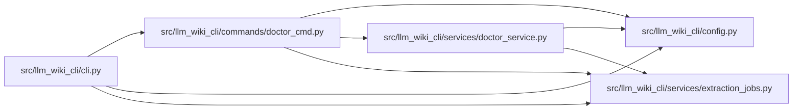

# doctor_cmd Module

**Path:** `src/llm_wiki_cli/commands/doctor_cmd.py`

## Description

CLI adapter for the read-only knowledge health report.

## Imports

| Source | Symbols |
|--------|---------|
| `..config` | `DEFAULT_WIKI_DIR` |
| `..services.doctor_service` | `build_doctor_report`, `render_doctor_text` |
| `..services.extraction_jobs` | `extraction_job_request_from_args` |
| `__future__` | `annotations` |
| `json` | `json` |

## Local dependency map

<!-- Auto-generated local dependency summary. Do not edit by hand. -->

### Internal neighbors

| Direction | Module |
|---|---|
| Inbound | [cli](../modules/cli.md) |
| Outbound | [config](../modules/config.md) |
| Outbound | [doctor_service](../modules/doctor_service.md) |
| Outbound | [extraction_jobs](../modules/extraction_jobs.md) |

## Functions

| Function | Signature | Decorators | Description |
|----------|-----------|------------|-------------|
| `run` | `(args) -> None` | — | — |
