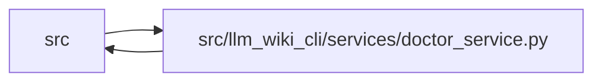

# doctor_service Module

**Path:** `src/llm_wiki_cli/services/doctor_service.py`

## Description

Read-only composition for the repository knowledge health report.

The doctor does not define another analyzer. It composes the operation-scoped
knowledge read, freshness counts, drift diagnostics, governance checks, and
verification-receipt evaluation already produced by strict lint.

## Imports

| Source | Symbols |
|--------|---------|
| `..config` | `DEFAULT_WIKI_DIR`, `validate_path`, `validate_source_root` |
| `.contracts` | `DOCTOR_SCHEMA_VERSION` |
| `.extraction_jobs` | `ExtractionJobRequest` |
| `.knowledge_artifacts` | `KNOWLEDGE_INDEX_FILENAME` |
| `.knowledge_consumption` | `KnowledgeAvailability`, `KnowledgeReadView`, `MachineVerificationAvailability` |
| `.knowledge_governance` | `GOVERNANCE_EXTENSION_KEY`, `GOVERNANCE_FILENAME` |
| `.knowledge_model` | `ComputedFreshness`, `KnowledgeLoadState` |
| `.knowledge_observability` | `UNEVALUATED_FRESHNESS_DISCLOSURE`, `knowledge_freshness_disclosure` |
| `.lint_service` | `LintIssue`, `LintReport`, `build_report` |
| `.sync_manifest` | `SyncManifest` |
| `.verification_contracts` | `VERIFICATION_RECEIPT_FILENAME` |
| `.wiki_surface_index` | `SURFACE_INDEX_FILENAME` |
| `__future__` | `annotations` |
| `collections.abc` | `Iterable`, `Mapping` |
| `dataclasses` | `dataclass` |
| `enum` | `Enum` |
| `pathlib` | `Path` |
| `re` | `re` |

## Local dependency map

<!-- Auto-generated local dependency summary. Do not edit by hand. -->

> Module-level dependencies exceed the generated-diagram limits, so the diagram and table below group them by top-level package. Counts report the number of module neighbors in each package.

### Internal neighbors

| Direction | Module |
|---|---|
| Inbound | `src` (2) |
| Outbound | `src` (12) |

> All 14 module neighbor(s) are summarized by package because the module-level view exceeds the 12-node limit.

## Classes

| Class | Kind | Line | Bases / Target | Description |
|-------|------|------|----------------|-------------|
| [DoctorStatus](../entities/DoctorStatus.md) | Enum | 37 | `str`, `Enum` | Closed overall health vocabulary for the doctor contract. |
| [DoctorReport](../entities/DoctorReport.md) | Class | 71 | — | One stable machine report plus its process exit classification. |

## Functions

| Function | Signature | Decorators | Description |
|----------|-----------|------------|-------------|
| `build_doctor_report` | `(wiki_dir: str \| Path = DEFAULT_WIKI_DIR, src_dir: str \| Path = '.', *, strict: bool = False, allow_external_src: bool = False, helper_cache_dir: str \| Path \| None = None, include_tests: Iterable[str] \| None = None, parallel_jobs: int = 1, job_request: ExtractionJobRequest \| None = None, source_selection: str \| Path \| None = None) -> DoctorReport` | — | Build a doctor report by composing existing strict-lint results. |
| `compose_doctor_report` | `(lint: LintReport, *, strict: bool, wiki_dir: str, src_dir: str) -> DoctorReport` | — | Compose health sections from one already-computed lint operation. |
| `render_doctor_text` | `(report: DoctorReport) -> str` | — | Render the report as a compact one-screen human summary. |
| `_availability_section` | `(lint: LintReport, view: KnowledgeReadView \| None, wiki_root: Path) -> dict[str, object]` | — | — |
| `_knowledge_declared` | `(wiki_root: Path) -> bool` | — | — |
| `_freshness_section` | `(lint: LintReport, view: KnowledgeReadView \| None) -> dict[str, object]` | — | — |
| `_snapshot_section` | `(lint: LintReport, view: KnowledgeReadView \| None) -> dict[str, object]` | — | — |
| `_governance_section` | `(lint: LintReport, view: KnowledgeReadView \| None, wiki_root: Path) -> dict[str, object]` | — | — |
| `_drift_section` | `(lint: LintReport, freshness: Mapping[str, object], view: KnowledgeReadView \| None) -> dict[str, object]` | — | — |
| `_diagnostic_freshness_states` | `(diagnostics: Iterable[LintIssue], view: KnowledgeReadView \| None) -> list[str]` | — | — |
| `_diagnostic_reasons` | `(issues: Iterable[LintIssue]) -> list[str]` | — | — |
| `_verification_section` | `(lint: LintReport, view: KnowledgeReadView \| None) -> dict[str, object]` | — | — |
| `_classify` | `(*, strict: bool, source_selection_mismatch: bool, availability: Mapping[str, object], freshness: Mapping[str, object], snapshot: Mapping[str, object], governance: Mapping[str, object], drift: Mapping[str, object], verification: Mapping[str, object]) -> tuple[DoctorStatus, tuple[str, ...], tuple[str, ...]]` | — | — |
| `_issues` | `(lint: LintReport, category: str, *, diagnostics: bool = False) -> list[LintIssue]` | — | — |
| `_reasons` | `(issues: Iterable[LintIssue]) -> list[str]` | — | — |
| `_format_counts` | `(value: object) -> str \| None` | — | — |
