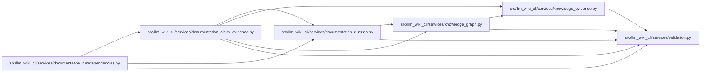

# documentation_claim_evidence Module

**Path:** `src/llm_wiki_cli/services/documentation_claim_evidence.py`

## Description

Versioned, out-of-band evidence contracts for documentation agents.

Claim evidence qualifies a documentation assertion against the supported
native query service.  Runtime-capture evidence records an observation made by
an explicitly authorized capture workflow.  Neither record is written into
the native knowledge projection or governance ledger, and neither can upgrade
structural evidence, freshness, review, verification, or lifecycle state.

## Imports

| Source | Symbols |
|--------|---------|
| `.documentation_queries` | `DocumentationQueryError`, `DocumentationGraphQueryService` |
| `.knowledge_evidence` | `is_valid_sha256` |
| `.knowledge_graph` | `GRAPH_ORIGINS`, `GRAPH_RESOLUTIONS`, `is_supported_relationship_kind` |
| `.validation` | `require_exact_choice`, `require_exact_fields`, `require_mapping`, `require_mapping_list`, `require_nonnegative_int`, `require_portable_relative_path`, `require_trimmed_text`, `require_trimmed_text_list` |
| `__future__` | `annotations` |
| `collections.abc` | `Iterable`, `Mapping` |
| `hashlib` | `hashlib` |
| `pathlib` | `Path`, `PurePosixPath` |
| `re` | `re` |
| `typing` | `TYPE_CHECKING`, `Any` |
| `urllib.parse` | `urlsplit` |

## Local dependency map

<!-- Auto-generated local dependency summary. Do not edit by hand. -->

### Internal neighbors

| Direction | Module |
|---|---|
| Inbound | [documentation_run_dependencies](../modules/documentation_run_dependencies.md) |
| Outbound | [documentation_queries](../modules/documentation_queries.md) |
| Outbound | [knowledge_evidence](../modules/knowledge_evidence.md) |
| Outbound | [knowledge_graph](../modules/knowledge_graph.md) |
| Outbound | [validation](../modules/validation.md) |

## Classes

| Class | Line | Bases | Description |
|-------|------|-------|-------------|
| [DocumentationClaimEvidenceError](../entities/DocumentationClaimEvidenceError.md) | 185 | `ValueError` | Raised when an evidence record is malformed or does not reconcile. |

## Functions

| Function | Signature | Decorators | Description |
|----------|-----------|------------|-------------|
| `normalize_claim_evidence_records` | `(value: object) -> tuple[dict[str, Any], ...]` | — | Strictly validate and deterministically order claim-evidence records. |
| `normalize_runtime_capture_records` | `(value: object) -> tuple[dict[str, Any], ...]` | — | Strictly validate and deterministically order runtime-capture records. |
| `qualify_claim_evidence` | `(service: DocumentationGraphQueryService, *, claim_id: str, canonical_page: str, concept_query: str, section_locator: str \| None = None, graph_query: Mapping[str, Any] \| None = None, safe_evidence_link: str \| None = None, internal_evidence_ref: str \| None = None) -> dict[str, Any]` | — | Build the current supported qualification for one claim. |
| `reconcile_claim_evidence_records` | `(records: Iterable[Mapping[str, Any]], service: DocumentationGraphQueryService) -> tuple[dict[str, Any], ...]` | — | Recompute every worker assertion and reject any current-view mismatch. |
| `reconcile_runtime_capture_records` | `(records: Iterable[Mapping[str, Any]], *, wiki_root: str \| Path, service: DocumentationGraphQueryService \| None) -> tuple[dict[str, Any], ...]` | — | Verify persisted capture bytes and append current identity reconciliation. |
| `preflight_runtime_capture_records` | `(records: Iterable[Mapping[str, Any]], *, wiki_root: str \| Path) -> tuple[dict[str, Any], ...]` | — | Validate capture contracts and persisted bytes without native queries. |
| `_verify_runtime_capture_record` | `(record: Mapping[str, Any], *, root: Path) -> None` | — | — |
| `_normalize_claim_record` | `(value: object, field_name: str) -> dict[str, Any]` | — | — |
| `_normalize_capture_record` | `(value: object, field_name: str) -> dict[str, Any]` | — | — |
| `_current_lifecycle_review` | `(service: DocumentationGraphQueryService, *, query: str, selected: Mapping[str, Any] \| None, section_locator: str \| None) -> tuple[dict[str, Any] \| None, dict[str, Any] \| None]` | — | — |
| `_capture_section_state` | `(service: DocumentationGraphQueryService, query: str, section_locator: object, *, capture_id: str) -> str` | — | — |
| `_normalize_graph_query` | `(value: object, field_name: str) -> dict[str, Any] \| None` | — | — |
| `_structural_evidence` | `(value: object, field_name: str) -> dict[str, Any]` | — | — |
| `_freshness` | `(value: object, field_name: str) -> dict[str, Any]` | — | — |
| `_lifecycle_review` | `(value: object, field_name: str) -> dict[str, Any] \| None` | — | — |
| `_bounds` | `(value: object, field_name: str) -> dict[str, Any]` | — | — |
| `_bound` | `(result: Mapping[str, Any], path: str) -> dict[str, Any]` | — | — |
| `_bound_record` | `(value: object, field_name: str) -> dict[str, Any]` | — | — |
| `_analyzer_bounds` | `(value: object) -> list[dict[str, Any]]` | — | — |
| `_capture_result` | `(value: object, field_name: str) -> dict[str, Any]` | — | — |
| `_native_observation` | `(value: object, field_name: str) -> dict[str, Any]` | — | — |
| `_redaction` | `(value: object, field_name: str) -> dict[str, Any]` | — | — |
| `_environment` | `(value: object, field_name: str) -> dict[str, Any]` | — | — |
| `_safe_evidence_link` | `(value: object, *, canonical_page: str, field_name: str) -> str` | — | — |
| `_internal_evidence_ref` | `(value: object, field_name: str) -> str` | — | — |
| `_portable_path` | `(value: object, field_name: str, *, suffix: str \| None = None) -> str` | — | — |
| `_runtime_capture_path` | `(value: object, field_name: str) -> str` | — | — |
| `_section_locator` | `(value: object, field_name: str) -> str` | — | — |
| `_optional_locator` | `(value: object, field_name: str) -> str \| None` | — | — |
| `_optional_identifier` | `(value: object, field_name: str) -> str \| None` | — | — |
| `_identifier` | `(value: object, field_name: str) -> str` | — | — |
| `_reason` | `(value: object, field_name: str) -> str` | — | — |
| `_enum` | `(value: object, allowed: frozenset[str], field_name: str) -> str` | — | — |
| `_text` | `(value: object, field_name: str) -> str` | — | — |
| `_string_list` | `(value: object, field_name: str) -> list[str]` | — | — |
| `_nonnegative_int` | `(value: object, field_name: str) -> int` | — | — |
| `_mapping` | `(value: object, field_name: str) -> Mapping[str, Any]` | — | — |
| `_object_array` | `(value: object, field_name: str) -> list[Mapping[str, Any]]` | — | — |
| `_exact_fields` | `(value: Mapping[str, Any], allowed: frozenset[str], required: frozenset[str], field_name: str) -> None` | — | — |
| `_reject_sensitive_metadata` | `(value: object, field_name: str) -> None` | — | — |
| `_validate_runtime_capture_content` | `(path: Path, *, capture_id: str) -> None` | — | — |
