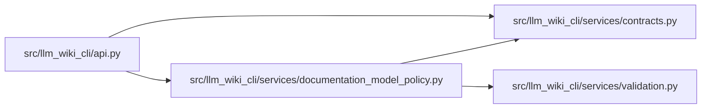

# documentation_model_policy Module

**Path:** `src/llm_wiki_cli/services/documentation_model_policy.py`

## Description

Provider-neutral model routing for documentation-agent invocations.

The deterministic package does not call a model provider.  This module gives a
host supervisor a small, auditable policy for choosing a configured model route
before it invokes a generic agent or creates a handoff.  Provider credentials,
transport configuration, prompts, and responses are deliberately outside the
contract.

Both invocation modes must start on a ``low-cost`` route.  A more expensive or
capable route is selected only by an explicit user override or a configured
escalation rule.  Model identifiers and aliases remain ordinary configuration
strings; the protocol never enumerates vendor model names or treats one
provider as the default.

## Imports

| Source | Symbols |
|--------|---------|
| `.contracts` | `DOCUMENTATION_MODEL_ROUTING_SCHEMA_VERSION`, `DOCUMENTATION_MODEL_SELECTION_SCHEMA_VERSION` |
| `.validation` | `require_exact_fields`, `require_mapping`, `require_mapping_tuple`, `require_nonempty_text`, `require_string_tuple`, `trimmed_text_or_none` |
| `__future__` | `annotations` |
| `dataclasses` | `dataclass`, `replace` |
| `hashlib` | `hashlib` |
| `json` | `json` |
| `re` | `re` |
| `typing` | `Any`, `Mapping` |

## Local dependency map

<!-- Auto-generated local dependency summary. Do not edit by hand. -->

### Internal neighbors

| Direction | Module |
|---|---|
| Inbound | [api](../modules/api.md) |
| Outbound | [services_contracts](../modules/services_contracts.md) |
| Outbound | [validation](../modules/validation.md) |

## Classes

| Class | Line | Bases | Description |
|-------|------|-------|-------------|
| [DocumentationModelPolicyError](../entities/DocumentationModelPolicyError.md) | 82 | `ValueError` | Raised when model-routing configuration is unsafe or ambiguous. |
| [DocumentationModelRoute](../entities/DocumentationModelRoute.md) | 87 | — | One configured provider/model route. |
| [DocumentationModelEscalationRule](../entities/DocumentationModelEscalationRule.md) | 161 | — | Configured signal-to-route promotion owned by the host supervisor. |
| [DocumentationModelRoutingPolicy](../entities/DocumentationModelRoutingPolicy.md) | 253 | — | Complete low-cost-first routing configuration for wiki updates. |
| [DocumentationModelOverride](../entities/DocumentationModelOverride.md) | 440 | — | Explicit user choice of a configured route or an inline public model id. |
| [DocumentationModelRoutingRequest](../entities/DocumentationModelRoutingRequest.md) | 501 | — | One credential-free request to choose a wiki-update agent model. |
| [DocumentationModelSelection](../entities/DocumentationModelSelection.md) | 548 | — | Credential-free model selection produced by a routing decision. |

## Functions

| Function | Signature | Decorators | Description |
|----------|-----------|------------|-------------|
| `select_documentation_model` | `(policy: DocumentationModelRoutingPolicy, request: DocumentationModelRoutingRequest) -> DocumentationModelSelection` | — | Select a model without invoking a provider or reading credentials. |
| `validate_documentation_model_selection` | `(policy: DocumentationModelRoutingPolicy, request: DocumentationModelRoutingRequest, selection: DocumentationModelSelection) -> DocumentationModelSelection` | — | Validate selection metadata against its originating policy and request. |
| `_selection` | `(*, policy: DocumentationModelRoutingPolicy, request: DocumentationModelRoutingRequest, route: DocumentationModelRoute, route_id: str, default_route_id: str, basis: str, matched_rule_id: str \| None = None) -> DocumentationModelSelection` | — | — |
| `_resolve_override` | `(policy: DocumentationModelRoutingPolicy, mode: str, override: DocumentationModelOverride) -> DocumentationModelRoute` | — | — |
| `_inline_override_id` | `(route: DocumentationModelRoute) -> str` | — | — |
| `_validate_object` | `(payload: Mapping[str, Any], allowed: set[str], label: str) -> None` | — | — |
| `_reject_sensitive_keys` | `(value: Any, path: str = '$') -> None` | — | — |
| `_required_text` | `(value: Any, label: str) -> str` | — | Retain the model policy's historical whitespace normalization. |
| `_optional_text` | `(value: Any) -> str \| None` | — | — |
| `_text_sequence` | `(value: Any, label: str) -> tuple[str, ...]` | — | — |
| `_object_sequence` | `(value: Any, label: str) -> tuple[Mapping[str, Any], ...]` | — | — |
| `_validate_slug` | `(value: Any, label: str) -> str` | — | — |
| `_validate_public_identifier` | `(value: Any, label: str) -> str` | — | — |
| `_validate_provider_family` | `(value: Any) -> str` | — | — |
| `_validate_tier` | `(value: Any) -> str` | — | — |
| `_validate_mode` | `(value: Any) -> str` | — | — |
| `_normalise_modes` | `(values: Any, label: str) -> tuple[str, ...]` | — | — |
