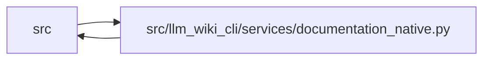

# documentation_native Module

**Path:** `src/llm_wiki_cli/services/documentation_native.py`

## Description

Native-knowledge evaluation and refresh for standalone documentation runs.

This module is an internal bridge between the standalone documentation
controller and the native knowledge runtime.  It owns no source discovery
policy of its own: callers supply the already approved source/wiki roots and
the explicit source-plugin trust decision.  Artifact metadata is never used to
select plugins.

## Imports

| Source | Symbols |
|--------|---------|
| `.api_contracts` | `ApiContractError`, `attach_routes_to_entry_points`, `build_api_contracts` |
| `.bootstrap_runtime` | `build_entity_occurrence_page_map`, `build_entity_page_map`, `build_module_page_map` |
| `.context_service` | `_build_context_knowledge_view` |
| `.data_flow` | `analyze_data_flow`, `build_data_flow_context` |
| `.entrypoints` | `build_flow`, `detect_entry_points`, `read_console_scripts` |
| `.extraction_jobs` | `ExtractionJobRequest` |
| `.extraction_service` | `InventoryRequest`, `get_docker_inventory`, `get_inventory_result`, `resolve_call_edges` |
| `.infrastructure_inventory` | `get_yaml_infrastructure_inventory` |
| `.inventory_cache` | `InventoryCacheOptions` |
| `.knowledge_artifacts` | `KNOWLEDGE_INDEX_FILENAME`, `CommitStage`, `KnowledgeArtifactError`, `KnowledgeCommitResult`, `validate_knowledge_artifacts`, `validate_surface_index_bytes` |
| `.knowledge_consumption` | `KnowledgeReadView` |
| `.knowledge_envelope` | `ConsumedInput`, `ConsumedInputKind`, `hash_source_snapshot` |
| `.knowledge_evidence` | `is_valid_sha256` |
| `.knowledge_freshness` | `KnowledgeFreshnessReport`, `evaluate_knowledge_freshness` |
| `.knowledge_model` | `ComputedFreshness`, `KnowledgeIndex`, `ObservationScope` |
| `.knowledge_orchestration` | `RUNTIME_GENERATION_OPTION_DEFAULTS`, `RuntimeKnowledgeInputs`, `RuntimeLiveEvaluationInputs`, `build_runtime_live_evaluation`, `collect_runtime_repository_evidence`, `finalize_runtime_knowledge`, `runtime_generation_options` |
| `.paths` | `is_test_source_path` |
| `.source_selection` | `SourceSelectionError`, `resolve_source_selection`, `source_selection_identity_from_generation_inputs`, `source_selection_inputs_from_generation_inputs`, `validate_persisted_source_selection_identity` |
| `.source_snapshot` | `SourceSnapshot`, `SourceSnapshotError`, `build_source_snapshot`, `capture_source_selection_inputs` |
| `.sync_manifest` | `LEGACY_MANIFEST_VERSION`, `MANIFEST_FILENAME`, `MANIFEST_VERSION`, `SyncManifest` |
| `.validation` | `is_portable_relative_path` |
| `.wiki_surface` | `PageKind` |
| `.wiki_surface_index` | `SURFACE_INDEX_FILENAME`, `WIKI_SURFACE_INDEX_SCHEMA_VERSION`, `SurfaceIndexEvaluation`, `evaluate_surface_index` |
| `__future__` | `annotations` |
| `collections.abc` | `Callable` |
| `dataclasses` | `dataclass`, `field` |
| `hashlib` | `hashlib` |
| `json` | `json` |
| `pathlib` | `Path`, `PurePosixPath` |
| `stat` | `stat` |
| `typing` | `Any`, `Mapping`, `TypeGuard` |

## Local dependency map

<!-- Auto-generated local dependency summary. Do not edit by hand. -->

> Module-level dependencies exceed the generated-diagram limits, so the diagram and table below group them by top-level package. Counts report the number of module neighbors in each package.

### Internal neighbors

| Direction | Module |
|---|---|
| Inbound | `src` (2) |
| Outbound | `src` (23) |

> All 25 module neighbor(s) are summarized by package because the module-level view exceeds the 12-node limit.

## Classes

| Class | Line | Bases | Description |
|-------|------|-------|-------------|
| [DocumentationNativeError](../entities/DocumentationNativeError.md) | 93 | `RuntimeError` | Fail-closed native evaluation or refresh error. |
| [DocumentationNativeFreshness](../entities/DocumentationNativeFreshness.md) | 98 | — | Independent v5 compatibility result for standalone adoption. |
| [DocumentationNativeRefresh](../entities/DocumentationNativeRefresh.md) | 108 | — | One controller-owned native projection refresh. |
| [_DocumentationNativeRuntime](../entities/DocumentationNativeRuntime.md) | 132 | — | — |
| [_DocumentationPageMaps](../entities/DocumentationPageMaps.md) | 141 | — | — |

## Functions

| Function | Signature | Decorators | Description |
|----------|-----------|------------|-------------|
| `_native_source_snapshot_preflight` | `(*, source_root: str \| Path, manifest: SyncManifest, source_selection: str \| Path \| None, operation: str, allow_same_path_identity_update: bool = False) -> tuple[Path, SourceSnapshot]` | — | — |
| `evaluate_documentation_native_freshness` | `(*, knowledge: KnowledgeIndex, manifest: SyncManifest, source_root: str \| Path, trust_source_plugins: bool = False, helper_cache_dir: str \| Path \| None = None, source_selection: str \| Path \| None = None) -> DocumentationNativeFreshness` | — | Evaluate one validated v5 snapshot against live standalone defaults. |
| `refresh_documentation_native_projection` | `(*, source_root: str \| Path, wiki_root: str \| Path, trust_source_plugins: bool = False, helper_cache_dir: str \| Path \| None = None, source_selection: str \| Path \| None = None, fault_injector: Callable[[CommitStage], None] \| None = None) -> DocumentationNativeRefresh` | — | Recompute the native trio without mutating canonical Markdown. |
| `_collect_runtime` | `(*, source_root: str \| Path, trust_source_plugins: bool, helper_cache_dir: str \| Path \| None, source_selection: str \| Path \| None, generation_input_paths: tuple[str, ...] = (), source_snapshot: SourceSnapshot \| None = None) -> _DocumentationNativeRuntime` | — | — |
| `_evaluate_runtime_surface` | `(*, source_root: Path, wiki_root: Path, runtime: _DocumentationNativeRuntime, trust_source_plugins: bool, manifest: SyncManifest, page_maps: _DocumentationPageMaps, generation_options: Mapping[str, object]) -> SurfaceIndexEvaluation` | — | — |
| `_runtime_flow_entries` | `(*, source_root: Path, runtime: _DocumentationNativeRuntime, trust_source_plugins: bool, manifest: SyncManifest, generation_options: Mapping[str, object]) -> list[dict[str, Any]]` | — | — |
| `_runtime_api_contracts` | `(*, source_root: Path, inventory: Mapping[str, Mapping[str, Any]], manifest: SyncManifest, source_snapshot: SourceSnapshot) -> Mapping[str, Any]` | — | — |
| `_page_maps` | `(inventory: Mapping[str, Mapping[str, Any]]) -> _DocumentationPageMaps` | — | — |
| `_regenerated_evidence_pages` | `(page_maps: _DocumentationPageMaps) -> frozenset[str]` | — | Return exactly the structural pages backed by current inventory. |
| `_runtime_generation_options` | `(manifest: SyncManifest) -> dict[str, object]` | — | — |
| `_generation_input_paths` | `(manifest: SyncManifest) -> tuple[str, ...]` | — | — |
| `_capture_generation_inputs` | `(snapshot: SourceSnapshot, paths: tuple[str, ...]) -> tuple[SourceSnapshot, tuple[str, ...]]` | — | — |
| `_source_mismatches` | `(*, knowledge: KnowledgeIndex, manifest: SyncManifest, runtime: _DocumentationNativeRuntime) -> tuple[str, ...]` | — | — |
| `_live_source_snapshot_hash` | `(runtime: _DocumentationNativeRuntime, manifest: SyncManifest) -> str \| None` | — | — |
| `_validate_refresh_artifact_basis` | `(wiki_root: Path, manifest: SyncManifest, *, manifest_version: int) -> dict[str, str]` | — | — |
| `_refresh_manifest_version` | `(wiki_root: Path) -> int` | — | — |
| `_validate_legacy_surface_bytes` | `(content: bytes) -> None` | — | — |
| `_is_safe_relative_posix_path` | `(value: object, *, required_suffix: str \| None = None) -> TypeGuard[str]` | — | — |
| `_native_artifact_hashes` | `(wiki_root: Path, *, allow_missing: bool = False) -> dict[str, str]` | — | — |
| `_validated_directory` | `(value: str \| Path, field_name: str) -> Path` | — | — |
| `_markdown_hashes` | `(wiki_root: Path) -> dict[str, str]` | — | — |
