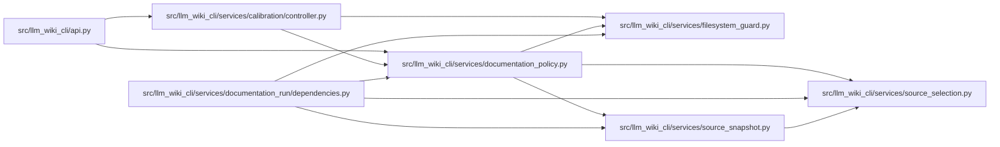

# documentation_policy Module

**Path:** `src/llm_wiki_cli/services/documentation_policy.py`

## Description

Mutation and filesystem-integrity policy for documentation workspaces.

The standalone documentation lifecycle is deliberately stricter than the
managed knowledge-base commands.  It treats both the source project and an
adopted wiki as read-only evidence and gives callers an explicit, small set of
write roots instead of inferring permission from the current working directory.

## Imports

| Source | Symbols |
|--------|---------|
| `.filesystem_guard` | `WindowsDirectoryGuardError`, `WindowsFileGuardError`, `WindowsIdentityUnavailableError`, `fresh_no_follow_stat`, `guard_windows_directory_chain`, `open_windows_readonly_file`, `windows_object_identity`, `_windows_path_handle_metadata` |
| `.source_selection` | `SourceSelectionError`, `SourceSelectionPolicy`, `resolve_source_selection` |
| `.source_snapshot` | `SourceSnapshot`, `SourceSnapshot` |
| `__future__` | `annotations` |
| `contextlib` | `contextmanager` |
| `dataclasses` | `dataclass` |
| `hashlib` | `hashlib` |
| `os` | `os` |
| `pathlib` | `Path` |
| `stat` | `stat` |
| `typing` | `TYPE_CHECKING`, `Any`, `Iterable`, `Iterator` |
| `urllib.parse` | `urlsplit` |

## Local dependency map

<!-- Auto-generated local dependency summary. Do not edit by hand. -->

### Internal neighbors

| Direction | Module |
|---|---|
| Inbound | [api](../modules/api.md) |
| Inbound | [controller](../modules/controller.md) |
| Inbound | [documentation_run_dependencies](../modules/documentation_run_dependencies.md) |
| Outbound | [filesystem_guard](../modules/filesystem_guard.md) |
| Outbound | [source_selection](../modules/source_selection.md) |
| Outbound | [source_snapshot](../modules/source_snapshot.md) |

## Classes

| Class | Line | Bases | Description |
|-------|------|-------|-------------|
| [DocumentationPolicyError](../entities/DocumentationPolicyError.md) | 71 | `ValueError` | Raised when an external documentation policy cannot be enforced. |
| [TreeBaseline](../entities/TreeBaseline.md) | 76 | — | A deterministic, portable content baseline for a read-only tree. |
| [IntegrityDifference](../entities/IntegrityDifference.md) | 115 | — | — |
| [DocumentationMutationPolicy](../entities/DocumentationMutationPolicy.md) | 136 | — | Resolved runtime roots and portable policy metadata. |

## Functions

| Function | Signature | Decorators | Description |
|----------|-----------|------------|-------------|
| `resolve_documentation_policy` | `(workspace_root: str \| Path, *, source_root: str \| Path \| None = None, source_selection: str \| Path \| None = None, input_wiki_root: str \| Path \| None = None, helper_cache_root: str \| Path \| None = None, capture_root: str \| Path \| None = None, trust_source_plugins: bool = False, live_service_url: str \| None = None, live_service_access_mode: str = 'unspecified', live_service_observation_allowed: bool = False) -> DocumentationMutationPolicy` | — | Resolve and validate the external documentation mutation policy. |
| `capture_tree_baseline` | `(root: str \| Path, *, display: str, excluded_directories: Iterable[str] = (), max_files: int = DEFAULT_MAX_BASELINE_FILES, max_file_bytes: int = DEFAULT_MAX_BASELINE_FILE_BYTES, max_total_bytes: int = DEFAULT_MAX_BASELINE_TOTAL_BYTES) -> TreeBaseline` | — | Hash regular files without following links or requiring Git. |
| `compare_tree_baseline` | `(baseline: TreeBaseline, root: str \| Path, *, max_files: int = DEFAULT_MAX_BASELINE_FILES, max_file_bytes: int = DEFAULT_MAX_BASELINE_FILE_BYTES, max_total_bytes: int = DEFAULT_MAX_BASELINE_TOTAL_BYTES) -> IntegrityDifference` | — | — |
| `source_tree_baseline` | `(root: str \| Path) -> TreeBaseline` | — | — |
| `source_snapshot_tree_baseline` | `(snapshot: SourceSnapshot) -> TreeBaseline` | — | Build a source baseline from the shared snapshot's selected inputs. |
| `compare_source_snapshot_baseline` | `(baseline: TreeBaseline, snapshot: SourceSnapshot) -> IntegrityDifference` | — | Compare an exact selected-input baseline with a fresh shared snapshot. |
| `source_plugin_tree_baseline` | `(root: str \| Path) -> TreeBaseline` | — | Capture the exact project plugin store and lockfile without broadening source. |
| `compare_source_plugin_tree_baseline` | `(baseline: TreeBaseline, root: str \| Path) -> IntegrityDifference` | — | — |
| `input_wiki_tree_baseline` | `(root: str \| Path) -> TreeBaseline` | — | — |
| `hash_bytes` | `(data: bytes) -> str` | — | — |
| `hash_file` | `(path: str \| Path) -> str` | — | — |
| `_walk_regular_files` | `(root: Path, *, excluded: frozenset[str]) -> Iterable[tuple[str, Path, os.stat_result]]` | — | — |
| `_guard_baseline_directory` | `(root: Path, relative_directory: Path) -> Iterator[None]` | `@contextmanager` | Pin a Windows baseline directory chain for inspection and leaf reads. |
| `_hash_file` | `(path: Path, *, inspected: os.stat_result \| None = None, max_bytes: int \| None = None) -> str` | — | — |
| `_hash_windows_file` | `(path: Path, *, inspected: os.stat_result \| None, max_bytes: int \| None) -> str` | — | Hash one Windows leaf through the native no-redirection read guard. |
| `_lstat` | `(path: Path, *, context: str) -> os.stat_result` | — | — |
| `_is_windows_reparse_point` | `(result: os.stat_result) -> bool` | — | — |
| `_assert_safe_directory` | `(path: Path, result: os.stat_result, *, context: str) -> None` | — | — |
| `_assert_safe_regular_file` | `(path: Path, result: os.stat_result) -> None` | — | — |
| `_assert_same_file_identity` | `(before: os.stat_result, after: os.stat_result, *, path: Path, operation: str) -> None` | — | — |
| `_assert_stable_file_metadata` | `(before: os.stat_result, after: os.stat_result, *, path: Path) -> None` | — | — |
| `_assert_stable_windows_path_handle_metadata` | `(path_result: os.stat_result, handle_result: os.stat_result, *, path: Path) -> None` | — | — |
| `_stable_metadata_signature` | `(result: os.stat_result) -> tuple[int, int, int, int]` | — | — |
| `_hash_labeled_hashes` | `(file_hashes: dict[str, str]) -> str` | — | — |
| `_validate_live_service` | `(url: str \| None, *, access_mode: str, observation_allowed: bool, capture_root: Path \| None) -> None` | — | — |
| `_resolve_existing_directory` | `(path: str \| Path, label: str) -> Path` | — | — |
| `_resolve_optional_root` | `(path: str \| Path \| None, label: str) -> Path \| None` | — | — |
| `_resolve_optional_path` | `(path: str \| Path \| None) -> Path \| None` | — | — |
| `_resolve_path` | `(path: str \| Path) -> Path` | — | — |
| `_contains` | `(root: Path, target: Path) -> bool` | — | — |
| `_overlap` | `(left: Path, right: Path) -> bool` | — | — |
